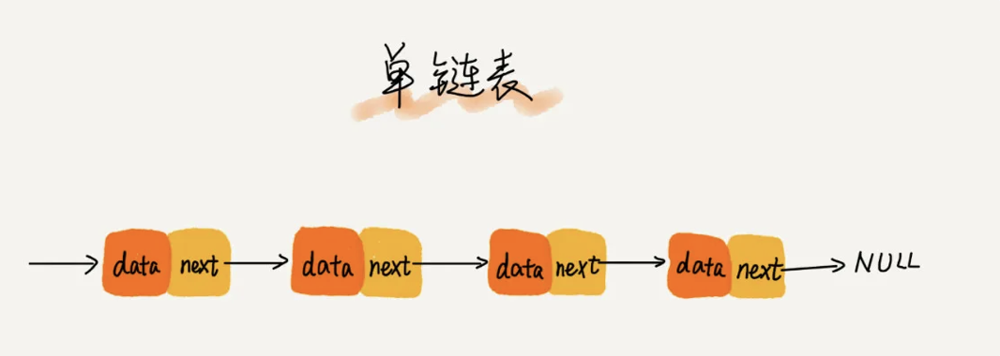
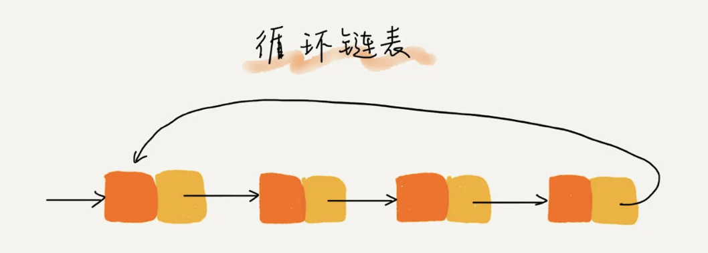
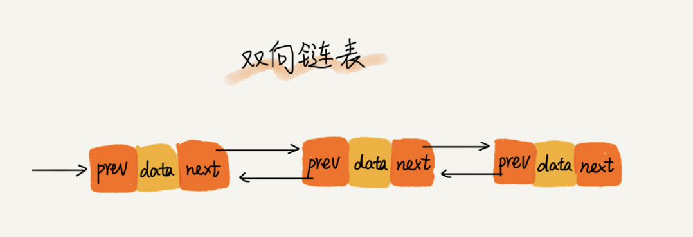
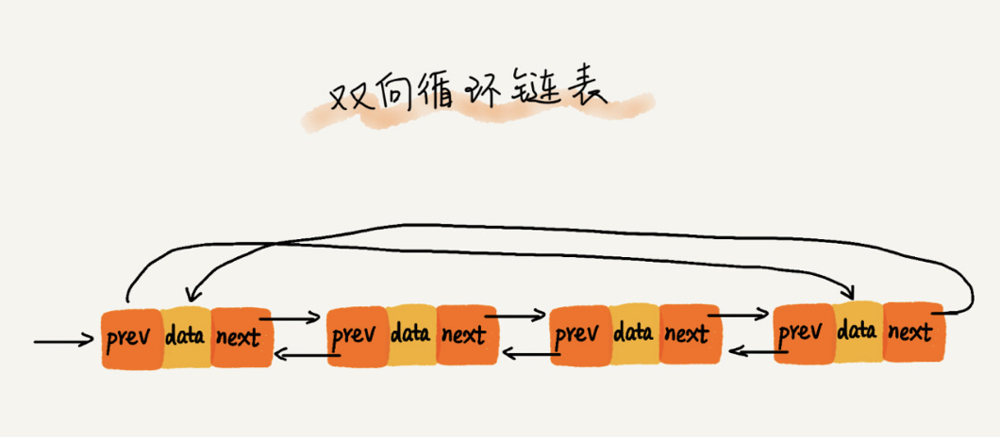

Review
1. 2021/06/09
2. 2024-09-09 07:51

> [!Summary]
> 

## 一、Introduction
数组需要一块连续的内存空间来存储，对内存的要求比较高。
链表恰恰相反，它并不需要一块连续的内存空间，它通过“指针”将一组零散的内存块串联起来使用。

4种最常见的链表结构，它们分别是：
- 单链表
- 双向链表
- 循环链表
- 双向循环链表

## 常见问题
1. [x] 206 反转链表 ✅ 2024-09-28
2. [x] 21 合并两个有序链表 #Easy ✅ 2024-09-28
3. [ ] 检测链表中是否有环
4. [x] 237 删除链表中的节点 #Medium ✅ 2024-09-29
5. [x] 876 链表的中间节点 #Easy ✅ 2024-09-29
6. [x] 删除链表的倒数第N个节点 ✅ 2024-09-29
7. [x] 61 旋转链表 #Medium ✅ 2024-09-29
8. [ ] 奇偶链表重排
9. [ ] 扁平化多级双向链表
10. [x] 2 两数相加（链表版） ✅ 2024-09-29
11. [x] 相交链表 ✅ 2024-09-28
12. [x] 234 回文链表 ⭐️⭐️⭐️ ✅ 2024-09-28
13. [x] 141 环形链表 #Easy ✅ 2024-09-28
14. [x] 142 环形链表2 #Medium ⭐️⭐️⭐️ ✅ 2024-09-28
15. [x] 24 两两交换链表中的节点 #Medium  O(n), O(1) ✅ 2024-09-29
16. [ ] 148 排序链表 #Medium  O(nlogn), O(1) ⭐️⭐️⭐️
17. [ ] 138 随机链表的复制 #Medium O(n), O(1) 
18. [ ] K 个一组翻转链表
19. [ ] 合并 K 个生序链表
20. [ ] LRU 缓存

##### 1. 反转链表
   - 反转单向链表
   - 反转双向链表

##### 2. 合并两个有序链表
   - 合并两个有序链表,生成一个新的有序链表

##### 3. 检测链表中是否有环
   - 使用快慢指针检测链表中是否有环
   - 找出环的入口点

##### 4. 删除链表中的节点
   - 给定一个节点,删除该节点
   - 给定一个值,删除链表中所有值等于该值的节点

##### 5. 找出链表的中间节点
使用快慢指针找出链表的中间节点

##### 6. 删除链表的倒数第N个节点
给定一个整数N,删除链表的倒数第N个节点

##### 7. 旋转链表
将链表向右旋转k个位置

##### 8. 奇偶链表重排
将一个链表的奇数节点和偶数节点分离,然后重新串联起来

##### 9. 扁平化多级双向链表
将多级双向链表扁平化为单级双向链表

##### 10. 两数相加(链表版)
给定两个非空链表,它们表示两个非负整数。将这两个整数相加,并以链表形式返回结果。

##### 11: 相交链表
给你两个单链表的头节点 `headA` 和 `headB` ，请你找出并返回两个单链表相交的起始节点。如果两个链表不存在相交节点，返回 `null` 。

##### 12: 回文链表
给你一个单链表的头节点 `head` ，请你判断该链表是否为回文链表。如果是，返回 `true` ；否则，返回 `false` 。

> **回文** 序列是向前和向后读都相同的序列。

##### 13: 环形链表
给你一个链表的头节点 `head` ，判断链表中是否有环。

如果链表中有某个节点，可以通过连续跟踪 `next` 指针再次到达，则链表中存在环。 为了表示给定链表中的环，评测系统内部使用整数 `pos` 来表示链表尾连接到链表中的位置（索引从 0 开始）。**注意：`pos` 不作为参数进行传递** 。仅仅是为了标识链表的实际情况。

_如果链表中存在环_ ，则返回 `true` 。 否则，返回 `false` 。

##### 13: 环形链表 2
给定一个链表的头节点  `head` ，返回链表开始入环的第一个节点。 _如果链表无环，则返回 `null`。_

如果链表中有某个节点，可以通过连续跟踪 `next` 指针再次到达，则链表中存在环。 为了表示给定链表中的环，评测系统内部使用整数 `pos` 来表示链表尾连接到链表中的位置（**索引从 0 开始**）。如果 `pos` 是 `-1`，则在该链表中没有环。**注意：`pos` 不作为参数进行传递**，仅仅是为了标识链表的实际情况。

**不允许修改** 链表。

##### 如果字符串是通过单链表来存储的，那该如何来判断是一个回文串呢？
1. 快慢指针定位中间节点
2. 从中间节点对后半部分逆序
3. 前后半部分比较，判断是否为回文
4. 后半部分逆序复原

## Reference

