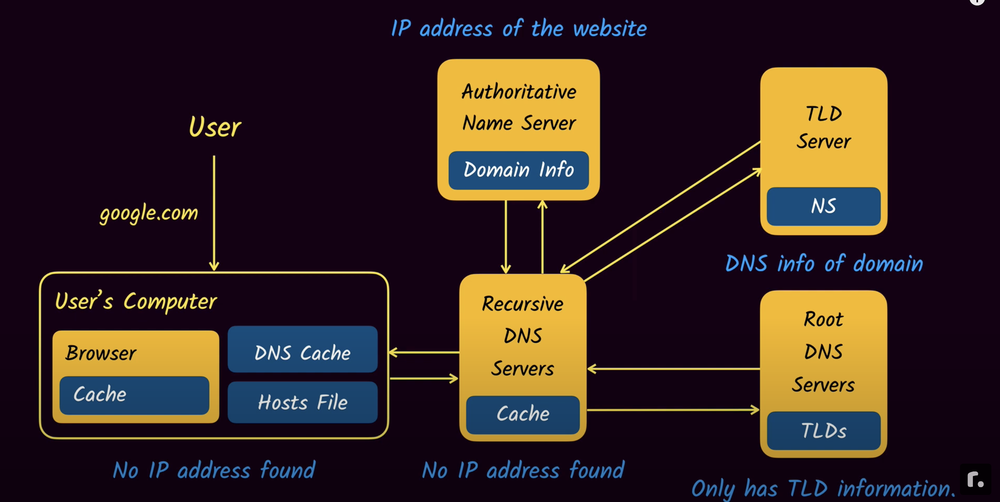
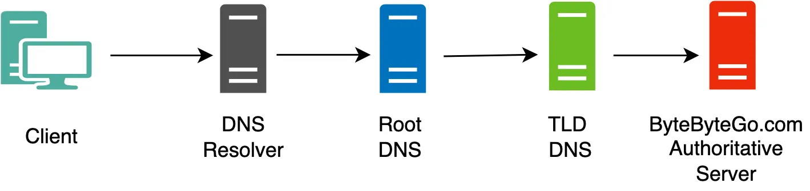
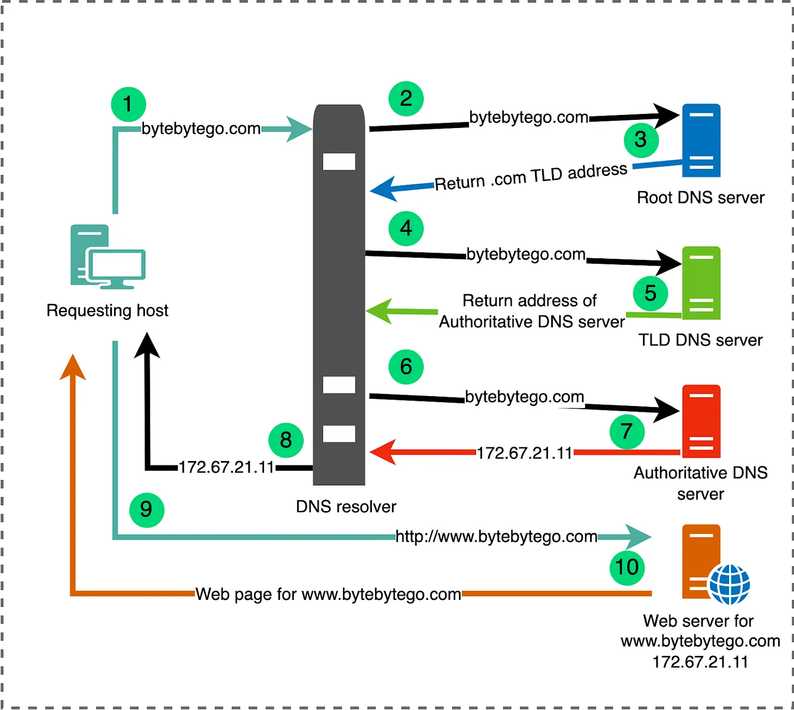
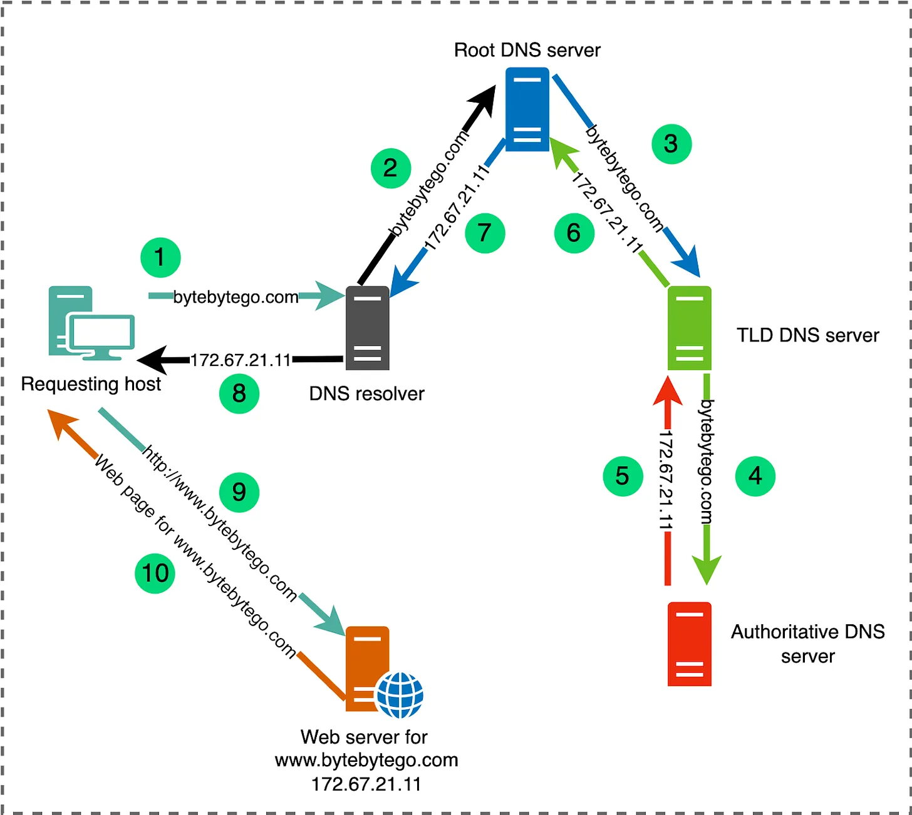

#DNS #DomainName

Review
1. 2019/08/19
2. 2020/05/11
3. 2021/08/19
4. 2023-07-07 07:28
5. 2024-01-06


> [!Summary]
> **关键术语**
> 
> 1. 根域名服务器（根域）：存放顶级域的NS列表
> 2. 顶级域名服务器（顶级域）：负责返回权威域名服务器的地址
> 3. 权威域名服务器（权威域）：提供最终IP地址解析能力
> 4. Local DNS：代理域名解析请求给最终的权威DNS，具有Cache的能力；一般是ISP提供的，可以指定公共的DNS，如Google:8.8.8.8
> 5. DNS no glue
> 6. DNS TTl：一条域名解析记录在DNS服务器上缓存的时间

## 一、Introduction
**A domain name is a unique, easy-to-remember, human-readable address used to access websites**, such as ‘google.com’, and ‘facebook.com’. Users can connect to websites using domain names thanks to the ==Domain Name System== (DNS).

Any Internet-connected computer can be reached through a public [IP Address](https://developer.mozilla.org/en-US/docs/Glossary/IP_Address), either an IPv4 address (e.g. `173.194.121.32`) or an IPv6 address (e.g., `2027:0da8:8b73:0000:0000:8a2e:0370:1337`).

Computers can handle such addresses easily, but people have a hard time finding out who is running the server or what service the website offers. *IP addresses are hard to remember and might change over time*.

To solve all those problems we use human-readable addresses called ==domain names==.

**DNS** is a distributed and hierarchical system that acts as the internet's address book. It translates domain names into IP addresses to facilitate efficient communication between devices across the globe. The primary purpose of DNS is to provide a convenient way for users to access websites and resources using easily memorable domain names, while computers and servers use IP addresses for communication behind the scenes.

The DNS is implemented as an ==Application layer service==. It is implemented by the servers that sit at the network edge rather than routers and switches inside the network.

### Key Services Provided by DNS
- Host-to-IP address mapping
- Host aliasing: through  CNAME(Canonical Name) records. This allows a single IP address or primary domain name to be associated with multiple domain name aliases.
- Email Routing: MX records
- IP-to-host address mapping: reverse lookups
- Load balancing: DNS can distribute incoming network traffic across multiple servers by returning different IP addresses in response to the same domain name query.


## 二、Deeper dive

### 2.1 Structure of domain names
A domain name has a simple structure made of several parts (it might be one part only, two, three…), separated by dots and **read from right to left**:


Each of those parts provides specific information about the whole domain name.

#### [TLD](https://developer.mozilla.org/en-US/docs/Glossary/TLD) (Top-Level Domain)

TLDs tell users the general purpose of the service behind the domain name. The most generic TLDs (`.com`, `.org`, `.net`) don't require web services to meet any particular criteria, but some TLDs enforce stricter policies so it is clearer what their purpose is. For example:
- Local TLDs such as `.us`, `.fr`, or `.se` can require the service to be provided in a given language or hosted in a certain country — they are supposed to indicate a resource in a particular language or country.
- TLDs containing `.gov` are only allowed to be used by government departments.
- The `.edu` TLD is only for use by educational and academic institutions.

TLDs can contain special as well as latin characters. A TLD's maximum length is 63 characters, although most are around 2–3.

The full list of TLDs is [maintained by ICANN](https://www.icann.org/resources/pages/tlds-2012-02-25-en).

#### Label (or component)

The labels are what follow the TLD. A label is a case-insensitive character sequence anywhere from one to sixty-three characters in length, containing only the letters `A` through `Z`, digits `0` through `9`, and the '-' character (which may not be the first or last character in the label). `a`, `97`, and `hello-strange-person-16-how-are-you` are all examples of valid labels.

The label located right before the TLD is also called a _Secondary Level Domain_ (SLD).

A domain name can have many labels (or components). It is not mandatory nor necessary to have 3 labels to form a domain name. For instance, [www.inf.ed.ac.uk](http://www.inf.ed.ac.uk/) is a valid domain name. For any domain you control (e.g. [mozilla.org](https://www.mozilla.org/en-US/)), you can create "subdomains" with different content located at each, like [developer.mozilla.org](https://developer.mozilla.org/), [iot.mozilla.org](https://iot.mozilla.org/), or [bugzilla.mozilla.org](https://bugzilla.mozilla.org/).

#### Finding an available domain name

```sh
whois google.com
nslookup
host github.com

# dig命令可以查看追踪DNS信息
dig baidu.com

# Linux、macOS查看、及修改nameserver配置
cat /etc/resolve.conf
```

#### DNS refreshing

DNS databases are stored on every DNS server worldwide, and all these servers refer to a few special servers called "authoritative name servers" or "top-level DNS servers" — these are like the boss servers that manage the system.

Whenever your registrar creates or updates any information for a given domain, the information must be refreshed in every DNS database. Each DNS server that knows about a given domain stores the information for some time before it is automatically invalidated and then refreshed (the DNS server queries an authoritative server and fetches the updated information from it). Thus, it takes some time for DNS servers that know about this domain name to get the up-to-date information.

```sh
# macOS 更新DNS缓存
sudo killall -HUP mDNSResponder
```

### 2.2 How does a DNS request work?



#### 2.2.1 Root DNS Servers
At the top of the DNS hierarchy are the root servers. The root servers are contacted when a server is not actually able to resolve a name. You can think of it as a first point of contact to get the resolution started.

Root servers act like the central nervous system of the internet, and as such, security is going to be very important. Much of the infrastructure associated with the root servers is the responsibility of ICANN (Internet Corporation for Assigned Names and Numbers). There are 13 logical root servers around the world, but each of these logical root servers is actually replicated, so corresponding to these 13 logical servers are actually close to a thousand physical servers around the world.

#### 2.2.2 Top-Level Domain (TLD) DNS servers
Moving down a level from the root servers, we find the TLD (Top-Level Domain) servers and each of the servers in the TLD layer is responsible for resolving one of the addresses that have an ending like **.com**, **.edu**, **.net**, and **.org**.

The Internet Corporation for Assigned Names and Numbers (ICANN) has authority over all TLDs used on the Internet, and it delegates the responsibility of these TLDs to various organizations. For individuals or entities looking to register a new domain under these TLDs, they typically approach Domain Name Registrars, which are accredited entities interfacing with the registries to handle the registration process.

#### 2.2.3 Authoritative DNS servers
Authoritative servers are the definitive source for domain name resolutions within their specific domain. They store the actual name-to-IP address mappings for a given domain. While various caching mechanisms exist across the internet to speed up domain name resolutions, it's the authoritative servers that provide the correct and final answer when queried. Domain owners or administrators configure their domain's records, but the actual infrastructure—the DNS servers—is often maintained and operated by DNS hosting providers or registrars like Cloudflare, Namecheap, GoDaddy, and others.

#### 2.2.4 Recursive DNS Servers (Resolver)
Recursive servers handle DNS queries from client devices like computers and smartphones. When a device wants to resolve a domain name, it contacts these servers. Acting on behalf of the client, recursive servers traverse the DNS hierarchy, consulting various DNS servers to determine the IP address associated with a domain name. Once they obtain the answer, they return it to the client. For efficiency, recursive servers often cache responses to avoid repeatedly querying the same information.

Check out the illustration below, it shows the placement of some of the main DNS servers inside the pipeline of a DNS query.


#### How DNS Resolution Works
There are two main methods of query resolution in DNS:
- Iterative query resolution
- Recursive query resolution

##### Iterative query resolution


##### Recursive Query Resolution



As we already saw, when you want to display a webpage in your browser it's easier to type a domain name than an IP address. Let's take a look at the process:

1. Type `mozilla.org` in your browser's location bar.
2. Your browser asks your computer if it already recognizes the IP address identified by this domain name (using a **local DNS cache**). If it does, the name is translated to the IP address and the browser negotiates contents with the web server. End of story.
3. If your computer does not know which IP is behind the `mozilla.org` name, it goes on to ask a DNS server, whose job is precisely to tell your computer which IP address matches each registered domain name.
4. Now that the computer knows the requested IP address, your browser can negotiate contents with the web server.


### DNS Record
访问一个还没有配置Record的域名，会看到 “This site can’t be reached”
Now, go to a website(visit-before) in your browser. You should get an error like "Server Not Found", since we haven't created the record yet.

Create a CNAME record with it and go to the website(visit-before)  in your browser again. You should get the same "Server Not Found" error as before. Even if you force reload the page!

域名与IP之间的对应关系，称为"记录"（record）。根据使用场景，"记录"可以分成不同的类型（type）。

常见的DNS记录类型如下:
（1）**A**：地址记录（Address），返回域名指向的IP地址。
（2）**NS**：域名服务器记录（Name Server），返回保存下一级域名信息的服务器地址。该记录只能设置为域名，不能设置为IP地址。
（3）**MX**：邮件记录（Mail eXchange），返回接收电子邮件的服务器地址。
（4）**CNAME**：规范名称记录（Canonical Name），返回另一个域名，即当前查询的域名是另一个域名的跳转，详见下文。
（5）**PTR**：逆向查询记录（Pointer Record），只用于从IP地址查询域名，详见下文。

#### Why do I get a "server not found" error?

Here's what happens with "visit-after", where everything's working as expected
- You create the record
- Browser asks: where's visit-after.jade157.messwithdns.com?
- DNS server responds: success!

With visit-before, it doesn't work because of something DNS resolvers do called **negative caching**, where they cache the **absence** of a record.
- Browser: where's visit-before.jade157.messwithdns.com?
- DNS server: doesn't exist!
- DNS resolver: "oops it doesn't exist! Better cache that!"
- DNS resolver: Doesn't exist
- You create record
- Request: where's visit-before.jade157.messwithdns.com?
- DNS resolver: "I saw this before!! It doesn't exist!"
- DNS resolver: doesn't exist
- You: :( :( :( IT EXISTS THOUGH
- You wait 1 hour and try again, everything works because the cache expired

### DNS TTL
Setting a very long TTL (like 10 days) makes your life very inconvenient: if you want to make a change, you need to wait up to 10 days for the change to happen! We'll:
-  Create a record with a short TTL, visit the page in our browser, change the record, and refresh the page. We'll see the change!
-  Create a record with a long TTL, visit the page in our browser, change the record, and refresh the page. We won't see the change!

When the TTL is 30 seconds, the second time you make the request, the cache will have expired so you'll get the new version. Here's what that looks like in detail:

- You create a record
- Browser asks: where's short-ttl.jade157.messwithdns.com?
- Resolver doesn't have this in cache, so requests it
- DNS server responds: Here's the IP! The TTL is 30 seconds!
- Resolver caches the IP for 30 seconds
- Resolver responds: Here's the IP!
- ... 30 seconds pass
- You update the record
- Browser asks: where's short-ttl.jade157.messwithdns.com?
- Resolver notices that the cache expired, and requests it again
- DNS server responds: Here's the IP!
- Resolver caches the IP for 30 seconds
- Resolver responds: Here's the new IP!

And when the TTL is a big number like 10 days, the cache never expires, so you can't get the updated site. Here's what that looks like:

- You create a record
- Browser asks: where's long-ttl.jade157.messwithdns.com?
- Resolver doesn't have this in cache, so requests it
- DNS server responds: Here's the IP! The TTL is 10 days!
- Resolver caches the IP for 10 days
- Resolver responds: Here's the IP!
- ... 30 seconds pass
- You update the record
- Browser asks: where's long-ttl.jade157.messwithdns.com?
- Resolver responds: I have that cached! Here's the IP!

| Terminology              | Explain                                                                                                                                                                                                                                                                                                                                                                                            |
| ------------------------ | -------------------------------------------------------------------------------------------------------------------------------------------------------------------------------------------------------------------------------------------------------------------------------------------------------------------------------------------------------------------------------------------------- |
| A record                 | A very common type of DNS record. It contains an IPv4 address, like `1.2.3.4`                                                                                                                                                                                                                                                                                                                      |
| Authoritative DNS server | This is one type of DNS server. Every domain has an authoritative DNS server assigned to it. The way DNS requests generally flow is:<br><br>you -> DNS resolver -> authoritative<br>                         DNS server                                                                                                                                                                            |
| CNAME record             | A common type of DNS record. It contains an hostname address, like `example.com`. [CNAME records comic](https://wizardzines.com/comics/cname).                                                                                                                                                                                                                                                     |
| DNS name                 | Every time you type a domain, subdomain, or sub-sub-domain into your browser, that's a DNS name! A DNS name (like `bananas.prince.fruit.oops.pie.com.`) has to:<br><br>- be less than 255 characters<br>- have less than 63 "`.`"s in it<br>- be composed of only a-z, A-Z, 0-9, and "-" characters<br>- and a couple of other rules<br><br>Other than that, DNS queries can contain any DNS name. |
| DNS record               | When you make a DNS query, you get 0 or more records in response. Every record has at least 4 fields: the **name**, the **TTL**, the **type**, and one or more **content** fields. For example the IP address in an A record is its content.                                                                                                                                                       |
| DNS resolver             | This is one type of DNS server. A resolver takes your request, sends it to the right authoritative DNS server, and caches the result. You might be using a resolver run by Google, Cloudflare, or your ISP.                                                                                                                                                                                        |
| DNS query                | A DNS query is a request that you send to a DNS server. It contains 2 fields: the name (like example.com), and the type (like "A").                                                                                                                                                                                                                                                                |
| Subdomain                | See DNS name                                                                                                                                                                                                                                                                                                                                                                                       |
| TTL                      | Stands for **Time To Live**. This is a DNS record field. It's an number of seconds. DNS resolvers use it to decide how long to cache the record.                                                                                                                                                                                                                                                   |

## DNS服务器搭建与配置
- [RFC-1034 - Domain Names - Concepts and Facilities](https://tools.ietf.org/html/rfc1034)
- [RFC-1035 - Domain Names - Implementation and Specification](https://tools.ietf.org/html/rfc1035)
- [RFC-2782 - A DNS RR for specifying the location of services (DNS SRV)](https://tools.ietf.org/html/rfc2782)
- [RFC-7766 - DNS Transport over TCP - Implementation Requirements](https://tools.ietf.org/html/rfc7766)
- [RFC-8484 - DNS Queries over HTTPS (DoH)](https://tools.ietf.org/html/rfc8484)
- [DNS服务器搭建与配置](https://cshihong.github.io/2018/10/15/DNS%E6%9C%8D%E5%8A%A1%E5%99%A8%E6%90%AD%E5%BB%BA%E4%B8%8E%E9%85%8D%E7%BD%AE/)
- [如何搭建一个DNS服务器](https://ghh3809.github.io/2021/03/17/create-dns-server/)
- [搭建本地私有DNS服务器](https://blog.51cto.com/u_13570193/2106152)


## DNS服务
- [BIND](https://www.isc.org/downloads/bind/) - BIND is open source software that enables you to publish your Domain Name System (DNS) information on the Internet, and to resolve DNS queries for your users.
- [Power DNS](https://www.powerdns.com/) - PowerDNS, founded in the late 1990s, is a premier supplier of open source DNS software, services and support.
- [Unbound](http://unbound.net/) - Unbound is a validating, recursive, and caching DNS resolver.
- [NSD](https://www.nlnetlabs.nl/projects/nsd/) - NSD is an authoritative only, high performance, simple and open source name server.
- [Knot DNS](https://www.knot-dns.cz/) - Knot DNS is a high-performance authoritative-only DNS server which supports all key features of the modern domain name system.
- [dnspod-sr](https://github.com/DNSPod/dnspod-sr/) - A faster recursive dns server from DNSPod.
- [CoreDNS](https://coredns.io/) - CoreDNS is a DNS server that chains plugins, written in Go. It is a [Cloud Native Computing Foundation](https://cncf.io/) graduated project.

## 公共DNS测评
**为什么我们要手动设置 DNS 呢？原因会有以下几点：**
1. 访问某些网络服务很缓慢，比如 Apple 的 iCloud 服务。
2. 比较担心安全问题，希望能通过设置 DNS 来保证你访问安全的网站，
3. 厌烦了每当你输入一个不正确的网址，运营商总会给你跳转到一个充满广告的界面

你可以在路由器上设置公共 DNS，这将应用到你全部的设备。也可以根据需要只在某台电脑、手机上独立进行设置。

国内最快：
阿里（[http://alidns.com/](http://alidns.com/)）
- 223.5.5.5
- 223.6.6.6

CNNIC（[sdns.cn/](https://link.zhihu.com/?target=http%3A//www.sdns.cn/)）
- 1.2.4.8
- 210.2.4.8

国外最快：
谷歌
- 8.8.8.8
- 8.8.4.4

## Reference
1. [MDN: What is a Domain Name?](https://developer.mozilla.org/en-US/docs/Learn/Common_questions/Web_mechanics/What_is_a_domain_name)
2. [Mess with DNS](https://messwithdns.net/)
3. [DNS Dictionary](https://messwithdns.net/dictionary.html)
4. [YouTube: DNS and How does it work?](https://www.youtube.com/watch?v=Wj0od2ag5sk)
5. [YouTube: DNS Records](https://www.youtube.com/watch?v=7lxgpKh_fRY)
6. [What is domain name? Domain name vs URL](https://www.cloudflare.com/en-gb/learning/dns/glossary/what-is-a-domain-name/)
7. [A Crash Course in DNS](https://blog.bytebytego.com/p/a-crash-course-in-dns-domain-name)
8. [Unbound_简体中文](https://wiki.archlinuxcn.org/wiki/Unbound)
9. [DNS 原理入门](https://www.ruanyifeng.com/blog/2016/06/dns.html)
10. [盘点国内外优秀公共DNS](https://zhuanlan.zhihu.com/p/53958870)
11. [unbound](https://nlnetlabs.nl/projects/unbound/about/)
12. [dnsmasq-china-list](https://github.com/felixonmars/dnsmasq-china-list)
13. [awesome-dns](https://github.com/dnsplus/awesome-dns)
