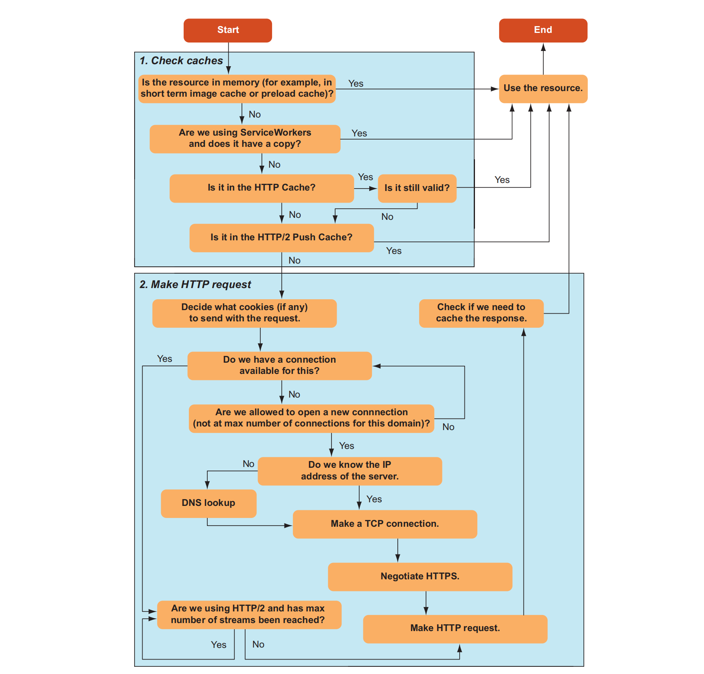
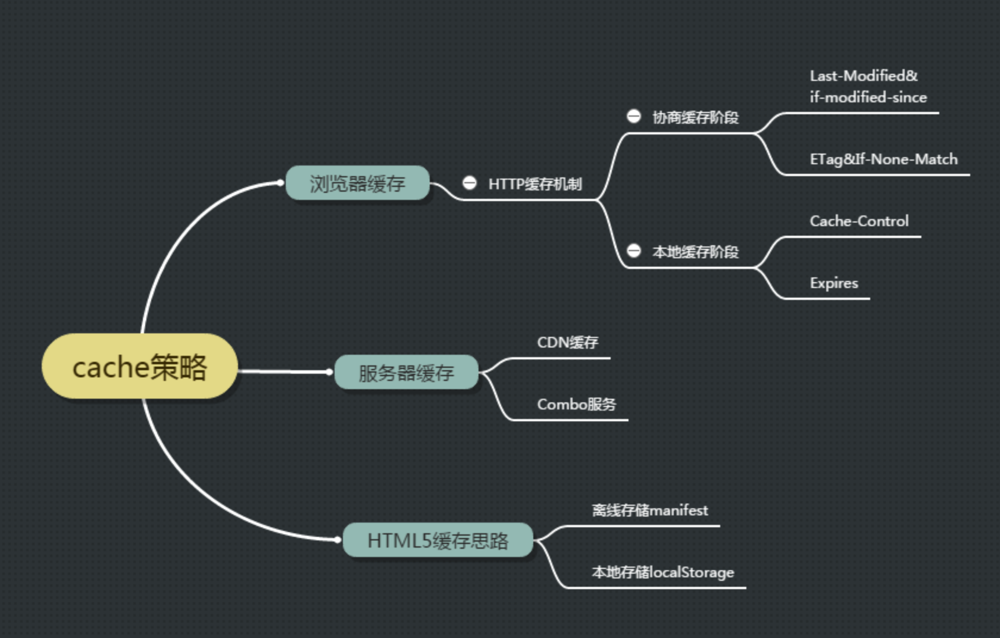
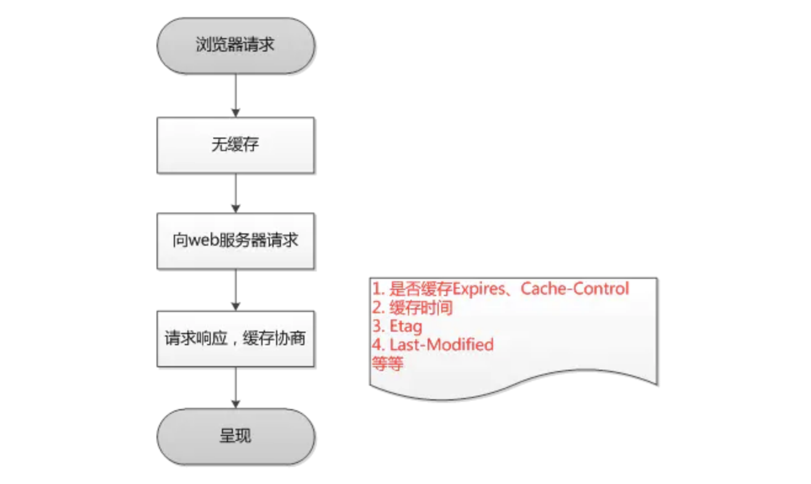

Review
1. 2020/07/29
2. 2020/09/22
3. 2024-09-26 22:06

> [!Summary]
> HTTP 缓存会存储与请求关联的响应，并将存储的响应复用于后续请求。
> The HTTP cache stores a response associated with a request and reuses the stored response for subsequent request
> 
> Cache-Control 配置了 `no-cache` 强缓存失效，但协商缓存可用
> 配置了 `no-store` 理性情况下，强缓存和协商缓存都失效，谨慎使用
> no-cache 确保数据新鲜，no-store用于保护敏感数据

**浏览器处理缓存的过程**


Cache-Control 存储指令
- 请求指令
	- `no-cache` 使用缓存前必须检查有效性
	- `no-store` 不允许缓存
	- `max-age=[秒]` 缓存的有效期
- 响应指令
	- `public` 共享缓存中缓存
	- `private` 不允许在共享缓存中存储
	- `no-cache` 
	- `no-store` 
	- `must-revalidate` 如果缓存已经过期，除非检查有效性，否则就无法缓存
	- `max-age=[秒]` 
	- `s-max-age=[秒]` 指定在共享缓存中优先于 `max-age` 的有效期
	- `immutable` 无需检查有效性，即可使用缓存


> [!Info] Cache-Control field diff
> **“no-cache”和“no-store”**
> “no-cache” 表示必须先与服务器确认返回的响应是否发生了变化，然后才能使用该响应来满足后续对同一网址的请求。 因此，如果存在合适的ETag，no-cache 会发起往返通信来验证缓存的响应，但如果资源未发生变化，则可避免下载。
> 
> “no-store” 禁止浏览器以及所有中间缓存存储该请求或响应的信息，包括头信息和实体内容。例如，包含个人隐私数据或银行业务数据的响应。 每次用户请求该资产时，都会向服务器发送请求，并下载完整的响应。注意配置了 `no-store` 也不会返回 Etag, Last-Modified 响应头
> 
> **“public”与 “private”**
> 如果响应被标记为“public”，可以被任何缓存存储，则即使它有关联的 HTTP 身份验证，甚至响应状态代码通常无法缓存，也可以缓存响应。 大多数情况下，“public”不是必需的，因为明确的缓存信息（例如“max-age”）已表示响应是可以缓存的。
> 
> `private` 只能被浏览器缓存。 不过，这些响应通常只为单个用户缓存，因此不允许任何中间缓存对其进行缓存。 例如，用户的浏览器可以缓存包含用户私人信息的 HTML 网页，但 CDN 却不能缓存。
> 
> **“max-age”**
> max-age 是相对于资源被服务器返回时的那个时间点开始算起的。
> 指令指定从请求的时间开始，允许提取的响应被重用的最长时间（单位：秒）。 例如，“max-age=60”表示可在接下来的 60 秒缓存和重用响应。


==定义Cache-Control 策略==


==强缓存、协商缓存校验流程==


###### 第一次请求



###### 第二次请求
![[a8b2b54fe7c8_cf5018ad.png]]

**基本流程**
浏览器在加载资源时，会按照一定的规则来判断是否命中缓存，从而决定是直接从本地读取缓存还是向服务器发起请求。这个过程主要涉及启发式缓存、强缓存和协商缓存3种机制。

1. 如果没有配置 `Cache-Control`, `Expires` ，走启发式缓存，否则判断是强缓存还是协商缓存
2. 如果缓存未过期（`max-age`, `expires`） ，则直接使用缓存，如果缓存过期或不存在，则进行下一步协商缓存
3. 向服务器发送请求，携带 If-Modified-Since 或 If-None-Match 头。服务器比较请求头中的信息与服务器端存储的资源信息。如果一致，返回 304 Not Modified，浏览器使用本地缓存。如果不一致，返回 200 OK及新的资源，浏览器更新本地缓存并使用新资源。

> 相同点：如果命中，都是从客户端缓存中加载资源，而不是从服务器加载资源数据；
> 不同点：强缓存不发请求到服务器，协商缓存会发请求到服务器。

> **浏览器是如何计算缓存过期时间的呢？**
> 1. **记录响应时间:** 当浏览器第一次接收到一个资源时，它会记录下服务器返回的响应时间。这个时间通常包含在HTTP响应头的 `Date` 字段中。
> 2. **计算过期时间:** 浏览器会将 `Date` 字段中的时间加上 `max-age` 指定的秒数，得到资源的过期时间。
> 3. **每次请求时比较:** 每次浏览器需要访问该资源时，它会将当前时间与计算得到的过期时间进行比较。如果当前时间小于过期时间，则认为缓存有效，否则认为缓存过期。


## 一、Introduction
### 1.1、缓存简介
##### 缓存的价值
1. **提升访问速度**：首先，由于不需要将请求传递到源服务器，因此客户端和缓存越近，响应速度就越快。最典型的例子是浏览器本身为浏览器请求存储缓存。
2. **减轻服务器上的负载**：当响应可复用时，源服务器不需要处理请求——因为它不需要解析和路由请求、根据 cookie 恢复会话、查询数据库以获取结果或渲染模板引擎。

在 [HTTP Caching](https://httpwg.org/specs/rfc9111.html) 标准中，有两种不同类型的缓存：**私有缓存**和**共享缓存**。

##### Private caches 私有缓存
私有缓存是绑定到特定客户端的缓存——通常是*浏览器缓存*。由于存储的响应不与其他客户端共享，因此私有缓存可以存储该用户的个性化响应。

如果响应包含个性化内容并且你只想将响应存储在私有缓存中，则必须指定 `private` 指令。

*请注意，如果响应具有 `Authorization` 标头，则不能将其存储在私有缓存（或共享缓存，除非 Cache-Control 指定的是 `public`）中。*

```HTTP
Cache-Control: private
```

##### Shared caches 共享缓存
共享缓存位于客户端和服务器之间，可以存储能在用户之间共享的响应。共享缓存可以进一步细分为 **代理缓存** 和 **托管缓存**。

###### 代理缓存(Proxy caches)
除了访问控制的功能外，一些代理还实现了缓存以减少网络流量。

###### 托管缓存(Managed caches)
托管缓存由服务开发人员明确部署，以降低源服务器负载并有效地交付内容。包括*反向代理*、*CDN* 和 *service worker 与缓存 API* 的组合。

使用托管缓存，可以通过仪表板操作、API 调用、重新启动等实时删除已经存储的响应/缓存。这允许更主动的缓存策略。

##### 启发式缓存 (Heuristic caching) 
HTTP 旨在尽可能多地缓存，因此即使没有给出 `Cache-Control`，如果满足某些条件，响应也会被存储和重用。这称为**启发式缓存**。

```HTTP
HTTP/1.1 200 OK
Content-Type: text/html
Content-Length: 1024
Date: Tue, 22 Feb 2022 22:22:22 GMT
Last-Modified: Tue, 22 Feb 2021 22:22:22 GMT

<!doctype html>
…
```

试探性地知道，整整一年没有更新的内容在那之后的一段时间内不会更新。因此，客户端存储此响应（尽管缺少 `max-age`）并重用它一段时间。复用多长时间取决于实现，但规范建议存储后大约 10%（在本例中为 0.1 年）的时间。

> 启发式缓存是在 `Cache-Control` 被广泛采用之前出现的一种解决方法，基本上所有响应都应明确指定 `Cache-Control` 标头。


##### 基于 age 的缓存策略
存储的 HTTP 响应有两种状态：**fresh** 和 **stale**。_fresh_ 状态通常表示响应仍然有效，可以重复使用，而 _stale_ 状态表示缓存的响应已经过期。

确定响应何时是 fresh 的和何时是 stale 的标准是 **age**。在 HTTP 中，age 是自响应生成以来经过的时间。

```HTTP
HTTP/1.1 200 OK
Content-Type: text/html
Content-Length: 1024
Date: Tue, 22 Feb 2022 22:22:22 GMT
Cache-Control: max-age=604800

<!doctype html>
…
```

存储响应的缓存，会计算响应生成后经过的时间，并将结果用作响应的 _age_。

对于该示例的响应，`max-age` 的含义如下：
- If the age of the response is _less_ than one week, the response is _fresh_.
- If the age of the response is _more_ than one week, the response is _stale_.

当响应存储在共享缓存中时，有必要通知客户端响应的 age。继续看示例，如果共享缓存将响应存储了一天，则共享缓存将向后续客户端请求发送以下响应。

```HTTP
HTTP/1.1 200 OK
Content-Type: text/html
Content-Length: 1024
Date: Tue, 22 Feb 2022 22:22:22 GMT
Cache-Control: max-age=604800
Age: 86400

<!doctype html>
…
```

###### Age字段的计算
Age字段的值通常由**缓存服务器**计算。当一个缓存服务器接收到一个请求时，它会检查缓存中是否有与该请求匹配的响应。如果命中缓存，缓存服务器会：
1. **检查缓存中的Age值：** 如果存在Age值，则将其作为初始值。
2. **计算当前时间与缓存创建时间的时间差：** 将这个时间差添加到初始Age值中，得到新的Age值。
3. **将新的Age值添加到响应头中：** 将计算得到的新的Age值添加到响应头的Age字段中，然后将响应返回给客户端。

##### Expires or max-age
在 HTTP/1.0 中，有效期是通过 `Expires` 标头来指定的。
`Expires` 标头使用明确的时间而不是通过指定经过的时间来指定缓存的生命周期。

```HTTP
Expires: Tue, 28 Feb 2022 22:22:22 GMT
```

有如下问题
1. 时间格式难以解析
2. 通过故意偏移系统时钟来诱发问题

在 HTTP/1.1 中，`Cache-Control` 采用了 `max-age`——用于指定经过的时间。
如果 `Expires` 和 `Cache-Control: max-age` 都可用，则将 `max-age` 优先级更高。

##### 浏览器请求资源时，请求经过的缓存层
1. 浏览器缓存：启发式缓存、强缓存、协商缓存。浏览器会将最近访问过的资源缓存到本地磁盘，下次访问相同资源时，如果缓存未过期，可以直接从本地读取，无需再次向服务器发起请求。
2. 操作系统缓存：DNS缓存、SSL证书缓存
3. ISP缓存：DNS缓存、高频访问的网页资源缓存
4. CDN缓存：静态资源缓存
5. 反向代理缓存：动态内容缓存
6. 服务器缓存：内存缓存、磁盘缓存，如如数据库查询结果、模板渲染结果，通常使用`Memcached`、`Redis` 

##### 验证响应
过时的响应不会立即被丢弃。HTTP 有一种机制，可以通过询问源服务器将陈旧的响应转换为新的响应。这称为**验证**，有时也称为**重新验证**。

> Stale responses are not immediately discarded. HTTP has a mechanism to transform a stale response into a fresh one by asking the origin server. This is called **validation**, or sometimes, **revalidation**.

验证是通过使用包含 `If-Modified-Since` 或 `If-None-Match` 请求标头的**条件请求**完成的。

###### 方案1
`Last-Modified`
`If-Modified-Since`

`Last-Modified` 存在的问题
1. 时间格式复杂且难以解析
2. 分布式服务器难以同步文件更新时间

###### 方案2
`ETag` 
`If-None-Match`

`ETag` 响应标头的值是服务器生成的任意值。服务器对于生成值没有任何限制，因此服务器可以根据他们选择的任何方式自由设置值——例如主体内容的哈希或版本号。

> [!Warning] 温馨提示
> 在评估如何使用 `ETag` 和 `Last-Modified` 时，请考虑以下几点：在缓存重新验证期间，如果 `ETag` 和 `Last-Modified` 都存在，则 `ETag` 优先。因此，如果你只考虑缓存，你可能会认为 `Last-Modified` 是不必要的。然而，`Last-Modified` 不仅仅对缓存有用；相反，它是一个标准的 HTTP 标头，内容管理 (CMS) 系统也使用它来显示上次修改时间，由爬虫调整爬取频率，以及用于其他各种目的。所以考虑到整个 HTTP 生态系统，最好同时提供 `ETag` 和 `Last-Modified`。

##### 强制重新验证 (Force Revalidation)
If you do not want a response to be reused, but instead want to always fetch the latest content from the server, you can use the `no-cache` directive to force validation.

*`no-cache` 指令不会阻止响应的存储，而是阻止在没有重新验证的情况下重用响应。*

```HTTP
HTTP/1.1 200 OK
Content-Type: text/html
Content-Length: 1024
Date: Tue, 22 Feb 2022 22:22:22 GMT
Last-Modified: Tue, 22 Feb 2022 22:00:00 GMT
ETag: deadbeef
Cache-Control: no-cache

<!doctype html>
…
```

HTTP/1.1 之前方案
```HTTP
Cache-Control: max-age=0, must-revalidate
```

##### 不使用缓存
如果你不希望将响应存储在任何缓存中，请使用 `no-store`。

*`no-store` 指令阻止存储响应，但不会删除相同 URL 的任何已存储响应。换句话说，如果已经为特定 URL 存储了旧响应，则返回 `no-store` 不会阻止旧响应被重用。*

```HTTP
Cache-Control: no-store
```

“不缓存”情况：
- 出于隐私原因，不希望特定客户以外的任何人存储响应。
- 希望始终提供最新信息。
- 不知道在过时的实现中会发生什么。

在这种情况下，`no-store` 并不总是最合适的指令。

##### 不与其他用户共享
具有个性化内容的响应对其他用户不可见
```HTTP
Cache-Control: private
```

在这种情况下，即使设置了 `no-store`，也必须设置 `private`。

##### 每次都提供最新的内容
```HTTP
Cache-Control: no-cache, no-store
```

kitchen-sink 实现
```HTTP
Cache-Control: no-store, no-cache, max-age=0, must-revalidate, proxy-revalidate
```

###### `no-store` 问题
可能认为添加 `no-store` 是选择退出缓存的正确方法。

但是，不建议随意授予 `no-store`，因为失去了 HTTP 和浏览器所拥有的许多优势，包括浏览器的后退/前进缓存。

因此，要获得 Web 平台的全部功能集的优势，最好将 `no-cache` 与 `private` 结合使用。

##### Reload 重新加载页面的原理
*兼容 HTTP/1.1 之前版本*

reload, max-age=0, no-cache

请求如下：
```HTTP
GET / HTTP/1.1
Host: example.com
Cache-Control: max-age=0
If-None-Match: "deadbeef"
If-Modified-Since: Tue, 22 Feb 2022 20:20:20 GMT

```

请求中的 `max-age=0` 指令指定“重用 age 为 0 或更少的响应”——因此，中间存储的响应不会被重用。

`Fetch` 重新加载

```JS
// 注意：“reload”不是正常重新加载的正确模式；“no-cache”才是
fetch("/", { cache: "no-cache" });
```

##### Force reload 强制重新加载原理

force-reload, no-cache, reload

```HTTP
GET / HTTP/1.1
Host: example.com
Pragma: no-cache
Cache-Control: no-cache
```

`Fetch` 强制重新加载

```js
// 注意：“reload”——而不是“no-cache”——是“强制重新加载”的正确模式
fetch("/", { cache: "reload" });
```

##### Avoiding revalidation
Content that never changes should be given a long `max-age` by using cache busting — that is, by including a version number, hash value, etc., in the request URL.

However, when the user reloads, a revalidation request is sent even though the server knows that the content is immutable.

To prevent that, the `immutable` directive can be used to explicitly indicate that revalidation is not required because the content never changes.

```HTTP
Cache-Control: max-age=31536000, immutable
```


##### Request collapse 请求折叠
共享缓存主要位于源服务器之前，旨在减少到源服务器的流量。
因此，如果多个相同的请求同时到达共享缓存，中间缓存将代表自己将单个请求转发到源，然后源可以将结果重用于所有客户端。这称为 **_请求折叠_**。
当请求同时到达时会发生请求折叠，因此即使响应中给出了 `max-age=0` 或 `no-cache`，它也会被重用。
如果响应是针对特定用户个性化的，并且你不希望它在折叠中共享，则应添加 `private` 指令


### 1.2: 强缓存
**1、Expires**
Expires是http1.0提出的一个表示资源过期时间的header，它描述的是一个绝对时间，由服务器返回。  
Expires 受限于本地时间，如果修改了本地时间，可能会造成缓存失效。

**2、 Cache-Control**
Cache-Control 出现于 HTTP / 1.1，`max-age` 优先级高于 Expires，表示的是相对时间，值为时间秒数

`private`
Indicates that all or part of the response message is intended for a single user and MUST NOT be cached by a shared cache. This allows an origin server to state that the specified parts of the response are intended for only one user and are not a valid response for requests by other users. A private (non-shared) cache MAY cache the response.

**Note:** This usage of the word private only controls where the response may be cached, and cannot ensure the privacy of the message content.

### 1.3: 协商缓存
**`Last-Modified` & `If-Modified-Since` 是一对**
Last-Modified与If-Modified-Since是一对报文头，属于http 1.0。
last-modified是WEB服务器认为对象的最后修改时间，比如文件的最后修改时间，动态页面的最后产生时间。

Last-Modified 表示本地文件最后修改日期，浏览器会在request header加上If-Modified-Since（上次返回的Last-Modified的值），询问服务器在该日期后资源是否有更新，有更新的话就会将新的资源发送回来
但是如果在本地打开缓存文件，就会造成 Last-Modified 被修改，所以在 HTTP / 1.1 出现了 `Etag`

`If-Modified-Since(Last-Modified)`

`Etag` 与 `If-None-Match` 是一对报文，属于http 1.1。
ETag是一个文件的唯一标志符。就像一个哈希或者指纹，每个文件都有一个单独的标志，只要这个文件发生了改变，这个标志就会发生变化。

If-None-Match的header会将上次返回的 `Etag` 发送给服务器，询问该资源的 `Etag` 是否有更新，有变动就会发送新的资源回来
`Etag`的优先级比`Last-Modified`更高

`If-None-Match(ETag)`

`Etag` 主要为了解决 Last-Modified 无法解决的一些问题：
1. 一些文件也许会周期性的更改，但是他的内容并不改变(仅仅改变的修改时间)，这个时候我们并不希望客户端认为这个文件被修改了，而重新GET；
2. 某些文件修改非常频繁，比如在秒以下的时间内进行修改，(比方说1s内修改了N次)，If-Modified-Since能检查到的粒度是秒级的，这种修改无法判断(或者说UNIX记录MTIME只能精确到秒)；
3. 某些服务器不能精确的得到文件的最后修改时间。


## 二、缓存扩展
缓存的默认行为（即对于没有 `Cache-Control` 的响应）不是简单的“不缓存”，而是根据所谓的“*启发式缓存*”进行隐式缓存。

为了避免这种启发式缓存，最好显式地为所有响应提供一个默认的 `Cache-Control` 标头。

为确保默认情况下始终传输最新版本的资源，通常的做法是让默认的 `Cache-Control` 值包含 `no-cache`：
```HTTP
Cache-Control: no-cache
```

另外，如果服务实现了 cookie 或其他登录方式，并且内容是为每个用户个性化的，那么也必须提供 `private`，以防止与其他用户共享：

```http
Cache-Control: no-cache, private
```

最适合缓存的资源是静态不可变文件，其内容永远不会改变。而对于会变化的资源，通常的最佳实践是每次内容变化时都改变 URL，这样 URL 单元可以被缓存更长的时间。

可以使用包含基于version、hash URL 来提供 JavaScript 和 CSS

max-age 最长时间的最佳实践，QPACK定义了常用的字段值表
```txt
36 cache-control max-age=0
37 cache-control max-age=604800
38 cache-control max-age=2592000
39 cache-control no-cache
40 cache-control no-store
41 cache-control public, max-age=31536000
```

数字“37”、“38”和“41”分别代表一周、一个月和一年。

> `public` 值具有使响应可存储的效果，即使存在 `Authorization` 标头。
> 只有在设置了 `Authorization` 标头时需要存储响应时才应使用 `public` 指令。否则不需要，因为只要给出了 `max-age`，响应就会存储在共享缓存中。

**缓存破坏**是一种通过在内容更改时更改 URL 来使响应在很长一段时间内可缓存的技术。该技术可以应用于所有子资源，例如图像。

子资源可以通过缓存破坏来缓存很长时间，但主资源（通常是 HTML 文档）不能。

缓存主要资源很困难，因为仅使用 HTTP 缓存规范中的标准指令，在服务器上更新内容时无法主动删除缓存内容。

但是，可以通过部署托管缓存（例如 CDN 或 service worker）来实现。


## Reference
1. HTTP缓存：<https://developers.google.com/web/fundamentals/performance/optimizing-content-efficiency/http-caching?hl=zh-cn>
2. Server Configs：<https://github.com/h5bp/server-configs>
3. HTTP Cache：<https://web.dev/http-cache/>
4. Caching best practices: <https://jakearchibald.com/2016/caching-best-practices/> 
5. HTTP缓存：<https://developer.mozilla.org/zh-CN/docs/Web/HTTP/Caching> 
6. HTTP缓存：<https://dunwu.github.io/javatech/cache/http-cache.html>
7. 强制缓存和协商缓存：<https://github.com/amandakelake/blog/issues/41>
8. [浏览器缓存机制：强缓存、协商缓存](https://github.com/amandakelake/blog/issues/41) 
9. What is Cacheable: https://www.w3.org/Protocols/rfc2616/rfc2616-sec14.html#sec14.9.1

