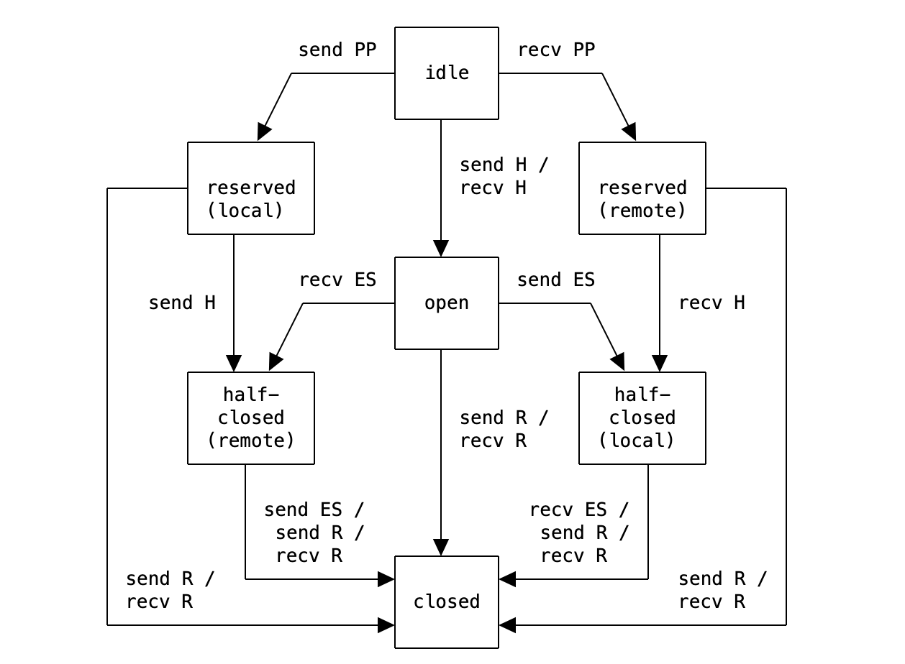

Review
1. 2024-10-29 06:43

> [!Summary]
> 详见 <https://www.rfc-editor.org/rfc/rfc9113#section-5.1>

## 一、Introduction
HTTP/2的流会经过一些生命周期状态。客户端发送HEADERS帧以开启一个HTTP请求（比如GET请求），服务器响应此请求，然后流结束。这个过程经历如下状态：

1. 空闲。流刚被创建或者引用时的状态。
2. 打开。当流被用以发送HEADERS帧时，就是打开的状态，此时流可以用来做双向的消息传递。只要客户端还在发送数据，流都保持在这个状态。因为大多HTTP/2请求只包含一个HEADERS帧，当这个帧被发送完成时，流就可能进入下一状态：半关闭。
3. 半关闭。当客户端使用END_STREAM标志位，表明请求的HEADERS帧已经包含了请求的所有数据时，流就变成半关闭的状态，此时流只能被用来给客户端发送响应数据，客户端不能使用它再发送数据（除非像WINDOW_UPDATE这种控制帧）。
4. 关闭。当服务器完成数据发送，并在最后一个帧上使用END_STREAM标志时，流就变成关闭状态，此时不可以再使用流。

新的承诺的流 (Promise Stream) 会经过一个类似的状态流转过程：
1. 空闲。当承诺（要推送）的流最初被创建，或者被另外一个流上的PUSH_PROMISE帧引用的时候的状态。
2. 保留。推送流直接进入保留状态，直到服务器准备好要推送的资源。你知道流已经存在（所以它起码是空闲的），其将被用于发送指定的资源（此时就不是空闲状态了，所以是保留的状态），但是没有具体资源的详细信息，就像第一个示例中，在接收到HEADERS帧之后的状态。但是因为它只用于推送资源，所以这个流永远不会是打开状态，因为你不会想让客户端在这个流上发送数据。当推送流发送完HEADERS帧之后（在原始的流上发送完PUSH_PROMISE帧之后），它会从保留态变成半关闭状态。明显，半关闭状态是下一个状态。
3. 半关闭。当服务器开始推送响应时，承诺的（推送）流进入半关闭状态，流只能用于发送推送的数据。
4. 关闭。当服务器发送完数据，在最后一个DATA帧上使用END_STREAM标志时，流会变成关闭状态，此时不能再使用流。

图1: HTTP/2 stream lifecycle

`send`: endpoint sends this frame
`recv`: endpoint receives this frame
`H`: HEADERS frame (with implied CONTINUATION frames)
`ES`: END_STREAM flag
`R`: RST_STREAM frame
`PP`: PUSH_PROMISE frame (with implied CONTINUATION frames); state transitions are for the promised stream

## Reference

