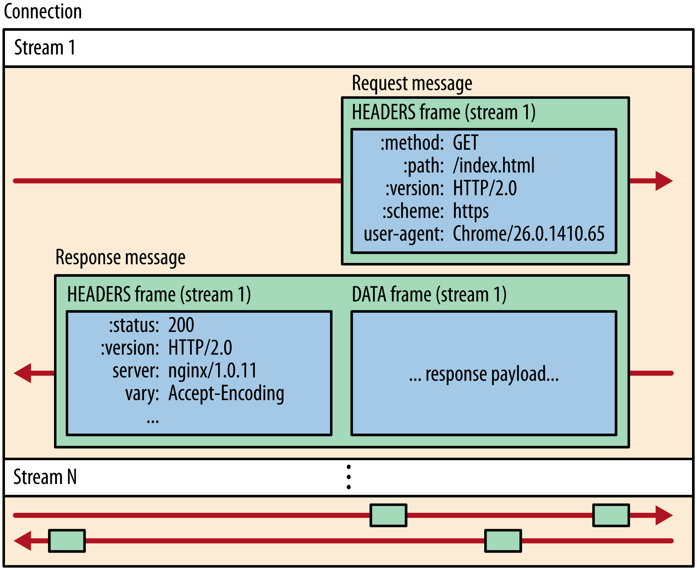
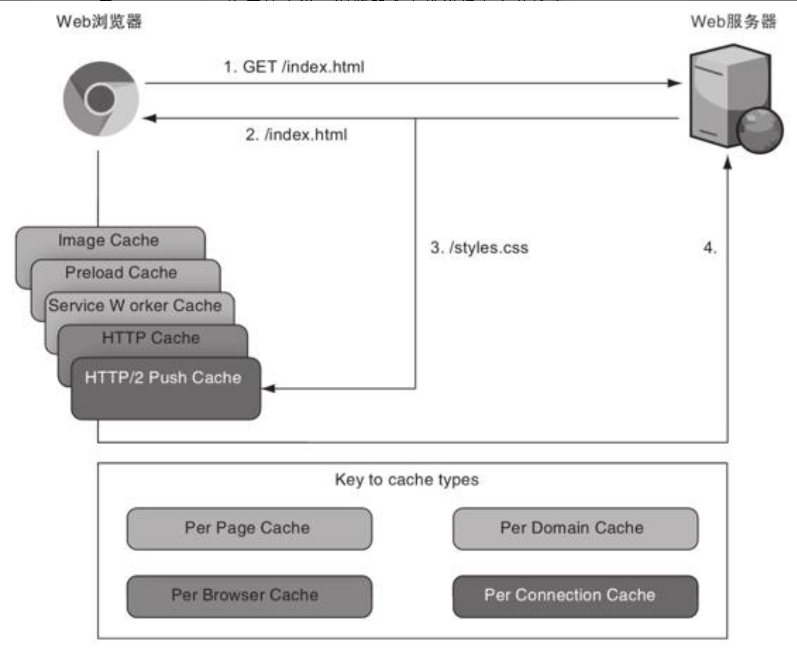
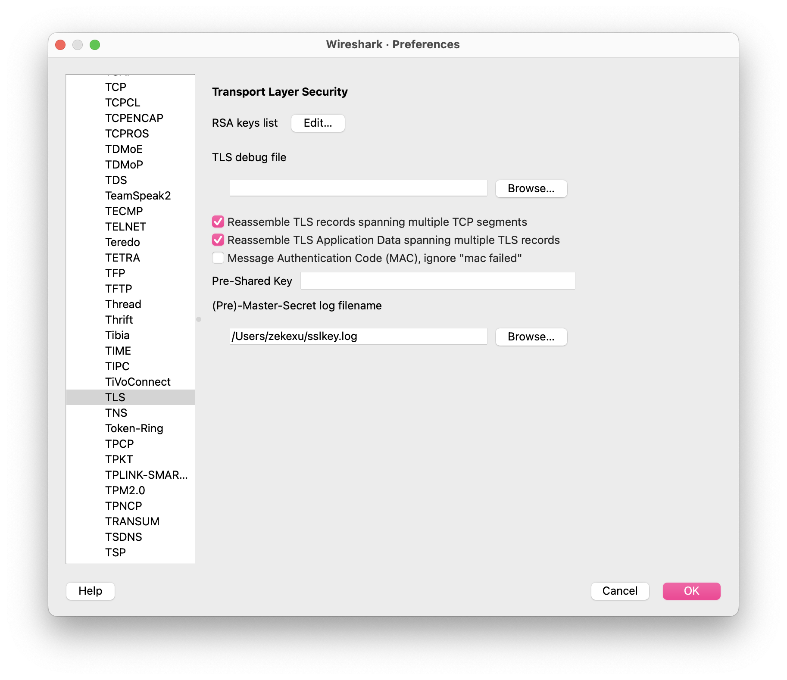
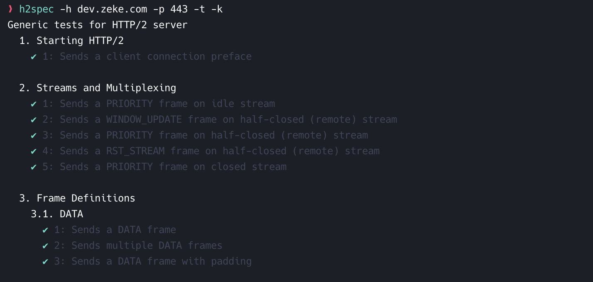

Review
1. 2020/07/23
2. 2024/09/23
3. 2024-09-28 06:34
4. 2024-11-02 20:10

> [!Summary]
> **HTTP/2 is used by** **47.0%** of all the websites.
> Statistics：[https://w3techs.com/technologies/details/ce-http2](https://w3techs.com/technologies/details/ce-http2)
> HTTP/2 浏览器支持超过 96.9%，包括Chrome 41+、Firefox 36+、Safari 9+、IE 11 和 Edge等，详见 [Can I Use HTTP/2](https://caniuse.com/?search=HTTP%2F2) 
> 
> 本文概述了 HTTP/1.1 的现状和瓶颈，并重点介绍了 HTTP/2.0 的特性
> HTTP/2 是SPDY的标准化版本。
> 
> **History**💥
> - 2012年11月，基于SPDY发布了HTTP/2初稿
> - 在2014年底，HTTP/2规范作为互联网的标准被提出
> - 在2015年5月，被正式通过，这就是 **RFC 7450**
> - HTTP/2 最新 *RFC 9113* (June 2022) <https://httpwg.org/specs/rfc9113.html>
> 
> **调试 HTTP/2 协议** 🍎
> 可以使用 `curl`、`tcpdump` 这样的工具来调试协议，而如果要进一步地分析网络数据流则需要诸如 `Wireshark` 这样的 HTTP/2 解析器。

## 一、引言
### 1.1 现状及 HTTP/1.1 瓶颈
#### 现状（2015年HTTP/2诞生之前）
1. 网站资源请求数量越来越多（由原来几个增长到几十个甚至几百个），资源大小也越来越大（从几KB增长到2MB以上）
2. 实时性要求越来越高：移动互联网的爆发，移动网络延迟较高。现代互联网最大的问题之一是延迟而不是带宽。延迟是将单个消息发送到服务器所需的时间，而带宽是指用户可以在这些消息中下载多少内容。

#### HTTP/1.1 瓶颈
> 主要3方面问题：**性能**、**安全**、**无状态**

> HTTP/1 是**基于文本**的**串行请求**协议，首部后面跟着消息体，要发送完请求，并接受完响应之后，才能开始下一个请求。HTTP/1.0 引入了二进制的HTTP消息体（如支持图片）。HTTP/1.1 引入了管道化和分块编码。分块编码和管道化都有**队头阻塞**（HOL）的问题——在队列首部的消息会阻塞后面消息的发送，更不用说，管道化在实际应用中并没有得到很好的支持。

> [!bug]- 性能、安全、无状态问题
> ##### 1、性能问题
> 1. 串行请求：
> 	- 同一连接同时只能处理一个请求/响应
> 2. 连接复用限制
> 	- 每个请求都需要建立新的TCP连接，或者依赖`Keep-Alive`机制
> 	- HTTP/1.0一条连接上只可发送一个请求，HTTP/1.1一条连接可以发送多个请求（Keep-Alive），省去TCP建立连接耗时
> 	- 即使使用`Keep-Alive`，也存在*队头阻塞*问题
> 3. 队头阻塞（Head-of-line blocking）
> 	- 在同一TCP连接上，请求必须按顺序处理（服务器必须按照接收请求的顺序来处理这些请求，响应必须按照请求的顺序返回）
> 	- 一个慢请求会阻塞后续所有请求
> 4. 低效的资源优先级
> 	- 无法有效地设置请求的优先级，致使底层 *TCP 连接的利用率低下*
> 	- 关键资源可能被不重要的资源阻塞
> 5. 协议开销大（大量Header未压缩、冗余）
> 	- 每个请求都携带大量的Header信息，造成带宽浪费，首部信息越多，延迟越大
> 	- 无法有效压缩Header：因为不能高效编码数据，比如使用数字来表达Date首部，而不是使用人类可读的完整文本
> 	- 发送冗余的首部，每次互相发送相同的首部造成的浪费较多
> 6. 服务器推送能力缺失
> 	- 请求只能从客户端开始，服务器无法主动推送资源给客户端
> 	- 客户端必须先请求HTML，然后再请求其他资源
> 7. 延迟问题
> 	- 多次往返（RTT）增加了页面加载时间，特别是在高延迟网络环境下表现糟糕，对于低延迟场景（视频、游戏）影响很大
> 	- HTTP/1.x 客户端需要使用多个连接才能实现并发和缩短延迟
> 8. 缺乏流控制和多路复用
>     - 无法在单个连接上并行处理多个请求/响应，尽管可以在一个连接上发送多个请求，但它们仍然是顺序处理的
>     - 浏览器的同域名并发连接数限制通常为6-8个
> 9. 可任意选择数据压缩格式，非强制压缩发送
> 10. 没有充分利用TCP的一些重要特性
> 
> ##### 2、安全问题
> - 纯文本协议的安全和隐私问题：不强制使用加密，容易受到中间人攻击。需要强制使用HTTPS。
> - 向HTTP首部中添加换行符，可以进行一些HTTP攻击
> 
> ##### 3、无状态问题
> 通过 `Cookie` 可以解决
> 
> 使用 `Cookie` 也有不足：
> - 每个请求都需要携带完整的上下文信息
> - 增加了网络传输量
> 

### 1.2 SPDY（Speedy）
> Google SPDY 从2012年诞生，2016停止维护。
> SPDY的目标在一开始就是瞄准HTTP/1.x的痛点，即*延迟和安全性*，是为了在协议级别消除HTTP所遭遇的瓶颈。

SPDY 在协议层中的位置
- HTTP（应用层）
- SPDY（会话层）
- SSL（表示层）
- TCP（传输层）

> [!Warning]- 主要瞄准的问题：
> - 降低延迟，Client的单连接单请求，Server的FIFO响应队列都是延迟的大头。
> - HTTP最初设计都是Client发起请求，然后Server响应，Server无法主动push内容到Client。
> - 压缩 HTTP Header，http1.x的header越来越膨胀，Cookie和User Agent很容易让Header的大小超过1KB。由于 HTTP 无状态特性，每次请求都必须重复携带Cookie Header，很浪费流量。

> [!Tip]- 基于SPDY，HTTP获得的功能
> 1. 多路复用（multiplexing）。多路复用通过多个请求stream共享一个tcp连接的方式，解决了http1.x HOLB（head of line blocking）的问题，降低了延迟同时提高了带宽的利用率，TCP的处理效率得到提高。
> 2. 请求优先级（request prioritization）。多路复用带来一个新的问题是，在连接共享的基础之上有可能会导致关键请求被阻塞。SPDY允许给每个request设置优先级，这样重要的请求就会优先得到响应。主要是为了在发送多个请求时，解决因带宽低而导致响应变慢的问题。比如浏览器加载首页，首页的html内容应该优先展示，之后才是各种静态资源文件，脚本文件等加载，这样可以保证用户能第一时间看到网页内容。
> 3. Header压缩。前面提到过几次http1.x的header很多时候都是重复多余的。选择合适的压缩算法可以减小包的大小和数量。SPDY对header的压缩率可以达到80%以上，低带宽环境下效果很大。
> 4. Server推送（server push）。http1.x只能由客户端发起请求，然后服务器被动的发送response。开启server push之后，server通过X-Associated-Content header（X-开头的header都属于非标准的，自定义header）告知客户端会有新的内容推送过来。在用户第一次打开网站首页的时候，server将资源主动推送过来可以极大的提升用户体验。
> 5. Server暗示（server hint）。和server push不同的是，server hint并不会主动推送内容，只是告诉有新的内容产生，内容的下载还是需要客户端主动发起请求。server hint通过X-Subresources header来通知，一般应用场景是客户端需要先查询Server状态，然后再下载资源，可以节约一次查询请求。

> Google官方统计SPDY的成绩：页面加载时间相比于 HTTP/1.x 减少了64%
> 连接到底是基于域名来建立，还是不做区分所有子域名都共享一个连接：单连接共享模式表现好

> [!Tip]- 对SPDY方案测试要点
> 1. 建立连接数的选择（单连接共享模式）
> 2. 带宽的影响：网速快的环境下对减小延迟的提升更大
> 3. 丢包率：SPDY对Header的压缩有80%以上，整体包大小能减少大概40%，发送的包越少，自然受丢包率影响也就越小，所以丢包率大的恶劣环境下SPDY反而更能提升体验
> 4. RTT：RTT越大，延迟会越大，在高RTT的场景下，由于SPDY的Request是并发进行的，所以对包的利用率更高，反而能更明显的减小总体延迟。
> 

## 二、HTTP/2 简介

> [!Tip] 简介
> HTTP/2 于 2012 年后期开始讨论，基于 SPDY/3 草案进行一些修改之后发布了 HTTP/2 的 draft-00，并于 **2015/05** 正式发布。
> 
> 所有 HTTP/2 的消息都使用分块的编码技术（Stream+Frame）。[RFC 7230](https://www.rfc-editor.org/rfc/rfc7230#section-4.1) 定义的分块传输编码（Chunked Transfer Coding）不得在 HTTP/2 中使用。由于HTTP/2的DATA帧默认支持被分成多个部分，这就没有必要使用分块编码了。
> 
> Stream 不会被重用：每下载一次资源创建一个 HTTP/2 Stream，下载完成后这个流会被丢弃，这是HTTP/2流不完全等同于 HTTP/1.1 连接的一个原因。在流传输完它的资源之后，流会被关闭。当请求新资源时，会启用一个新的流。流是一个虚拟的概念，它是在每个帧上标示的一个数字，也就是 Stream ID。所以关闭或创建一个流的开销，远小于创建HTTP/1.1连接（包含TCP三次握手，可能在发送请求之前还有HTTPS协议协商）的开销。

> [!Info] 适用场景
> 高延迟、低带宽。提升高延迟、低带宽连接的速度。

> [!Summary]
> - 所有通信都在一个 TCP 连接上完成，此连接可以承载任意数量的双向数据流。
> - 每个数据流都有一个唯一的标识符和可选的优先级信息，用于承载双向消息。
> - 每条消息都是一条逻辑 HTTP 消息（例如请求或响应），包含一个或多个帧。
> - 帧是最小的通信单位，承载着特定类型的数据，例如 HTTP 标头、消息负载等等。 来自不同数据流的帧可以交错发送，然后再根据每个帧头的数据流标识符重新组装。

##### HTTP/2 设计前提
1. Client/Server 请求基本模型不变
2. 老的scheme不会变，使用 `http://` 和 `https://` 的服务和应用不会要做任何更改，不会有`http2://`。
3. 使用 HTTP/1.x 的Client/Server可以无缝的通过代理方式转接到 HTTP/2上。
4. 不识别 HTTP/2 的代理服务器可以将请求降级到 HTTP/1.x。

##### HTTP/2 名词解释
- **Message**：逻辑上的完整的 HTTP 请求或响应，由一个或多个Frame组成。保持 HTTP 协议的语义。
- **Stream**：有唯一的流标识符（Stream ID），1个 TCP 连接可以包含多个Stream，1个Stream可以包含多个Frame。1个Message对应一个Stream ID。Stream可以设置优先级。
- **Frame**：HTTP/2 通信的最小单位，每个帧都包含Frame Header, Stream ID

```txt
TCP连接
|
+--流1(Stream ID=11)
|  |--消息1
|     |--HEADERS帧
|     |--DATA帧
|     |--DATA帧
|
+--流2(Stream ID=13)
|  |--消息2
|     |--HEADERS帧
|     |--DATA帧
|
+--流3(Stream ID=15)
   |--消息3
      |--HEADERS帧
      |--DATA帧
```

##### HTTP/2 请求响应流程


##### HTTP/2 vs HTTP/1.1 请求


##### HTTP/2 Frame 基本结构

```txt
+-----------------------------------------------+
|                 Length (24)                    |
+---------------+---------------+---------------+
|   Type (8)    |   Flags (8)   |
+-+-------------+---------------+-------------------------------+
|R|                 Stream Identifier (31)                     |
+=+=============================================================+
|                   Frame Payload (0...)                       ...
+---------------------------------------------------------------+
```

> HTTP/2 的格式定义更接近TCP层的方式，这种二进制的方式十分高效且精简。

HTTP/2 用Binary格式定义了一个一个的 Frame，Frame内容如下：
- `Length`: 是 `Frame Payload` 的长度，不包括 Frame Header的固定 9 字节。
- `Type`: 帧的类型
- `Flags`: 帧特定的标志位
- `R`: 保留的1位
- `Stream Identifier`: 流标识符
- `Frame Payload`: 帧的实际负载

> [!Tip]- Frame Type（10种）
> Frame定义详见：[Frame Definitions](https://http2.github.io/http2-spec/#FrameTypes)
> 
> DATA (0x0)
> - 用途：传输HTTP消息体
> - 特点：可以设置填充
> 
> HEADERS (0x1)
> - 用途：传输HTTP头部
> - 特点：支持头部压缩(HPACK)
> 
> PRIORITY (0x2)
> - 用途：指定流优先级
> - 特点：设置依赖和权重
> 
> RST_STREAM (0x3)
> - 用途：终止流
> - 特点：包含错误码
> 
> SETTINGS (0x4)
> - 用途：配置连接参数
> - 特点：需要对端确认
> 
> PUSH_PROMISE (0x5)
> - 用途：服务器推送
> - 特点：预告即将创建的流
> 
> PING (0x6)
> - 用途：检测连接活性
> - 特点：要求立即响应
> 
> GOAWAY (0x7)
> - 用途：关闭连接
> - 特点：包含最后处理的流ID
> 
> WINDOW_UPDATE (0x8)
> - 用途：流量控制
> - 特点：增加窗口大小
> 
> CONTINUATION (0x9)
> - 用途：延续HEADERS帧
> - 特点：传输较大的头部块

> [!Tip]- Frame Flags
> END_STREAM (0x1)
> - 表示该帧是流的最后一帧
> 
> END_HEADERS (0x4)
> - 表示该帧是头部块的最后一帧
> 
> PADDED (0x8)
> - 表示帧包含填充
> 
> PRIORITY (0x20)
> - 表示帧包含优先级信息

## 三、HTTP/2 核心特性

> [!Summary]
> 1. 二进制分帧
> 2. 多路复用
> 3. 首部压缩
> 4. 服务端推送
> 5. 请求优先级
> 6. 流量控制

##### 1）二进制分帧
在应用层(HTTP/2)和传输层(TCP or UDP)之间增加一个二进制分帧层
```txt
应用层 (HTTP语义)
    ↓
二进制分帧层  <-- 核心创新
    ↓
传输层 (TCP/TLS)
```

HTTP/2 中新的二进制分帧层（Binary Framing Layer）实现了完整的请求和响应复用：*Client/Server可以将 HTTP Message 分解为互不依赖的 Frame，然后交错发送，最后再在另一端把它们重新组装起来（根据帧首部的 Stream ID 可以重新组装）*。

HTTP/2中二进制协议的基本单元叫 *Frame*（帧），不同 Frame 有不同作用，如：
* **SETTINGS**：用于==配置连接设置==，首先Client向Server发送SETTINGS Frame，Server接收并处理，然后在向 Client 发送 SETTINGS Frame，会包含ACK。该过程有点像在 TCP 连接建立后进行的一次更细粒度的握手，以确保双方对连接的配置达成一致。如是否开启 server push 功能、MAX_FRAME_SIZE、INITIAL_WINDOW_SIZE、HEADER_TABLE_SIZE等等。SETTINGS 帧中的参数是全局的，作用于整个连接，而不是单个流。在连接过程中，双方可以随时发送 SETTINGS 帧来调整连接参数，以适应不断变化的网络环境。
* **HEADERS**：承载 HTTP 头部信息
* **DATA**：承载实际的请求或响应数据
* **WINDOW_UPDATE：** 用于流量控制
* **PUSH_PROMISE**：用于服务端推送

> [!Tip] 扩展
> 1. HTTP/1.x是基于ASCII文本的明文传输协议，文本的表现形式具有多样性，做到健壮性要考虑的场景必然很多；HTTP/2.0基于二进制，实现方便且健壮。
> 2. HTTP/2 中的新二进制分帧层解决了 HTTP/1.x 中存在的队首阻塞（HOLB）问题，也消除了并行处理和发送请求及响应时对多个连接的依赖。 结果，应用速度更快、开发更简单、部署成本更低。
> 3. HTTP/2 通信都在一个TCP连接上完成，这个连接可以承载任意数量的双向数据流。
> 4. 每个逻辑 Message 都以 Frame 进行发送，每个 Frame 都会绑定一个 Stream ID，同一个 Message 的多个 Frame的 Stream ID 相同，不同 Message 的 Stream ID一定不同，Stream ID不能复用。多个不同的 Stream 可以乱序发送，同一个 Stream ID 的不同 Frame，一定是有先后顺序的，如 `HEADERS <- DATA` 

##### 2）多路复用 (Multiplexing)，即连接共享
HTTP/2 多路复用允许对同一个服务器的所有请求，仅通过1个 TCP 连接，同时发起多个请求/响应消息。

特点
1. 单连接多路复用：同一个域名下，所有的请求都通过一个 TCP 连接来完成，不再像 HTTP/1.1 那样为每个请求建立一个新的连接（最大连接数限制位 6～8）。该方式，有效减少 TCP 建立/断开连接次数、减少服务端的连接压力，内存占用更少，连接吞吐量更大。
2. 由于 TCP 连接的减少而使网络拥塞状况得以改善，同时慢启动时间的减少，使拥塞和丢包恢复速度更快。
3. 避免了队头阻塞问题

HTTP/2允许在单个连接上同时执行多个请求，每个HTTP请求或响应使用不同的Stream。通过使用二进制分帧层，给每个 Frame 分配一个 Stream ID，以支持同时发出多个独立请求。当接收到该 Stream 的所有 Frame 时，接收方可以将 Frame 组合成完整 Message。

Frame 是同时发送多个 Message 的关键。每个 Frame 都有 Stream ID 表明它属于哪个Stream，这样在一个连接上就可以同时有两个、三个甚至上百个Stream。

从严格意义上说请求并不是同时发出去的，因为，Frame在TCP连接上需要依次发送。

> 因为HTTP/2中流会被丢弃而且不能重用，而HTTP/1.1保持连接打开，并且可以重新用它来发送另一个请求。

为了防止 Stream ID 冲突，客户端发起的请求使用奇数 Stream ID，服务器发起的请求使用偶数 Stream ID。ID为0的流是客户端和服务器用于管理连接的控制流（控制消息 SETTINGS 和 WINDOW_UPDATE 帧）。

##### 3）首部压缩（Header Compression）
> 使用 **HPACK** 算法，详见 [[HTTP2 HPACK]] 

HTTP/1.x的 Header 由于 Cookie 和 User Agent 很容易膨胀，而且每次都要重复发送。有些特殊的响应首部，如CSP（Content Security Policy）首部，可能会很大，也可能会有重复。HTTP/1允许压缩HTTP正文内容（Accept-Encoding首部），但是不会压缩HTTP首部。

HTTP/2 基于 **HPACK** 算法对 HTTP 请求和响应的头部进行压缩。相较于 HTTP/1.1，这极大地减少了传输的数据量，从而提升了网站的性能。

HPACK 使用了和正文压缩（deflate, gzip, brotli）不同的技术。该技术支持跨请求压缩首部，这可以避免正文压缩所使用算法的安全问题。

HPACK 压缩算法的核心逻辑是通过 **静态表**、**动态表**、==后缀匹配== 和 **霍夫曼编码** 来减少 HTTP 头部数据的传输量。

###### 1. 静态表(Static Table)
- **预定义的头部字段：** 静态表中存储了 HTTP 协议中**常见**的头部字段及其对应的索引值，静态表共 61 个预定义的键值对。
- **减少传输量：** 对于静态表中存在的头部字段，只需传输其索引值，而不需要传输完整的字段名和值。

###### 2. 动态表(Dynamic Table)
客户端和服务器都会维护一个动态表，用于存储在当前连接中频繁出现的头部字段（如 Cookie, Authorization 头部）。通过引用动态表中的索引，可以进一步减少传输的数据量。
- **传输过程中更新**： 动态表初始为空，在编码解码过程中会不断更新，存储最近使用的头部字段。
- **提高重复字段的压缩率：** 对于频繁出现的头部字段，通过动态表可以进一步提高压缩率。
- **有限大小：** 动态表采用FIFO方式管理，大小是有限的，当表满时，会按照一定的规则移除旧的条目。

###### 3. 后缀匹配(Suffix Matching)
- 如果一个头部字段的值与动态表中的某个条目只有后缀不同，那么就可以只传输后缀部分，而不需要重复传输整个值。
- 这对于那些值很长但变化部分较小的头部字段非常有效。

###### 4. 霍夫曼编码(Huffman encode)
- **基于频率的编码：** 霍夫曼编码是一种基于字符出现频率的变长编码方式。
- **高频字符短编码：** 对于出现频率高的字符或字节序列，分配较短的编码，从而减少整体的编码长度。
- **压缩头部字段：** HPACK 使用霍夫曼编码来压缩头部字段的名称和值。

###### HPACK 压缩流程
1. **查找静态表：** 首先，在静态表中查找是否存在完全匹配的头部字段。如果找到，则直接使用索引表示。
2. **查找动态表：** 如果静态表中没有找到，则在动态表中查找。如果找到，则使用索引表示。
3. **后缀匹配**：如果动态表中存在与当前头部字段名称相同的条目，但值不同，则只传输后缀部分。
4. **构造新条目：** 如果上述步骤都找不到，则构造一个新的条目，并将其添加到动态表中，并生成一个新的索引
5. **霍夫曼编码：** 对头部字段的名称和值进行霍夫曼编码。
6. **编码整数：** 使用特定的编码方式对索引值和字符串长度进行编码。

##### 4）服务端推送（Server Push）
> [!Tip] 简介
> 在 HTTP/2 中，服务器可以对*客户端的一个请求发送多个响应*。推送资源是为了响应初始请求而做出的额外响应。
> 通过push的方式将客户端需要的内容预先推送过去，所以也叫 “cache push”。在理想情况下，应该*只推送页面需要的可能缓存里没有的关键资源*。仅推送需要的最少资源，来“填充空闲的网络时间，不要做多余的操作”。HTTP/2推送被提议时，目的是作为*内联关键资源*的替代方案。
> 
> 主要的思想：当一个客户端请求资源X，而服务器知道它也需要资源Z的情况下，服务器可以在返回X的响应时，push资源Z给客户端。这样当在客户端发送请求资源Z前，已经接收到了资源Z。

###### 推送方案
1. 基于 `Link` Header （HTTP/1.1支持的方式，通过 `Link` Header 暗示客户端）
2. 基于 `PUSH_PROMISE(0x5)` Frame （HTTP/2 支持）
3. 基于 `103 Early Hints` 响应状态码

###### ➀ 基于 `Link` Header 推送
在 HTTP/1.1 中，服务器可以通过在响应头中添加 `Link` 头部来暗示客户端，该页面还依赖哪些资源。浏览器在解析 HTML 时，会根据 `Link` 头部中的信息，提前发起对这些资源的请求。*它只能暗示浏览器预加载资源，不能保证浏览器一定会按照预期加载。*

```http
Link: <https://example.com/style.css>; rel=preload; as=style
```
- `<https://example.com/style.css>`：要预加载的资源的 URL。
- `rel=preload`：表示这是一个预加载资源。
- `as=style`：表示预加载的资源是一个样式表。

推送 `Link` 首部经常包含在条件语句中，以支持仅对指定的路径或者文件类型推送资源。

通过HTTP `Link` 首部直接推送的优势是，服务器不需要在推送前等资源返回以查看 Link 首部。

###### ➁ 基于 `PUSH_PROMISE` 推送

典型的 `PUSH_PROMISE` Frame 包含以下信息：
- **Stream ID：** 表示被推送的资源所在的 Stream。
- **被推送资源的路径：** 即将推送的资源的 URL。
- **头部块：** 包含了与被推送资源相关的头部信息，例如 Content-Type、Content-Length 等。

服务器在发送响应之前，可以通过 `PUSH_PROMISE` Frame（Stream ID还是原请求Stream的ID）告知客户端，它打算推送哪些额外的客户端没有明确请求的资源，每个 `PUSH_PROMISE` 帧都会创建一个新的 Stream，用于传输被推送的资源。客户端不需要再发送额外的请求来获取这些资源，从而减少了RTT（Round Trip Time），提高了页面加载速度。

> [!Warning] 注意 🍉:
> - `PUSH_PROMISE` Frame 必须 *优先主请求响应发送*，否则浏览器可能在推送资源到达前已经发起了依赖资源请求，造成重复和浪费。
> - 如果要推送的资源首部比较大，则它 `HEADER` frame后面也会跟一个 `CONTINUATION` frame。
> - 客户端可以通过发送 **RST_STREAM** frame 来拒绝推送资源，使用一个 `CANCEL` 或者 `REFUSED_STREAM` 代码即可。只有在浏览器知道它不需要推送的资源时，`RST_STREAM` frame 才有用。如果HTTP缓存中已经有资源，明显可以利用 `RST_STREAM` frame 来停止推送。
> - Web服务器不能给其他域名推送资源。
> - 服务端推送的资源在Chrome开发者工具中以Initiator列显示。


如果使用方法正确，HTTP/2推送可以减少加载时间。但如果你多推送了资源（客户端不需要，或者已经在缓存里），则将会延长加载时间。这会浪费带宽，本来应该用这些带宽加载需要的资源。所以，在使用HTTP/2推送时应该小心，经过考虑后再使用。

###### ➂ 103 Early Hints
允许服务器在准备完整响应之前，向客户端发送一些提前提示，告诉客户端哪些资源即将被加载。这对于提升网页加载速度具有重要意义。

**工作原理**
1. 服务器发送 103 Early Hints 响应：
    - 在准备完整响应之前，服务器向客户端发送一个 103 Early Hints 响应。
    - 响应中包含 `Link` 头部，指示哪些资源需要提前加载。
2. 浏览器解析 `Link` 头部：
    - 浏览器接收到 103 Early Hints 响应后，会解析 `Link` 头部中的信息，并开始提前加载指定的资源。
3. 服务器发送完整响应：
    - 服务器准备好完整响应后，再发送 200 OK 响应。

```http
HTTP/1.1 103 Early Hints 
Link: <https://example.com/style.css>; rel=preload; as=style 
Link: <https://example.com/font.woff2>; rel=preload; as=font 

HTTP/1.1 200 OK 
...
```

> [!error] Client Hints 规范
> 💛 并非所有浏览器都支持 103 Early Hints，需要进行兼容性检测。
> 
> 当第一次使用103时，在许多HTTP实现（例如Web浏览器）中发现了一些问题，这些实现不能接收多个HTTP响应，因为1XX信息响应的应用不够广泛，只在指定情况下才能使用它。从技术上讲，这个变化是一个非破坏性的变化，不需要更新版本。但由于它与现有的状态码略有不同，许多客户端认为这是一个破坏性的变化，直到它们纠正了自己的实现。

> [!Tip]- 推送策略
> 服务端如何推送一个资源，浏览器处理推送的方式与你猜想的不太一样。*资源不是被直接推到网页中，而是被推到缓存中*。跟平常一样处理网页。当页面知道它需要什么资源时，它先查看缓存，如果发现缓存中有，就直接从缓存中加载，而不需要向服务端请求。
> 
> 1. 服务器可以记录它在一个客户端的连接上推送过哪些资源。这项技术的实现取决于服务端，可以基于连接，或者会话ID等。比如，每次推送一个资源时，服务器要记住，在这个连接/会话上不再推送同样的资源，就算被要求推送。
> 2. 客户端发送一个 `If-Modified-Since` 或者 `Etag` 首部，而引用这个CSS的页面已经在浏览器的缓存中，但已过期。当你看到类似的首部时，可以选择不推送这个CSS资源，因为这个样式文件可能已经在缓存中了。
> 3. 在客户端记录哪些资源已经被推送。Cookie是做这个的理想载体，当然也可以使用 LocalStorage 和SessionStorage。当推送资源时，设置一个会话 `Cookie` 或者和被推送的资源时间相同的 `Cookie`。当页面中每个请求到达时，检查是否存在这个 `Cookie`。如果 `Cookie` 不存在，则资源可能就不在浏览器缓存中，那么就推送资源并设置 `Cookie`。如果 `Cookie` 存在，就不推送资源。
> 4. *缓存摘要*是一个提议（已废弃），浏览器用它来告诉服务器缓存里有什么内容。当连接建立时，`浏览器发送一个CACHE_DIGEST` frame，列出当前域名（或者本连接授权的其他域名）的HTTP缓存中的所有资源。`CACHE_DIGEST` frame 应该在连接建立之后尽快发送。在2019年1月，HTTP工作组声称，他们不会继续进行标准化缓存摘要的工作。安全和隐私问题是停止缓存摘要标准化的原因。
> 5. 在 `SETTINGS` frame 中将 `SETTINGS_ENABLE_PUSH` 设置为0，客户端可以禁用推送。此后，服务端不能使用 `PUSH_PROMISE` frame。


> [!Tip]- 推送规则
> - 推送请求必须是一些安全可以缓存的请求（通常为 `GET`、`HEAD` 和一些 `POST` 请求）。
> - 推送请求不能包含请求体（但经常包含响应体）。
> - 只将推送请求发送到权威服务器的域。
> - 客户端不能推送，只有服务端可以。
> - 资源可以在当前请求的响应中推送。如果没有请求，则服务端不可能发起一个推送。
> 
> 实际上，由于这些规则，只有 `GET` 请求会被推送。


> [!Warning] HTTP/2 推送风险：
> - 很容易就会推送过多的内容，这会降低网站性能。
> - HTTP/2推送带来的性能提升可能没那么大，但是风险很高。
> - 相较于使用 Server Push，配合使用预加载和 103 Early Hints可能更好。
> - HTTP/2推送可能有其他应用场景，但有些需要更改协议。


> [!Quote] 扩展
> 有一个叫作 Signed HTTP Exchanges 的有趣协议（之前叫 Web Packaging），通过它可以在域名上提供签名的资源，就像是直接从源站提供的一样，这使得推送其他网站的资源高效了很多。
> 
> 也许等到 103 Early Hints 首部得到更好的支持的时候，过量推送的问题已经可以使用缓存摘要或者类似技术解决了。


###### 扩展 - 浏览器缓存分类


浏览器缓存分类（优先级由上到下）
1. **内存缓存（和页面绑定）**：包括图片缓存和Preload缓存。图片缓存是一个短期的内存中的缓存。当页面多次引用一个图片时，它可以防止多次下载图片。当用户离开页面时，缓存被销毁。preload缓存是另外一种短期的内存中的缓存，它用来缓存预加载的资源。同样，这个缓存是跟页面绑定的。不要给另外一个页面预加载资源，因为它用不到。
2. **Service worker缓存**：它独立于网页运行，可以作为网页和网站的中间人。它可以让网站表现得更像原生应用，比如你可以在没有网络的时候运行。它们有自己的缓存和域名绑定。
3. **HTTP缓存**：它是一种基于磁盘的持久缓存，多个浏览器可以共享，每个域名使用有限的空间。
4. **HTTP/2 推送缓存（和连接绑定）**：HTTP/2推送缓存是一个短期的内存中的缓存，它和连接绑定，最后才使用它。HTTP/2推送缓存是一个短期的内存中的缓存，它和连接绑定，最后才使用它。最后，当资源从连接的推送缓存中被“认领”并拿出后，就不能再从推送缓存中使用它了。如果HTTP cache-control首部设置了缓存，则可以从浏览器的HTTP缓存中获取。推送缓存还有一点和HTTP缓存不同，那就是不缓存的资源（在HTTP cache-control首部中设置了no-cache和no-store）也可以被推送，并可以从推送缓存中读取它们。

##### 5）请求优先级(Priority)
在多路复用场景下，如何有效地管理这些请求的优先级就变得尤为重要。

HTTP/2 定义了 3 种方式来设置请求优先级（高优先级获得更多的frame）：
- **帧头中的优先级标志（priority flag）：** 这个标志位用于快速判断一个流的优先级高低
- **流依赖（Stream Dependency）：** 将一个流（子流）依赖于另一个流（父流）。子流的优先级会继承父流的优先级，并且只有父流完成之后，子流才会被处理。
- **流权重（Stream Weight）：** 权重值是一个相对的概念，表示一个流相对于其他依赖于相同父流的流应该分配的资源比例。权重越高，分配的资源（Frame）就越多。

事实是，优先级问题本身是复杂的，同时支持依赖和权重，或者两者混合，可以大大增加优先级的灵活性。

> [!Quote]- 一些解释
> 1. 客户端可以在开启一个 Stream 时，通过设置在 *HEADER*  帧里的 *PRIORITY* 这个 flag，来指定流的优先级。这样子就可以做到高优先级（如核心 CSS、HTML），优先发给客户端。
> 2. Stream 优先级由请求方指定（比如客户端），但由响应方（比如服务器）最终决定发送什么帧。所以，优先级是一种建议或提示，完全由响应方决定要不要忽略优先级，并且以响应方认为的顺序返回数据。客户端（如浏览器）可能会决定优先级。也可能服务端会覆盖这些配置，但大多数情况下，采用客户端的优先级。
> 3. 服务器发送响应的顺序完全取决于服务器，但客户端可以指定优先级。如果可以发送多个响应，则服务器可以进行优先级排序，先发送重要资源（例如CSS和JavaScript），然后是不太重要的资源（例如图像）。
> 4. 所有的流都默认依赖于流0，它是控制流，没有依赖。使用流优先级的目的是尽量高效利用连接，而不是作为一种阻塞机制。HTTP/2依赖模型不支持多依赖（虽然和权重的方法类似）。
> 5. 另外一个有助于定义流优先级的概念是流权重，其用于给两个依赖同一个父资源的请求设定优先级。相比于假定同一个依赖水平的资源权重相同，流权重可以支持更复杂的场景。
> 6. 假流（Stream id 1,3,5,7,9）仅用于优先级排序，永远不会被用来直接发送请求。

##### 6）流量控制（Flow Control）
HTTP/2 引入了流量控制机制，以确保客户端和服务器之间的数据传输不会淹没对方，从而提高连接的稳定性和可靠性。流量控制是对同一个TCP连接上发送多个流的一种控制方式。

###### 流量控制的基本原理
- **窗口大小：** 每个连接和每个流都会有一个窗口大小，表示接收方当前可以接受的最大字节数。
- **窗口更新：** 当接收方处理完一部分数据后，会发送 `WINDOW_UPDATE` 帧来通知发送发进行窗口大小更新。
- **流量控制窗口：** 发送方在发送数据之前，必须检查接收方的窗口大小，确保发送的数据不会超过窗口的限制。

###### 流量控制的流程
1. **初始窗口大小：** 连接建立时，客户端和服务器会协商一个初始的窗口大小。
2. **发送数据：** 发送方在发送数据帧之前，会检查接收方的窗口大小。如果剩余窗口大小足够，则发送数据；否则，需要等待接收方发送 WINDOW_UPDATE 帧。
3. **更新窗口：** 接收方处理完一部分数据后，会计算出新的窗口大小，并发送 WINDOW_UPDATE 帧通知发送方。
4. **调整窗口：** 发送方接收到 WINDOW_UPDATE 帧后，会更新本地维护的窗口大小。
5. **重复上述过程：** 整个过程会不断重复，以实现对流量的动态控制。

初始的数据窗口大小可以通过 `SETTINGS` frame 设置（如果不指定，默认为 65535 个8位字节），每次发送都会从总量中减去发送的数据（Frame payload）的大小，然后接收方接收到的响应数据后，发送 `WINDOW_UPDATE` Frame 把大小加回去。所以，`WINDOW_UPDATE` 帧是一个简单的帧，没有任何标志位，只有一个值（和一个保留位）。具体什么时候发送 `WINDOW_UPDATE` 帧（在每个DATA帧被消费完？接近限制的时候？还是周期性的？）取决于各端实现。`nghttp` 在消费的数据达到窗口大小的一半时发送此帧。使用 `nghttp` 的`-w`和`-W`参数，来设置不同的初始窗口大小。

###### 流量控制的意义
- 防止接收方过载： 避免接收方缓冲区溢出，导致数据丢失。
- 提高连接稳定性： 通过平滑数据流，减少网络抖动对连接的影响。
- 支持多路复用： 确保多个流之间能够公平地共享带宽。

> 如果接收方处理消息的速度慢于发送方，就会存在积压，需要将数据放入缓冲区。而当缓冲区满时会导致丢包，需要重新发送。在连接层，TCP支持限流，但HTTP/2要在流的层面实现流量控制。

###### HTTP/2 流量控制的特性
- **流级别和连接级别：** HTTP/2 在流级别和连接级别都实现了流量控制。
- **动态调整：** 窗口大小可以动态调整，以适应网络条件的变化。
- **基于字节：** 流量控制是以字节为单位的，而不是以帧为单位。


HTTP/2 的 flow control 是类似 receive window 的做法，数据的接收方通过告知对方自己的 flow window（*WINDOW_UPDATE帧*）大小表明自己还能接收多少数据。

*只有 DATA frame 才有 flow control 的功能*。所有其他类型的帧（至少目前定义的），就算超出了窗口大小的限制也可以继续发送。这个特性可以防止重要的控制消息（比如 `WINDOW_UPDATE` Frame 自己）不被较大的DATA frame 阻塞。

## 四、HTTP/2 协议协商方案
HTTP/2 作为 HTTP/1.1 的继任者，在不引入全新协议的基础上，通过现有 HTTP 协议进行协商，成功实现了向新协议的过渡。所以客户端和服务器之间在确立使用HTTP/1还是HTTP/2之前，必须要确认对方是否支持HTTP/2，所以这里必须要有个协商的过程。

##### 建立 HTTP/2 连接的方法（协商使用 HTTP/2 协议的方式）
1. **基于HTTPS协商**：HTTP/2 使用此方式。在建立 TLS 连接时，客户端会通过 ALPN Extension 告知服务器自己支持的协议列表，通常包括 HTTP/2 和 HTTP/1.1。服务器会基于自己支持的协议选出一个双方都支持的最高版本协议，然后通知客户端。Chrome 和 Opera 仅支持基于 ALPN 的HTTP/2。ALPN 仅包含在 `OpenSSL@^1.0.2` 中。
2. 基于 HTTP Upgrade 首部协商(Negotiation)：通过发送Upgrade首部，客户端可以请求将现有的HTTP/1.1连接升级为HTTP/2。这个首部应该只用于未加密的HTTP连接（h2c）。基于加密的HTTPS连接的HTTP/2（h2）不得使用此方法进行HTTP/2协商，它必须使用ALPN。
3. 基于先验知识（前置知识）：客户端使用HTTP/2的方法是，看它是否已经知道服务器支持HTTP/2。如果它知道，则可以马上开始使用HTTP/2，不需要任何升级请求。此方法是风险最高的方法，因为它假设服务器可以支持HTTP/2。使用先验知识的客户端必须注意妥善处理拒绝信息，以防之前的信息有误。
4. 基于 HTTP Alternative Services（替代服务）：此标准允许服务器使用HTTP/1.1协议（通过 `Alt-Svc` HTTP首部）通知客户端，它所请求的资源在另一个位置（例如，另一个IP或端口），可以使用不同的协议访问它们。该协议可以使用先验知识启用HTTP/2。


> [!Summary]
> 1. **ALPN**（Application Layer Protocol Negotiation，应用层协议协商）
> 2. NPN（Next Protocol Negotiation）：SPDY使用此方式，存在安全问题，已过时废弃
> 
> ALPN很简单，它可以在现有的TLS协商消息中协商HTTP/2协议，不会引入额外的消息往返、跳转，或者其他的升级延迟。对TLS协议本身影响很小。
> 
> ALPN在*2014年7月*完成，在HTTP/2完成之前，其RFC只规定了它在HTTP/1.1和SPDY下应用的方法。后来，HTTP/2 ALPN扩展注册了，作为完整的HTTP/2规范的一部分。
> 
> NPN是ALPN之前的一个实现，两者工作方式类似。尽管被很多浏览器和Web服务器使用，但是它从来没有成为正式的互联网标准（虽然有一个草案在编制中）。ALPN成为正式标准，它在很大程度上是基于NPN实现的，正如HTTP/2是基于SPDY的，而HTTP/2成了一个正式版本。
> 
> 两者的主要区别是，*在使用NPN时，客户端决定最终使用的协议*，而*在使用ALPN时，服务端决定最终使用的协议*。
> 
> 现在不再推荐使用NPN，应该使用 **ALPN**。

HTTP/2 规范没有规定必须基于 HTTPS，但是所有浏览器厂商都表示，他们将仅支持基于HTTPS的HTTP/2，这使其成为事实上的标准。

## 五、HTTP/2 扩展

##### 新伪首部
HTTP/2 定义了新的伪首部（以冒号 `:` 开始），以定义HTTP请求中的不同部分。HTTP/2强制首部名称小写
- The "`:method`" pseudo-header field includes the HTTP method
- The `:authority` 代替了原来HTTP/1.1的 `Host` 首部
- The "`:path`" pseudo-header field includes the path and query parts of the target URI (the `absolute-path` production and, optionally, a '?' character followed by the `query` production;
- The "`:status`" pseudo-header field is defined that carries the HTTP status code field
##### HEADERS frame vs CONTINUATION frame
CONTINUATION frame 要求紧跟在 HEADERS frame 后面，其中不能插入其他帧，这影响了HTTP/2的多路复用，人们正考虑其他替代方案。实际上 CONTINUATION frame 很少使用，大多数请求都不会超出一个HEADERS帧的容量。太大的首部需要使用 CONTINUATION frame（0x9），它紧跟在HEADERS帧或者 PUSH_PROMISE frame 后面。CONTINUATION帧只定义了一个标志位，就是在普通的帧首部中可以设置的那个。当设置flag 为 END_HEADERS（0x4）的时候，表明HTTP首部内容到此帧结束，后续没有别的 CONTINUATION frame 了。

Header Block Fragment 是 HTTP/2 协议中为了提高传输效率和灵活处理大头部而引入的一个概念。通过将头部拆分成多个帧，可以更好地适应网络传输的特性，提高 HTTP 请求和响应的性能。

**简而言之，Header Block Fragment 就是 HTTP/2 中用来传输被压缩和分片的请求头的一部分。**

Header Block Fragment（首部块片段）字段包含首部和伪首部
- **HEADERS frame：** 用于建立一个新的流，并携带初始的 Header Block Fragment。
- **CONTINUATION frame：** 用于承载后续的 Header Block Fragment，以完成整个请求头的传输。

##### 尾随首部
HTTP/1.1引入了尾随首部的概念，可以在正文之后发送它。这些首部可以支持不能提前计算的信息。例如，在以流的形式传输数据时，内容的校验和或者数字签名可以包含在尾随首部中。实际上，尾随首部的支持很差，很少应用。但是HTTP/2决定继续支持它，所以一个 HEADERS frame（或者一个后跟 CONTINUATION frame 的HEADERS frame）可能出现在流的DATA frame之前或者之后。

HTTP/2 的 DATA frame 比较简单，它包含所需要的任何格式的数据：UTF-8编码、gzip压缩格式、HTML代码、JPEG图片的字节，什么都行。在 frame 首部中包含了长度(Length)，所以 DATA frame 自己的格式中不需要包含长度字段。

##### 其他帧介绍
> 每一个新的HTTP/2帧类型、HTTP/2的设置项和HTTP/2的错误码，都必须在 IANA（Internet Assigned Numbers Authority，互联网数字分配机构）注册。

###### GOAWAY帧(0x7)
用于关闭连接，当连接上没有更多的消息，或发生了严重错误时使用该帧。GOAWAY帧使用最小的8字节的长度发送（1bit + 31bit + 32bit），没有任何标志位，帧使用的 Stream ID为0。

###### PING帧(0x6)
用以计算发送方的消息往返时间，也可以用来保持一个不使用的连接。当收到这类帧的时候，接收方应当马上回复一个类似的PING帧。两个PING帧都应当在控制流（Stream ID为0）上发送。

###### RST_STREAM(0x3)
用于直接取消（重置）一个流。该取消可能是由于一个错误，或者是因为请求已经不需要进行了。可能是客户端已经跳转到其他页面、取消了加载，或者不再需要服务器推送的资源了。


> 新增了三个新的帧类型——ALTSVC、ORIGIN和CACHE_DIGEST

###### ALTSVC（0xa）
在HTTP/2规范被批准之后，ALTSVC帧（0xa）是第一个追加到HTTP/2中的帧。在一个单独的规范中对其进行了解释，其允许服务端宣告获取资源时可用的其他服务。这个帧可以用来进行升级（比如从h2升级到h2c）或者重定义流量到另外一个版本。

###### ORIGIN帧（0xc）
于2018年3月标准化，服务器使用它来宣告自己可以处理哪些源（比如域名）的请求。当客户端决定是否合并HTTP/2连接的时候，该帧非常有用。

###### CACHE_DIGEST帧（0xd）
是一个新的帧提议，客户端使用这个帧来表明自己缓存了哪些资源。例如，它指示服务器不必再推送这些资源，因为客户端已经有了。

> 已废弃, Expired  

更多资料
- [Cache Digests](https://wiki.squid-cache.org/SquidFaq/CacheDigests) 
- [Cache Digest specification v5](https://www.squid-cache.org/CacheDigest/cache-digest-v5.txt) 

##### 连接合并
HTTP/2 规范允许多个域名使用同一个 HTTP/2 连接，前提是它们是 authoritative（官方）的域名。就是说，这些域名被解析到同一个IP地址，并且HTTPS证书中同时包含这些域名。首先，只有在这些域名指向同一台服务器时连接合并才生效。如果服务器不同，就会使用不同的连接。另外一个问题是，浏览器要实现连接重用的功能，而有些浏览器并没有这么做。规范只是说连接可以被重用，但是没说一定要重用。在撰写本书时，Safari和Edge不会做合并，而Chrome和Firefox会。

简单地说，连接合并比较复杂，所以不建议依赖此项特性。反而，要看是否需要域名分片，看它是否会带来性能提升。如果想要保留域名分片的功能，最好在不同的服务器上使用该功能，以防止连接合并带来复杂问题。


> 记住，HTTP/2在大多数场景下比HTTP/1.1要快。难道你能因为一些非常少见的情况，就放弃使用更好的HTTP/2吗？


现在已经使用ALTSVC、ORIGIN和（提议中的）CACHE_DIGEST帧对协议进行了扩充。也还有其他的提议，例如二级证书，因此存在一种强有力的方法来持续扩展协议：使用新的帧类型

WebDAV（Web Distributed Authoring and Versioning，Web分布式创作和版本控制）引入了一些新方法（`包括PROPFIND`、`COPY` 和 `LOCK`），有一些RFC引入了其他方法，但最后一个方法是在2010年注册的（BIND）。

HTTP/2明确禁止使用以冒号（:method、:scheme、:authority、:path和:status）开头的新伪首部，但这些字段可以通过新的规范添加（例如:protocol伪首部是在Bootstrapping Websockets over HTTP/2 的RFC中添加的）

##### HTTP/2 升级为 WebSockets
**HTTP/2** 协议的设计目标是提高 HTTP 性能，通过多路复用等技术来实现。而 **WebSocket** 协议则更适合实时双向通信。为了在 HTTP/2 上建立 WebSocket 连接，需要一种既能保持 HTTP/2 连接的优势，又能实现协议升级的方式。**CONNECT** 方法就是一种比较常用的方法，它可以将 HTTP/2 连接升级为 WebSocket 连接，同时保持连接的多路复用特性。


## 六、HTTP/2 实际应用

##### 测试 ALPN 支持情况
1. 在线工具
	- SSL Labs Test <https://www.ssllabs.com/ssltest/> 
	- KeyCDN HTTP2/ Test <https://tools.keycdn.com/http2-test> 
2. 命令行工具
	- cURL 命令
	- OpenSSL `s_client` 命令
	- `testssl` <https://testssl.sh/> 
	- `nmap` 
	- `h2i` 

```sh
curl -vso /dev/null --http2 https://www.juejin.cn
```

```sh
# 显示更多ALPN相关信息
curl -v --tlsv1.2 --alpn h2 https://example.com
```

```sh
openssl s_client -alpn h2 -connect www.juejin.cn:443 -status
```
输出中查找：
- "ALPN protocol: h2" - 表示协商成功使用HTTP/2
- "ALPN protocol: http/1.1" - 表示降级到HTTP/1.1

```sh
# 使用NSE脚本检测
nmap --script http2-alpn -p 443 example.com
```

```sh
# 安装
go get github.com/golang/net/http2/h2i

# 使用
h2i example.com:443
```

##### 查看 HTTP/2 消息的方式
1. Chrome <chrome://net-export/> <https://netlog-viewer.appspot.com/> ⭐️⭐️⭐️
2. `nghttp` 协议一致性 ⭐️⭐️⭐️
3. `Wireshark` 问题排查⭐️⭐️⭐️
4. `h2spec` 协议一致性
5. `Mitmproxy` 问题排查
6. `tcpdump` 
7. `k6` <https://k6.io/> 性能测试
8. `WebPageTest` 性能测试
9. `Fiddler` 

###### `nghttp`
`nghttp` 是一个基于 `nghttp2` C库开发的命令行工具，许多Web服务器和客户端使用它来处理底层的HTTP/2协议

```sh
nghttp -v https://juejin.cn
```

```sh
nghttp -avn https://juejin.cn
```

###### Wireshark 调试 HTTP/2 需要配置密钥
启动 Wireshark，打开 `Preferences` ，选择 `Protocols` -> `TLS` 然后配置 `(Pre)-Master-Secret log filename`


然后通过命令行打开Chrome浏览器
```sh
export SSLKEYLOGFILE=~/sslkey.log
open /Applications/Google\ Chrome.app
```

然后随便访问一个支持 HTTP/2 的网站即可。


##### 启用 HTTP/2
配置服务器，启用 HTTP/2，可以参考 [Mozilla SSL Configuration Generator](https://ssl-config.mozilla.org/#server=nginx&version=1.26.0&config=modern&openssl=3.2.1&guideline=5.7)

客户端应用探查使用的是HTTP/1还是HTTP/2的方案
Resource Timing Level 2 API包含一个 `nextHopProtocol` 属性提供了相关的信息
一般在服务端检测所使用的协议，并将该信息返回给客户端比较好。

##### HTTP/2 一致性测试工具
- `h2spec`

```sh
h2spec -t -S -h dev.zeke.com -k -p 443
```




## 七、总结
##### HTTP/2 不足
1. TCP 以及TCP+TLS **建立连接的延时**：无论是 HTTP/1.1 还是 HTTP/2，都依赖于 TCP 连接。建立 TCP 连接需要进行三次握手，这会带来一定的延迟，尤其是在移动网络或弱网环境下。
2. **TCP 的队头阻塞**并没有彻底解决：虽然 HTTP/2 引入了多路复用，但底层的 TCP 协议仍然存在队头阻塞的问题。如果一个流中的数据包丢失，整个流的数据传输都会被阻塞，直到丢失的数据包被重传。

##### 常见 HTTP/2 攻击
- **HTTP/2 Rapid Reset 攻击：**
    - **原理：** 攻击者通过大量发送 HTTP/2 HEADERS 帧，然后立即发送 RST_STREAM 帧来重置这些流，从而消耗服务器资源，导致拒绝服务。
    - **危害：** 这种攻击效率极高，能够在短时间内产生大量流量，对服务器造成巨大的压力。

## Reference
1. 官网：<https://http2.github.io/>
2. HTTP/1.1 vs HTTP/2: What's the Difference?: https://www.digitalocean.com/community/tutorials/http-1-1-vs-http-2-what-s-the-difference 
3. 文档源码：<https://github.com/bagder/http2-explained>
4. 文档地址：<https://http2-explained.haxx.se/>
5. RFC7540（2015年5月15日）：<https://www.rfc-editor.org/rfc/rfc7540>
6. High Performance Browser Networking: <https://hpbn.co/http2/>
7. [7 Tips for Faster HTTP/2 Performance](https://www.nginx.com/blog/7-tips-for-faster-http2-performance/)  中文：<https://www.w3ctech.com/topic/1563#tip7sharding>
8. HTTP/2.0资料汇总：<https://imququ.com/post/http2-resource.html>
9. HTTP/2 简介：<https://developers.google.com/web/fundamentals/performance/http2?hl=zh-cn>
10. [RFC 7541 - HPACK: Header Compression for HTTP/2](https://httpwg.org/specs/rfc7541.html) 
11. 知乎讨论：<https://www.zhihu.com/question/34074946>
12. 服务器实现记录：<https://github.com/http2/http2-spec/wiki/Implementations>
13. 服务端推送（Server Push） https://www.infoq.cn/article/qydn85t4g4dl4vbae3n2 

