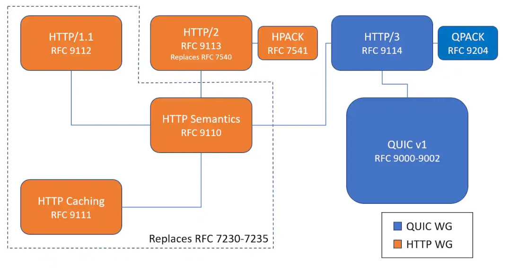
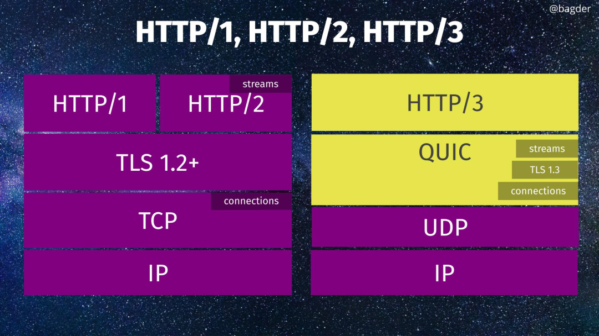

Review
1. 2020/07/23
2. 2022/06/11
2. 2024-09-28 09:49

> [!Summary]
> 基于 *QUIC* 的HTTP/3.0
> 
> QUIC WG <https://quicwg.org/> 
> RFC 9000 [QUIC: A UDP-Based Multiplexed and Secure Transport](https://www.rfc-editor.org/rfc/rfc9000.html) 
> 最新RFC June 2022 [RFC 9114](https://httpwg.org/specs/rfc9114.html) 
> 
> Books 📚
> 《解析QUIC/HTTP3：未来互联网的基石》2024/07

## 一、Introduction
HTTP/3 即 HTTP-over-QUIC，是采用了 **QUIC** 进行传输的新 HTTP 协议。

QUIC (*Quick UDP Internet Connections*) 是降低延迟、可靠且安全的新一代互联网传输协议，被认为可取代当今最常用的传输协议 TCP。原因之一是它在连接创建期间大大减少开销，QUIC 使用 UDP 协议作为其基础，不包括丢失恢复。最初由谷歌开发，当 IETF 开始标准化 QUIC 时，它分成了两个层：传输和 HTTP。该传输协议能用于传输其它数据，不限于 HTTP 或类 HTTP 协议。

> QUIC开始是 Quick UDP Internet Connections 的缩写，此协议面世时大多数Google Chromium文档中都是这样写的。在标准化的过程中，QUIC工作组决定丢弃这个缩写，随后在QUIC的规范中明确声明，“QUIC是一个名字，不是缩写。”

QUIC的定位是更广泛、更通用的传输层协议，不仅仅适用于HTTP，而HTTP/3只是QUIC的一个用例。

##### HTTP 和 QUIC RFC 的关系
 

##### 各个协议关系

## 二、HTTP3
#### QUIC 新功能
1. 大量减少连接创建时间
2. 改善拥塞控制
3. 多路复用，不存在TCP队头阻塞问题
4. 支持前向纠错
5. 连接迁移

##### 0-RTT
* 传输层 0RTT 就能建立连接。
* 加密层 0RTT 就能建立加密连接。

##### 多路复用
1. 解决了TCP 存在的问题
2. 不存在TCP队首阻塞
3. 移动端的表现也会比 TCP 好

##### 加密认证的报文
TCP 协议头部没有经过任何加密和认证，所以在传输过程中很容易被中间网络设备篡改，注入和窃听。

##### 向前纠错机制
FEC（Forward Error Correction，前向纠错）试图通过在邻近的数据包中添加一个QUIC数据包的部分数据来减少数据包重传的需求。这个想法是，如果只丢了一个数据包，那应该可以从成功传送的数据包中重新组合出该数据包。类似RAID5。

向前纠错牺牲了每个数据包可以发送数据的上限，但是减少了因为丢包导致的数据重传，因为数据重传将会消耗更多的时间(包括确认数据包丢失、请求重传、等待新数据包等步骤的时间消耗)

> [!Summary] 
> * HTTP/1.x 有连接无法复用、队头阻塞、协议开销大和安全因素等多个缺陷
> * HTTP/2 通过多路复用、二进制流、Header 压缩等等技术，极大地提高了性能，但是还是存在着问题的
> * QUIC 基于 UDP 实现，是 HTTP/3 中的底层支撑协议，该协议基于 UDP，又取了 TCP 中的精华，实现了即快又可靠的协议

#### HTTP/3 的核心优势
- **基于 QUIC 协议：** HTTP/3 抛弃了传统的 TCP 协议，转而使用 UDP 协议之上的 QUIC 协议。QUIC 协议具有*多路复用*、*0-RTT 连接*、更快的连接建立、更低的延迟等特性。
- **解决队头阻塞问题：** HTTP/2 虽然引入了多路复用，但仍然存在队头阻塞的问题。HTTP/3 通过 QUIC 协议的无序数据包传输和重传机制，有效解决了这个问题。
- **更快的连接建立：** QUIC 协议支持 0-RTT 连接，在某些情况下可以实现比 TLS 握手更快的连接建立。
- **更高的可靠性：** QUIC 协议内置了拥塞控制和流量控制机制，能够更好地适应复杂的网络环境，提高传输的可靠性。
- **更强的安全性：** QUIC 协议基于 `TLS 1.3`，提供了强大的加密和认证功能，确保数据传输的安全性。

> **需要注意的是：**
> - **浏览器和服务器支持：** 目前，虽然主流浏览器和服务器都已经支持 HTTP/3，但普及率还不是很高。
> - **网络环境：** HTTP/3 的性能提升依赖于网络环境的支持，在网络条件较差的环境下，其优势可能不明显。
> - **兼容性：** 在过渡期，需要考虑与 HTTP/2 和 HTTP/1.1 的兼容性问题。

#### QUIC的主要部分由多个不同的标准组成
- QUIC Invariants —— QUIC中恒定不变的部分
- QUIC Transport —— 核心传输协议
- QUIC Recovery —— 丢包检测和拥塞控制
- QUIC TLS —— QUIC中如何使用TLS加密
- HTTP/3 —— 主要基于HTTP/2，但有一些不同
- QUIC QPACK —— 使用QUIC的HTTP协议的首部压缩

#### QUIC不足
HTTP/2有多种方法来协商HTTP/2协议，包括使用HTTPS ALPN Extension、Upgrade Header、前置知识，还有`Alt-Svc` HTTP首部和HTTP/2帧。因为QUIC是基于UDP的，连接到Web服务器的浏览器必须先使用TCP连接，然后再升级到QUIC。这个过程就需要依赖基于TCP的HTTP，这就抵消了QUIC带来的一个关键好处（大量减少连接创建时间）。

## QPACK
QUIC旨在消除连接层顺序传输数据包的要求，以允许流独立处理。

QPACK引入了一些其他变化。使用一个比特位指定使用的是静态表还是动态表（而不是像HPACK一样显式地从61计数）。此外，可以更简单、更有效地复制首部，这就可以让关键首部（例如:authority和user-agent）保持在动态表的顶部附近，从而使用较少的数据进行传输。

## Reference
1. https://github.com/bagder/http3-explained
2. HTTP/3 Draft：<https://quicwg.org/base-drafts/draft-ietf-quic-http.html> 
3. QUIC Working Group: https://quicwg.org/
4. [一文读懂 HTTP/2 及 HTTP/3 特性](https://blog.fundebug.com/2019/03/07/understand-http2-and-http3/) 
5. [HTTP/3发布了，它有什么亮点](https://mp.weixin.qq.com/s/RZJx-mpydGl17LJfbDFXlA) 
6. https://www.rfc-editor.org/info/rfc9114
7. https://www.rfc-editor.org/rfc/rfc9114.html
8. https://www.oschina.net/news/143624/quic-is-now-rfc-9000

