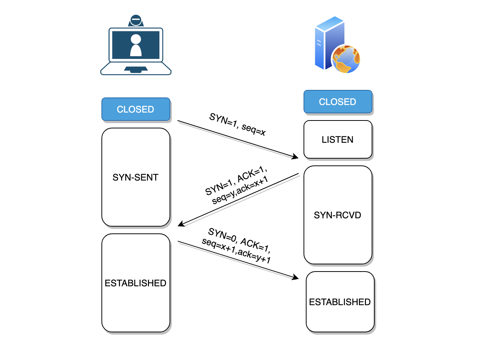
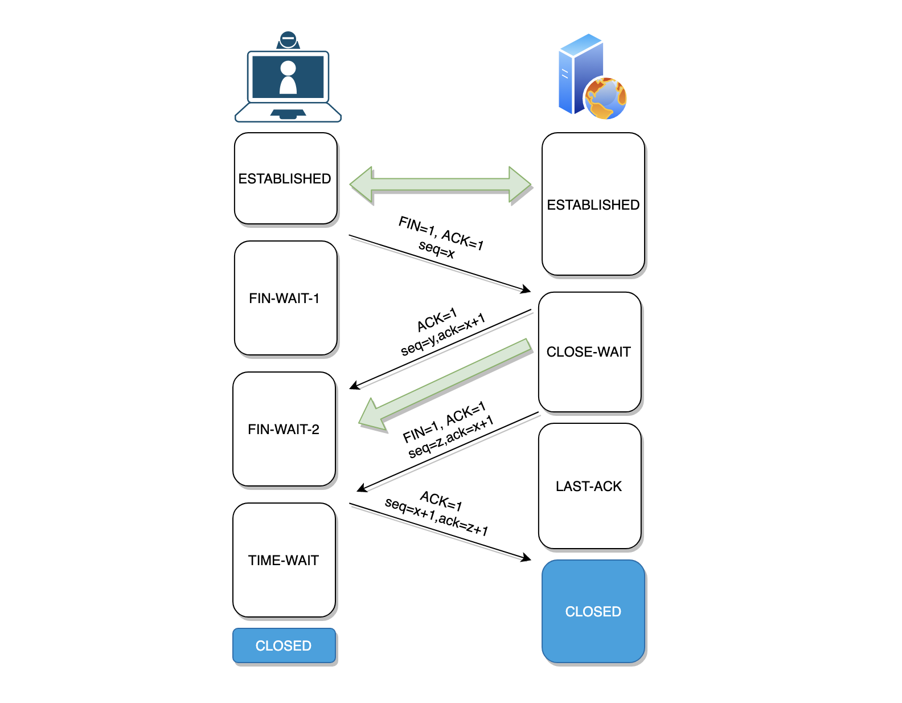

Review
1. 2019/11/18
2. 2024-09-28 07:18

> [!Summary]
> 

## 一、Introduction
### Three-way Handshake

1. HTTP1.1, HTTP2 都是基于TCP 3次握手流程，即客户端TCP连接进入 *ESTABLISHED* 状态后才正式开始发送请求数据，即 *1个RTT* 之后可以发送HTTP请求，需要 *2-RTT* 才能获取到服务端数据
2. HTTP3使用UDP，首次连接通常需要1-RTT，后续连接可以利用会话恢复机制，实现0-RTT。
3. HTTP3首次连接即可发送请求数据，即最快只需要 *1-RTT* 即可获取到服务端响应。
4. 当前0-RTT主要用于重复连接

TCP状态，连接建立过程（三次握手）：
- CLOSED：起始状态，表示无连接
- LISTEN：服务器等待连接请求（被动打开）
- SYN_SENT：客户端已发送连接请求，等待确认
- SYN_RECEIVED：服务器已收到并回应SYN，等待确认
- ESTABLISHED：连接建立，可以开始数据传输

- 客户端：LISTEN -> SYN_SENT -> ESTABLISHED
- 服务器：LISTEN -> SYN_RECEIVED -> ESTABLISHED

### Four-way Handshake
> TCP四次挥手是TCP连接关闭的标准过程。由于TCP连接是全双工的，因此每个方向的连接都必须单独关闭，这就造成了通常需要四次握手。客户端和服务器都可以主动发起关闭连接。

Process
- **客户端发送FIN报文：** 客户端首先发送一个 `FIN M` 报文给服务器，表示客户端要关闭连接。此时，客户端进入 `FIN_WAIT_1` 状态。
- **服务器发送ACK报文：** 服务器收到 FIN 报文后，发送一个 `ACK M+1` 报文给客户端，表示已经收到客户端的关闭请求。此时，服务器进入 `CLOSE_WAIT` 状态。
- **服务器发送FIN报文：** 服务器也可能有一些数据要发送给客户端，所以在发送完ACK报文后，接着会发送 `FIN N` 报文给客户端，表示服务器也要关闭连接。此时，服务器进入 `LAST_ACK` 状态。
- **客户端发送ACK报文：** 客户端收到服务器的FIN报文后，发送一个 `ACK N+1` 报文给服务器，表示已经收到服务器的关闭请求。此时，客户端进入 `TIME_WAIT` 状态，服务器则进入 `CLOSED` 状态。

TCP状态，连接关闭过程（四次挥手）：
- FIN_WAIT_1：主动关闭方发送FIN
- CLOSE_WAIT：被动关闭方收到FIN，等待应用程序关闭
- FIN_WAIT_2：主动关闭方收到ACK，等待对方FIN
- LAST_ACK：被动关闭方发送FIN
- TIME_WAIT：主动关闭方收到FIN，等待2MSL确保对方收到ACK
- CLOSING：罕见状态，双方同时关闭时可能出现
- CLOSED：连接完全关闭

- 主动关闭方：ESTABLISHED -> FIN_WAIT_1 -> FIN_WAIT_2 -> TIME_WAIT -> CLOSED
- 被动关闭方：ESTABLISHED -> CLOSE_WAIT -> LAST_ACK -> CLOSED

客户端进入TIME_WAIT状态的主要原因是为了保证服务器能够收到最后的ACK报文。如果服务器没有收到ACK报文，就会重新发送FIN报文，客户端再次收到FIN报文后就会重新发送ACK报文。这样就保证了TCP连接的可靠关闭。

> - TIME_WAIT状态的持续时间一般是2MSL（Maximum Segment Lifetime，最大报文段生存时间）。
> - 在TIME_WAIT状态期间，客户端不能立即重用本地端口，以防止旧连接的重复数据包对新连接造成干扰。

扩展：
- **为什么是四次挥手，而不是三次？** 这是因为当服务器收到客户端的FIN报文后，可能还有数据要发送给客户端。只有在发送完所有的数据后，才能发送自己的FIN报文，因此至少需要四次握手。
- **TIME_WAIT状态有什么作用？** TIME_WAIT状态的主要作用是保证TCP连接的可靠关闭，防止旧连接的重复数据包对新连接造成干扰。
- **2MSL的意义是什么？** 2MSL是TCP协议为了保证可靠传输所设置的一个超时时间。它足够让失落的报文在网络中消失，从而避免旧连接对新连接造成影响。

## Reference
[TCP 3-Way Handshake Process](https://www.geeksforgeeks.org/tcp-3-way-handshake-process/) 
[4-Way Handshake](https://www.wifi-professionals.com/2019/01/4-way-handshake) 
[Why TCP Connect Termination Need 4-Way-Handshake?](https://www.geeksforgeeks.org/why-tcp-connect-termination-need-4-way-handshake/)
