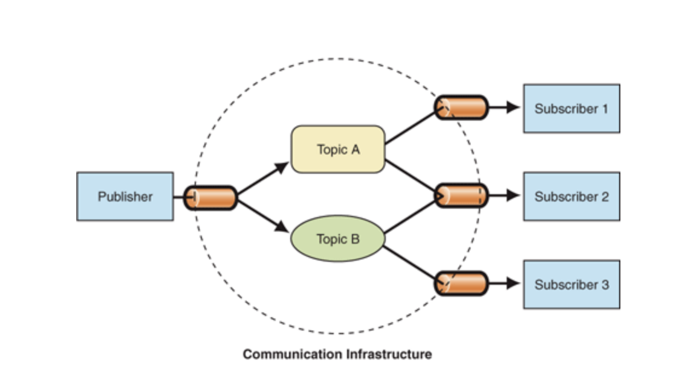

发布订阅模式、观察者模式、PubSub

Review
1. 2020/08/03
2. 2024-09-08 09:56

> [!Summary]
> 1. 发布订阅模式，简称 PubSub
> 2. NodeJS中的 EventEmitter 实现了发布订阅
> 3. Vue中的 EventBus 也实现了发布订阅，可以通过 `$emit` , `$on` 方法进行发布订阅，可以进行组件间通信

## 一、Introduction




**发布订阅 vs 观察者模式**
![[e09957db4b70_8d183dbd.png]]
发布订阅模式其实属于广义上的观察者模式

**观察者模式**，观察者需要直接订阅目标事件。在目标发出内容改变的事件后，直接接收事件并作出响应。

**发布订阅模式**，发布者和订阅者之间多了一个调度中心。调度中心一方面从发布者接收事件，另一方面向订阅者发布事件，订阅者需要在调度中心中订阅事件。通过调度中心实现了发布者和订阅者关系的解耦。使用发布订阅者模式更利于我们代码的可维护性。


```ts
class EventEmitter {
  constructor() {
    this.events = {};
  }

  on(event, callback) {
    if (!this.events[event]) {
      this.events[event] = [];
    }
    this.events[event].push(callback);
  }

  emit(event, ...args) {
    if (this.events[event]) {
      this.events[event].forEach(callback => {
        callback(...args);
      });
    }
  }

  off(event, callback) {
    if (this.events[event]) {
      this.events[event] = this.events[event].filter(cb => cb !== callback);
    }
  }

  once(event, callback) {
    const onceListener = (...args) => {
      callback(...args);
      this.off(event, onceListener);
    };

    this.on(event, onceListener);
  }
}

// 使用示例
const emitter = new EventEmitter();

// 订阅 'click' 事件
emitter.on('click', (data) => {
  console.log('Clicked:', data);
});

// 订阅 'click' 事件
emitter.on('click', (data) => {
  console.log('Another click handler:', data);
});

// 触发 'click' 事件
emitter.emit('click', { x: 10, y: 20 });

// 取消订阅其中一个 'click' 事件
emitter.off('click', (data) => {
  console.log('Clicked:', data);
});

// 再次触发 'click' 事件，只会触发剩余的一个订阅
emitter.emit('click', { x: 30, y: 40 });
```

## Reference
https://docs.microsoft.com/en-us/azure/architecture/patterns/publisher-subscriber

