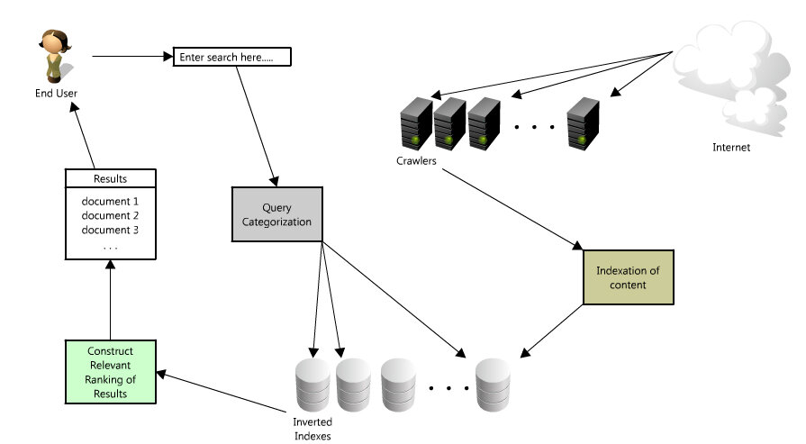

Review
2024-06-22

1. User inputs a query
2. Query is categorized (this is a nontrivial information retrieval problem - since the category really matters - you can read a little bit more here: [http://en.wikipedia.org/wiki/Web_query_classification](http://en.wikipedia.org/wiki/Web_query_classification))
3. Scans over the collection of documents that are organized similarly to inverted indexes  ([http://en.wikipedia.org/wiki/Inverted_index](http://en.wikipedia.org/wiki/Inverted_index)) to match the query to a set of relevant documents
4. Results are returned to the user, sorted by relevancy (with relevancy also being another hard problem - [http://en.wikipedia.org/wiki/Relevance_(information_retrieval)](http://en.wikipedia.org/wiki/Relevance_%28information_retrieval%29) )

But that is only half the story - before you ever get to typing in your query, there is a massive big data problem that is being solved to discover, organize and retrieve those results as quickly as possible. 

1. A web crawler has to crawl your site (and every other site on the web)
2. Indexes all the pages (meaning that a search engine needs to be able to "parse” and store the contents of every web page on the Internet)
3. Organizes the indexed collection and stores alongside corresponding metadata to provide extremely fast and relevant search results (and there are two interesting problems in this step - document classification ([http://en.wikipedia.org/wiki/Document_classification](http://en.wikipedia.org/wiki/Document_classification)) and how to create a performant search engine index ([http://en.wikipedia.org/wiki/Index_(search_engine)](http://en.wikipedia.org/wiki/Index_%28search_engine%29) )

The order in which results are returned is determined by **degree of relevancy**. Roughly, relevancy is a product of the number of query keywords found on a given page, and the authority of that pages’ domain.Relevancy = # query keywords * domain’s authority. Authority has many factors, but it largely relates to links.  Obviously a search engine cares about what you are saying on your site, but they care even more about what other people are saying about you (or in other words how they link to you).  So authority is a combination of incoming links with the corresponding anchor text.PageRank ([http://searchengineland.com/what-is-google-pagerank-a-guide-for-searchers-webmasters-11068 - definition](http://searchengineland.com/what-is-google-pagerank-a-guide-for-searchers-webmasters-11068#definition)) is another important part of authority.  At its simplest form PageRank is popularity – and every site that links to your site counts as a vote to your popularity.  The more popular a site is, the larger their vote in the popularity score.  Of course such an algorithm is easy to game (i.e. with link farms, circular linking, etc.) so Google has evolved the factors that impact any site's authority – including domain diversity, how important the domains are that link to your site, etc.Using authority to filter out spammy or malicious sites makes a lot of sense – it’s difficult to fake the 100s or 1000s of links that make a page relevant to a search. The anchor text ([http://www.seomoz.org/learn-seo/anchor-text](http://www.seomoz.org/learn-seo/anchor-text)) used to link back to a site is a strong signal on the relevancy to various queries (and this also helps explain why having a keyword in your site name is helpful for ranking for that keyword - so much of the incoming anchor text to your site will use your brand or website name).I have glossed over of ton of really interesting and important work here, however, you can definitely read up on more of this if you are interested.

## Reference
[The Anatomy of a Large-Scale Hypertextual Web Search Engine](http://infolab.stanford.edu/%7Ebackrub/google.html)
