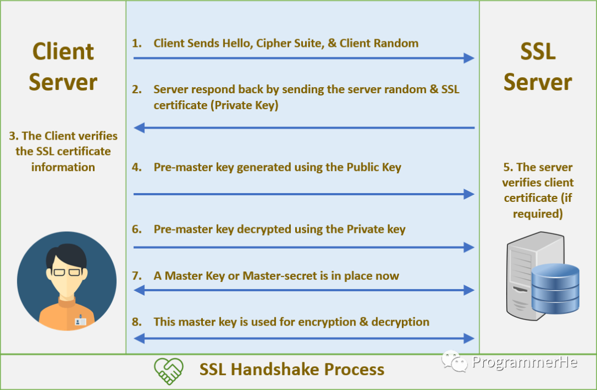

Review
1. 2023-02-22 06:29

## 一、Introduction


## TLS 握手过程
SSL和TLS协议可以为通信双方提供识别和认证的通道，从而确保通信的保密性和数据的完整性。在TLS握手过程中，**通信双方交换消息以验证通信，互相确认并建立它们所要使用的加密算法以及会话密钥**。

TLS在握手过程中能确定以下事情：
1. 确定双方通信所使用的TLS版本
2. 确定双方所需要使用的密码组合
3. 客户端通过服务器的公钥和数字证书上的签名验证服务端身份
4. 生成会话密钥，该密钥将用于握手结束后的对称加密


### TLS握手详细过程

 1. **"client hello"消息**：客户端通过发送"client hello"消息向服务器发起握手请求，该消息包含了客户端所支持的TLS版本和密码组合供服务器选择，还有一个"client random"随机的字符串
 2. **"server hello"消息**：服务器发送"server hello" 消息对客户端进行回应，该消息包含了数字证书，服务器选择的密码组合和"server random"随机字符串
 3. **验证**：客户端对服务器发来的证书进行验证，确保对方的合法身份
 4. **"Premaster secret"** 字符串：客户端向服务器发送另一个随机字符串"premaster secret(预主密钥)"，这个字符串是经过服务器公钥加密的，因此只有对应的私钥能解密。
 5. **生成私钥**：服务器使用私钥解密"premaster secret"
 6. **生成共享密钥**：客户端和服务端均使用client random ,server random和premaster scret，并通过相同的算法生成共享密钥KEY
 7. **客户端就绪**：客户端发送经过共享密钥KEY加密过的"finished"信号
 8. **服务器就绪**：服务器发送经过共享密钥KEY加密过的"finished"信号
 9. **达成安全通信**：握手完成，上方使用对称加密进行安全通信。

#### TLS证书认证
生成证书的配置文件ca.conf和server.conf
ca.conf
```ini
[ req ]
default_bits       = 4096
distinguished_name = req_distinguished_name

[ req_distinguished_name ]
countryName                 = GB
countryName_default         = CN
stateOrProvinceName         = State or Province Name (full name)
stateOrProvinceName_default = GuangDong
localityName                = Locality Name (eg, city)
localityName_default        = Foshan
organizationName            = Organization Name (eg, company)
organizationName_default    = Step
commonName                  = Foshan
commonName_max              = 64
commonName_default          = Foshan
```

server.conf
```ini
[ req ]
default_bits       = 2048
distinguished_name = req_distinguished_name

[ req_distinguished_name ]
countryName                 = Country Name (2 letter code)
countryName_default         = CN
stateOrProvinceName         = State or Province Name (full name)
stateOrProvinceName_default = GuangDong
localityName                = Locality Name (eg, city)
localityName_default        = Foshan
organizationName            = Organization Name (eg, company)
organizationName_default    = Step
commonName                  = CommonName (e.g. server FQDN or YOUR name)
commonName_max              = 64
commonName_default          = Foshan

[ req_ext ]
subjectAltName = @alt_names

[alt_names]
DNS.1   = go-grpc-example #这里要指定好 
IP      = 127.0.0.1
```

#### 生成证书
#### 生成CA根证书
1. 生成ca私钥，得到ca.key
```sh
openssl genrsa -out ca.key 4096
```

2. 生成ca证书签发请求，得到ca.csr
```sh
openssl req -new -sha256 -out ca.csr -key ca.key -config ca.conf
```

openssl req：生成自签名证书，-new 指生成证书请求、-sha256 指使用 sha256 加密、-key 指定私钥文件、-x509 指输出证书、-days 3650 为有效期，-config 指定配置文件

3. 生成ca根证书，得到ca.crt
```sh
openssl x509 -req -days 3650 -in ca.csr -signkey ca.key -out ca.crt
```

#### 生成终端用户证书
1. 生成私钥，得到server.key
```sh
openssl genrsa -out server.key 4096
```

2. 生成证书签发请求，得到server.csr
```sh
openssl req -new -sha256 -out server.csr -key server.key -config server.conf
```

3. 用CA证书生成终端用户证书，得到server.crt
```sh
openssl x509 -req -days 3650 -CA ca.crt -CAkey ca.key -CAcreateserial -in server.csr -out server.pem -extensions req_ext -extfile server.conf
```


## Reference

