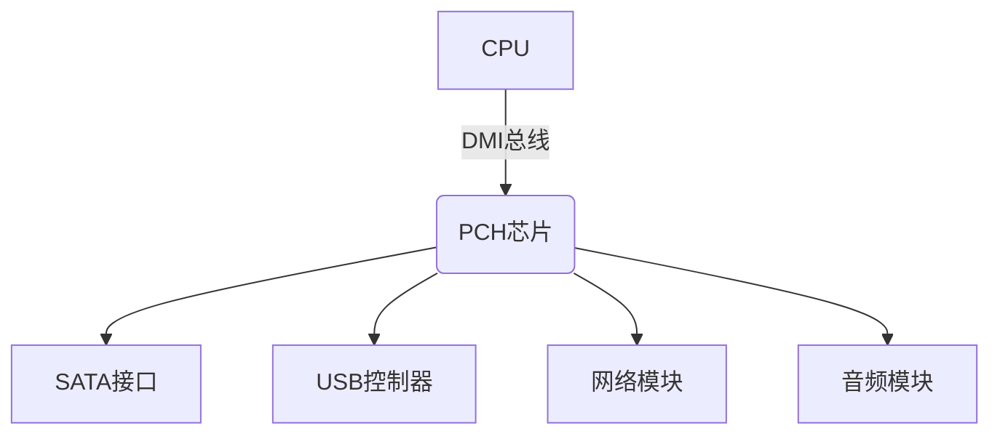

# 计算机导论

Review

1. 2019/08/02

计算机是通过中央处理器对输入数据进行逻辑运算与存储处理的智能电子设备，可执行预定义指令集并生成有效信息。其应用形态多样，主要包括：

- 通用计算设备：台式电脑、笔记本、平板电脑、一体机
- 移动智能终端：智能手机、智能手表、可穿戴设备
- 专用嵌入式系统：计算器、ATM机、GPS导航仪
- 微型开发平台：树莓派（Raspberry Pi）、香蕉派（Banana Pi）

## 电脑硬件的5大单元

依外观来讲

- 输入单元：键盘鼠标、读卡器、扫描仪、手写板、触控屏幕
- 主机部分：就是系统单元，里面最重要的是主板（MotherBoard），它一般包含CPU、内存（Main Memory， RAM）、硬盘、适配卡、网卡、显卡、磁盘阵列卡等
- 输出单元：显示器、打印机、扬声器、投影仪、蓝牙耳机、HDMI电视

中央处理器（Central Processing Unit， CPU）是一个具有特定功能的芯片，里面含有指令集。主要工作是管理和运算。
因此CPU内又可分为两个单元：

- 算术逻辑单元：主要负责程序运行与逻辑判断
- 控制单元：主要协调各周边组件与各单元间工作

CPU读取的数据都是从内存来的

电脑的5大组成单元

- 输入单元
- 内存
- 算术逻辑单元
- 控制单元
- 输出单元

## CPU的架构

### 核心架构

- 算术逻辑单元（ALU）：执行二进制运算与逻辑判断
- 控制单元（CU）：指令译码、时序控制、总线管理

### 指令集架构

- 精简指令集（Reduced Instruction Set Computer, RISC）使用该指令集CPU：ARM
- 复杂指令集（Complex Instruction Set Computer, CISC）使用该指令集CPU：AMD、Intel等x86架构

## 数据计量单位

位（bit）亦称比特，指的是CPU一次读取数据的最大值，它只认识0、1 。
字节（Byte）1字节 = 8位; 1K = 1024B;
Kilo, Mega, Giga, Tera, Peta, Exa, Zetta
一般来说，数据容量使用的是二进制，速度单位则常使用十进制，比如1GHz = 1000*1000*1000Hz。Hz是“次数/秒”

| 单位名称      | 换算关系                     | 应用场景                | 备注                                  |
|---------------|------------------------------|-------------------------|---------------------------------------|
| 位（bit）     | 二进制最小单位（0/1）        | 数据传输速率（bps）     | 网络带宽常用单位                      |
| 字节（Byte）  | 1 Byte = 8 bits              | 存储容量基本单位        | 文本字符存储基准                      |
| 千字节（KB）  | 1 KB = 1024 Bytes            | 小型文档/代码文件       | 存储容量使用二进制换算（1KiB=1024B）  |
| 兆字节（MB）  | 1 MB = 1024 KB              | 图片/短视频存储         | 内存容量常用单位                      |
| 吉字节（GB）  | 1 GB = 1024 MB              | 操作系统/大型软件       | 硬盘容量主流单位                      |
| 太字节（TB）  | 1 TB = 1024 GB              | 数据中心存储           | 云存储服务计量单位                    |
| 拍字节（PB）  | 1 PB = 1024 TB              | 大数据分析             | 超大规模存储场景                      |

> **注**：  
>
> 1. 存储容量采用二进制换算（如1GB=1024³B）  
> 2. 传输速率采用十进制换算（如1Gbps=10⁹bps）

## 计算机分类体系

- 超级计算机（Supercomputer）
- 大型计算机（Mainframe Computer）
- 迷你计算机（Minicomputer）保有大型计算机同时支持多用户的特性
- 工作站（Workstation）
- 微电脑（Microcomputer）个人电脑

| 类型             | 典型应用场景                 | 技术特征                              |
|------------------|-----------------------------|---------------------------------------|
| 超级计算机       | 气象模拟、核爆仿真           | 每秒万亿次浮点运算，多处理器集群架构  |
| 大型计算机       | 银行核心系统、航空订票       | 高可靠性、支持数千用户并发操作        |
| 迷你计算机       | 企业ERP系统、数据中心        | 中型规模、UNIX/Linux操作系统支持      |
| 工作站           | 三维渲染、科学计算           | 专业图形加速卡、多核高性能CPU         |
| 微电脑           | 个人办公、智能终端           | 高度集成化，形态包括PC/平板/嵌入式设备 |

## 芯片组架构演进

1. 传统南北桥架构

- 北桥（MCH）：高速设备枢纽（CPU↔内存↔显卡）
- 南桥（ICH）：低速设备管理（SATA/USB/声卡）

2. 现代集成架构

- SoC设计：将北桥功能集成至CPU内部
- 平台控制器：南桥演进为独立PCH芯片，管理扩展接口

## 性能关键指标

- 主频参数：3.5GHz表示每秒35亿次时钟周期
- 位宽特性：64位处理器单周期处理8字节数据
- 缓存体系：L1/L2/L3多级缓存降低内存延迟
