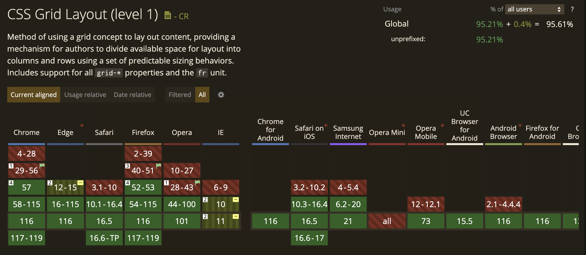
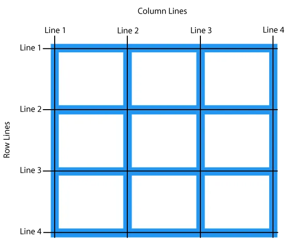
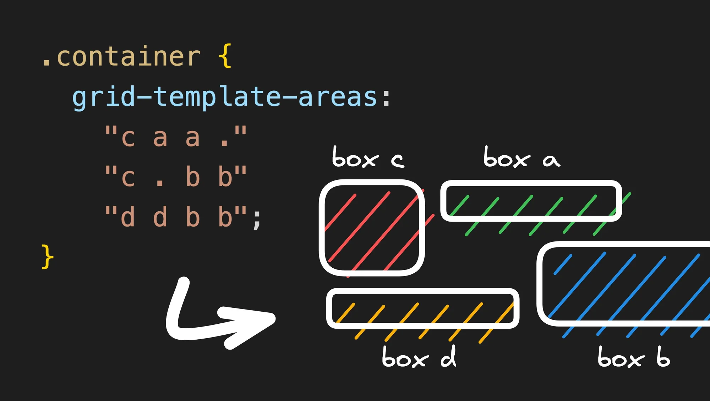
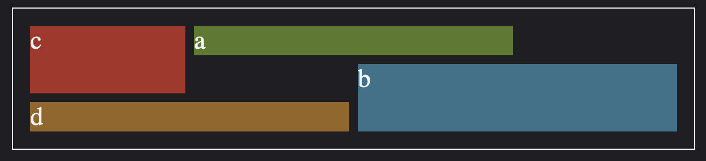

#css #grid

Review
1. 2023-08-26 13:55

## 一、Introduction
CSS grid is used for creating **two-dimensional** layouts. It is different from CSS flexbox, which can only create one-dimensional layouts and is mainly created for alignments. Being a two-dimensional layout system means that CSS grid allows us to simultaneously work with columns and rows to build `complex and responsive layouts`. The advent of CSS grid means we no longer need to deploy hacks like `positioning` and `floats`.



[CSS Grid Generator](https://cssgrid-generator.netlify.app/)

## 二、Terminology
- **Grid container**: The parent container where you’ve defined your `grid display`
- **Grid items**: The direct children of your `grid` container
- **Gap**: Used to create gutters, the spaces between `grid` cells, through rows and columns
- **Grid cell**: The space between two adjacent rows and two adjacent column `grid` lines. It’s a single unit of the `grid`. 
- **Grid area**: One or more grid cells make up a rectangular area on the grid. Grid areas must be rectangular in nature. 
- **Grid track**: Tracks are the space between two adjacent grid lines — essentially, the lines that start and stop rows or columns, so you’ll always have one more than the number of columns and rows you already have.
- **Grid lines**: These are the dividing lines that are created when you define a grid display
- **Fractional Units**: The `fr` value, otherwise known as the fractional unit, solves the problem of automatically distributing free space among elements and replaces the need for percentages.

### CSS Grid Properties
- **grid-template-columns** : Specifies the size of the columns, and how many columns in a grid layout.
- **grid-template-rows** : Specifies the size of the rows in a grid layout.
- **gap** : A shorthand property for the row-gap and the column-gap properties.
- **grid-column-start**: Specifies where to start the grid item.
- **grid-column-end** : Specifies where to end the grid item.
- **grid-row-start** Specifies where to start the grid item.
- **grid-row-end** Specifies where to end the grid item.

## 三、Usage
```html
<body class="container">
    <div class="item box1"><p>One</p></div>
    <div class="item box2"><p>Two</p></div>
    <div class="item box3"><p>Three</p></div>
</body>
```

```css
.container {
    display: grid;
}
```


### Position Items by Using a Line Number

You can refer to an exact line number in a grid by using the properties **_grid-column-start_** and **_grid-column-end_**.


```css
.tweets   {  
  grid-column-start: 1;  
  grid-column-end: 2;  
  grid-row: 1;  
}

.replies  {  
  grid-column-start: 2;  
  grid-column-end: 3;  
  grid-row: 1;  
}

.search   {  
  grid-column-start: 3;  
  grid-column-end: 4;  
  grid-row: 1;  
}

.messages {  
  grid-column-start: 4;  
  grid-column-end: 5;  
  grid-row: 1;  
}
```

You can also use **_span (n)_** where **_n_** specifies no. of rows or columns.

### grid-template-areas



### The magical `.` area
Another cool property of `grid-template-areas` is that you can describe empty cells using a dot. So if you write:

```css
.container {
	grid-template-areas: 
	  ". a c"
	  "d . b";
}
```


There are two important things to keep in mind when using `grid-template-areas`:
- Each row must have the exact same number of cells (add `.` to fill in any blanks).
- An element can only stretch into a **rectangle**. This means that this example:
```css
grid-template-areas:
  "a b b"
  "b b ."
```
is **invalid**, because `b` makes a complex shape that is not a rectangle.

```html
<!DOCTYPE html>
<html lang="en">

<head>
  <meta charset="UTF-8">
  <meta name="viewport" content="width=device-width, initial-scale=1.0">
  <title>Document</title>
  <style>
    body {
      background-color: rgb(30, 30, 34);
      color: #f5f5f5;
      display: flex;
      width: 100%;
      justify-content: center;
      font-size: 24px;
    }

    .container {
      border: 1px solid white;
      padding: 16px;
      width: 600px;
      /* height: 200px; */


      display: grid;
      grid-template-columns: repeat(4, 1fr);
      grid-template-rows: repeat(3, 1fr);
      grid-template-areas:
        "c a a ."
        "c . b b"
        "d d b b";
      gap: 8px;
    }

    .a {
      grid-area: a;
      background-color: #4d7c0f;
    }

    .b {
      grid-area: b;
      background-color: #0e7490;
    }

    .c {
      grid-area: c;
      background-color: #b91c1c;
    }

    .d {
      grid-area: d;
      background-color: #a16207;
    }
  </style>
</head>

<body>
  <div class="container">
    <div class="item a">a</div>
    <div class="item b">b</div>
    <div class="item c">c</div>
    <div class="item d">d</div>
  </div>
</body>

</html>
```




```css
grid-template-columns: repeat(auto-fit, minmax(250px, 1fr));
```

```css
grid-auto-rows: 100px;
```

```css
grid-auto-flow: column dense;
```


## Reference
1. [CSS Grid Layout Module](https://towardsdev.com/css-grids-made-easy-100-8e966b199dd7)
2. [Become a CSS Grid wizard with grid-template-areas](https://www.builder.io/blog/css-grid-template-areas)
3. [Mastering CSS Grid](https://www.coltsteele.com/tutorials/mastering-css-grid/css-grid-basics/enabling-css-grid)
4. [CSSGridTutorial](https://github.com/Colt/CSSGridTutorial)
5. [An Interactive Guide to CSS Grid](https://www.joshwcomeau.com/css/interactive-guide-to-grid/?ref=dailydev)
