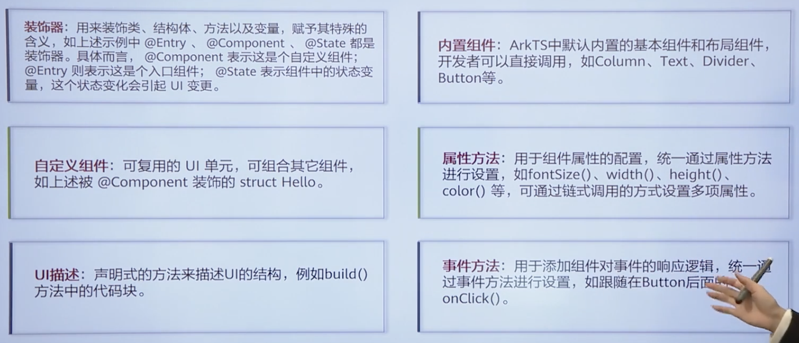

Review
1. 2023-12-17 15:13

## 一、Introduction

## 特性
ArkTS基于TypeScirpt语言扩展而来，是TS的超集。在TS基础上主要扩展了声明式UI能力，让开发者以更简洁、更自然的方式开发高性能应用。声明式UI特性：
1. 基本UI描述
2. 状态管理
3. 动态构建UI元素
4. 渲染控制
5. 使用限制于扩展

## Reference

