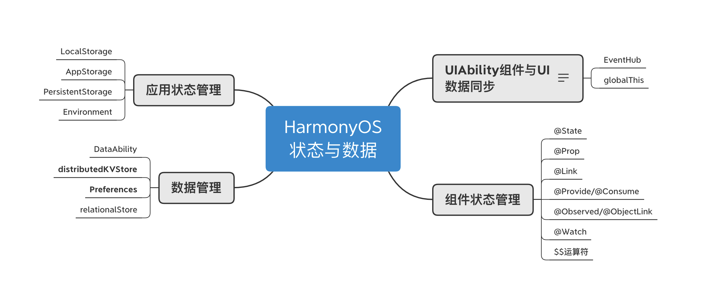

Review
1. 2023-12-15 20:37

## 一、Introduction
理解应用状态、组件状态、组件间通信和数据管理。


## 二、详细


### 2.1、globalThis
`globalThis` 是ArkTS引擎实例内部的一个**全局对象**，引擎内部的 UIAbility/ExtensionAbility/Page 都可以使用，因此可以使用globalThis全局对象进行数据同步。可以通过globalThis绑定属性/方法来进行UIAbility组件与UI的数据同步。


#### globalThis使用的注意事项


- Stage模型下进程内的UIAbility组件共享**ArkTS引擎实例**，使用globalThis时需要避免存放相同名称的对象。例如AbilityA和AbilityB可以使用globalThis共享数据，在存放相同名称的对象时，先存放的对象会被后存放的对象覆盖。
- FA模型因为每个UIAbility组件之间引擎隔离，不会存在该问题。
- 对于绑定在 globalThis 上的对象，其生命周期与ArkTS虚拟机实例相同，建议在使用完成之后将其赋值为null，以减少对应用内存的占用。

```ts
import UIAbility from '@ohos.app.ability.UIAbility'

export default class EntryAbility extends UIAbility {
    onCreate(want, launch) {
        globalThis.entryAbilityWant = want;
        // ...
    }
    // ...
}
```

### 2.2、EventHub
EventHub提供了UIAbility组件/ExtensionAbility组件级别的事件机制，以UIAbility组件/ExtensionAbility组件为中心提供了订阅、取消订阅和触发事件的数据通信能力。

在UIAbility中调用eventHub.on()方法注册一个自定义事件“event1”，eventHub.on()有如下两种调用方式，使用其中一种即可。

```ts
import UIAbility from '@ohos.app.ability.UIAbility';

const TAG: string = '[Example].[Entry].[EntryAbility]';

export default class EntryAbility extends UIAbility {
    func1(...data) {
        // 触发事件，完成相应的业务操作
        console.info(TAG, '1. ' + JSON.stringify(data));
    }

    onCreate(want, launch) {
        // 获取eventHub
        let eventhub = this.context.eventHub;
        // 执行订阅操作
        eventhub.on('event1', this.func1);
        eventhub.on('event1', (...data) => {
            // 触发事件，完成相应的业务操作
            console.info(TAG, '2. ' + JSON.stringify(data));
        });
    }
}
```

在UI界面中通过eventHub.emit()方法触发该事件，在触发事件的同时，根据需要传入参数信息。

```ts
import common from '@ohos.app.ability.common';

@Entry
@Component
struct Index {
  private context = getContext(this) as common.UIAbilityContext;

  eventHubFunc() {
    // 不带参数触发自定义“event1”事件
    this.context.eventHub.emit('event1');
    // 带1个参数触发自定义“event1”事件
    this.context.eventHub.emit('event1', 1);
    // 带2个参数触发自定义“event1”事件
    this.context.eventHub.emit('event1', 2, 'test');
    // 开发者可以根据实际的业务场景设计事件传递的参数
  }

  // 页面展示
  build() {
    // ...
  }
}
```


## Reference

