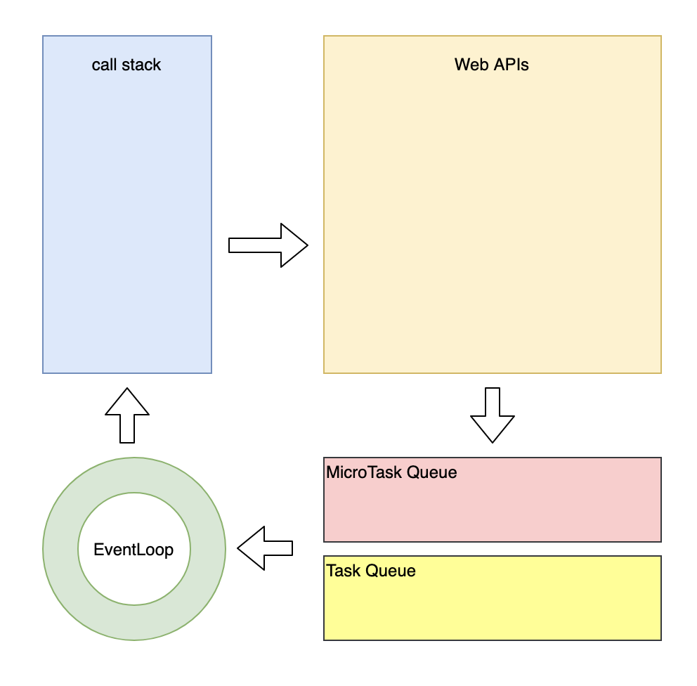

Review
1. 2024-07-27 17:29

## 一、Introduction




### 测试题
#### 题1
```js
console.log('script start')

async function async1() {
  await async2()
  console.log('async1 end')
}
async function async2() {
  console.log('async2 end')
}
async1()

setTimeout(function () {
  console.log('setTimeout')
}, 0)
new Promise(resolve => {
  console.log('Promise')
  resolve()
})
  .then(function () {
    console.log('promise1')
  })
  .then(function () {
    console.log('promise2')
  })

console.log('script end')
```

> script start -> **async2 end** -> Promise -> script end  -> async1 end -> promise1 -> promise2 -> setTimeout

#### 题2
```js
console.log(1);
setTimeout(() => console.log(2));
Promise.resolve().then(() => console.log(3));
Promise.resolve().then(() => setTimeout(() => console.log(4)));
Promise.resolve().then(() => console.log(5));
setTimeout(() => console.log(6));
console.log(7);
```

> 1 -> 7 -> 3 -> 5 -> 2 -> 6 -> 4


#### 题3
```js
console.log(1)
new Promise((resolve) => {
  console.log(2);
  resolve(3)
}).then((v) => {
  console.log(4);
}).then(() => {
  console.log(5);
})

setTimeout(() => {
  console.log(6);

  Promise.resolve().then(() => {
    console.log(8);
  })

  setTimeout(() => {
    console.log(7);
  })
})

console.log(9)
```

> 1 -> 2 -> 9 -> 4 -> 5 -> 6 -> 8 -> 7


## Reference

