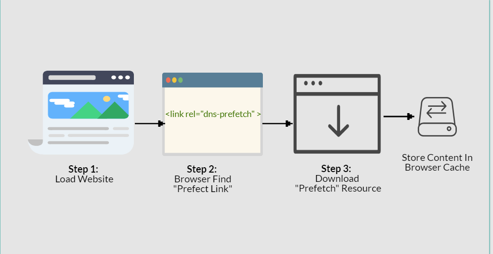

#请求暗示 

Review
1. 2024-07-29 05:10
2. 2024-10-05

tag `preconnect vs preload vs prefetch vs prerender`

## 一、Introduction
The **`rel`** attribute defines the relationship between a linked resource and the current document.

`<link rel="" />`

1. `dns-prefetch` 用于跨域资源或需要提前解析 DNS 的场景。仅用于提前解析DNS，不建立TCP连接。
2. `preconnect` 用于与第三方资源建立连接，如字体、广告，提前建立与指定服务器的连接，包括DNS解析、TCP连接等
3. `prefetch` 用于用户可能在后续页面访问的资源，如图片、字体，让浏览器在空闲时间，提前获取并缓存该资源
4. `preload` 用于当前页面必须加载的资源，如关键 CSS、JavaScript
5. `prerender` 比较耗费资源，谨慎使用，适用于对首屏加载速度要求极高的页面。可以让浏览器提前渲染整个页面，包括加载所有资源。
6. `subresource` 

### 1:  `dns-prefetch` 
```html
<link rel="dns-prefetch" href="xxx.com">
```

http页面下所有的a标签的href都会自动去启用DNS Prefetch，也就是说，你网页的a标签href带的域名，是不需要在head里面加上link手动设置的。https页面需要使用meta标签强制开启
```html
<meta http-equiv="x-dns-prefetch-control" content="on">
```

dns-prefetch适用于网页引用了大量其他域名的资源

### 2: `preconnect` 
Preconnecting is another speed-optimization html tag, in which the browser sets up an early connection before an HTTP request is actually sent to the server.

Connections such as DNS Lookup, and TLS negotiation can be initiated beforehand, **eliminating roundtrip latency** for those connections and saving time for users.

```html
<link rel="preconnect" href="//example.com">
<link rel="preconnect" href="//cdn.example.com" crossorigin>
```

- **建立连接：** `preconnect` 用于提前建立与指定服务器的连接，包括 DNS 解析、TCP 连接等。
- **减少延迟：** 通过提前建立连接，可以减少后续资源加载时的延迟。

### 3: `prefetch` 
prefetch（预取）用来加载低优先级的资源。preload试图让当前页面加载更快，而prefetch通常用来给将来要访问的页面加载内容。
Prefetching a process where the browser fetches the resources required to display a specific page that the **consumer is likely to get in its second click**. In other words, the browser loads a page that you’re probably going to visit in the future. The browser can store these resource in its own local cache, to **send the requested information quicker if the** user does end up visiting that page.


Once a webpage has completed loading and the idle period has now passed, the browser starts downloading the next prefetched page. After a person clicks on a specific link which has already been prefetched, they’ll observe the content immediately.

There are two different types of prefetch.
- **Link Prefetching**
- **DNS Prefetching**

DNS prefetching permits the browser to perform DNS lookups to a webpage in the background during the user is surfing. This item reduces latency since the DNS lookup has already taken place.

```html
<link rel="dns-prefetch" href="http://www.example.com/">
```

The process for link prefetching is identical, however, Link prefetching is a bit different than DNS-prefetching. In link prefetching we never do the DNS lookup, we let the browser to **fetch the resources, and save them at the cache**, presuming that the user will click on or request it later on.

```html
<link rel="prefetch" href="/uploads/images/pic.png">
```


### 4: `preload`
> - **优先级更高：** `preload` 的优先级高于 `prefetch`，浏览器会更积极地加载这些资源，甚至可能阻塞页面渲染。
> - **当前页面使用：** `preload` 主要用于当前页面必须加载的资源，比如关键的 CSS、JavaScript 文件或字体。

preload link首部的使用早于HTTP/2，开始时被用作客户端暗示。

preload（预加载）告诉浏览器使用高优先级给本页加载资源。它是preconnect之后的一个本地步骤，但不像prefetch，它给当前页面加载资源。

这个首部允许浏览器直接获取资源，不用等着下载、读取、解析整个页面之后才决定是否下载另一个资源。preload首部允许站长说：“这个资源肯定会用到，所以我建议，如果你没有它的缓存，尽快请求它。”

Web浏览器非常擅长扫描HTML的前面部分，并加载需要的资源，但preload可以让浏览器先下载页面没有直接包含的资源（比如在CSS文件中引用的字体）

当大家都使用103 Early Hints HTTP响应码时，preload会很有用，因为它可以包含HTTP preload link首部（在HTTP/1.1下也可以）。

A preload directive is an html tag that tells the browser how specific resources are fetched to your _current navigation_. Essentially it downloads resources in the background of your current page load, before it is actually used in the current page.

You need to add the `rel` attribute with the `preload` value and add `as="style"` on the `<link>` element.

```html
<head>
  <meta charset="utf-8" />
  <title>JS and CSS preload example</title>

  <link rel="preload" href="style.css" as="style" />
  <link rel="preload" href="main.js" as="script" />
  <link rel="preload" href="flower.avif" as="image" type="image/avif" />
  <link
    rel="preload"
    href="fonts/cicle_fina-webfont.woff2"
    as="font"
    type="font/woff2"
    crossorigin />

  <link rel="stylesheet" href="style.css" />
</head>

<body>
  <h1>bouncing balls</h1>
  <canvas></canvas>

  <script src="main.js" defer></script>
</body>
```

Many content types can be preloaded. The possible `as` attribute values are:
- `fetch`: Resource to be accessed by a fetch or XHR request, such as an ArrayBuffer, WebAssembly binary, or JSON file.
- `font`: Font file.
- `image`: Image file.
- `script`: JavaScript file.
- `style`: CSS stylesheet.
- `track`: WebVTT file.
- `document`

According to the preload [specification](https://w3c.github.io/preload/#dfn-preload), when **preloading fonts** there is an additional attribute which must be taken into consideration.

Preload links for CORS enabled resources, such as fonts or images with a `crossorigin` attribute, must also include a `crossorigin` attribute, in order for the resource to be properly used.

### 5: `prerender` 
prerender是开销最大的资源暗示。使用它可以下载整个页面（包含页面需要的其他资源）并提前渲染。这么做的原因是，如果肯定会访问下一个页面，则可以直接把它加载了。当前只有Chrome和IE11支持这个特性，但Chrome正打算把它标记为不推荐使用，以后可能不再支持它。过度使用prerender的风险很高，会浪费客户端的带宽和运算资源。

This is the nuclear option, as `prerender` gives us the ability to preemptively load all of the assets of a certain document, like so:
```html
<link rel="prerender" href="https://css-tricks.com">
```


## Reference
<https://css-tricks.com/prefetching-preloading-prebrowsing/>
<https://speedy.site/guide-to-browser-hints-preload-preconnect-prefetch/>

