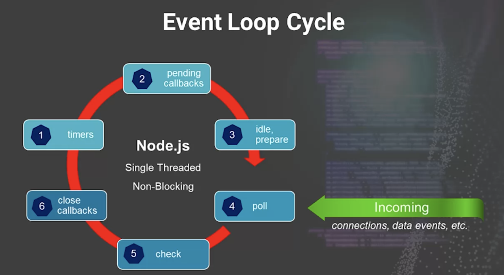
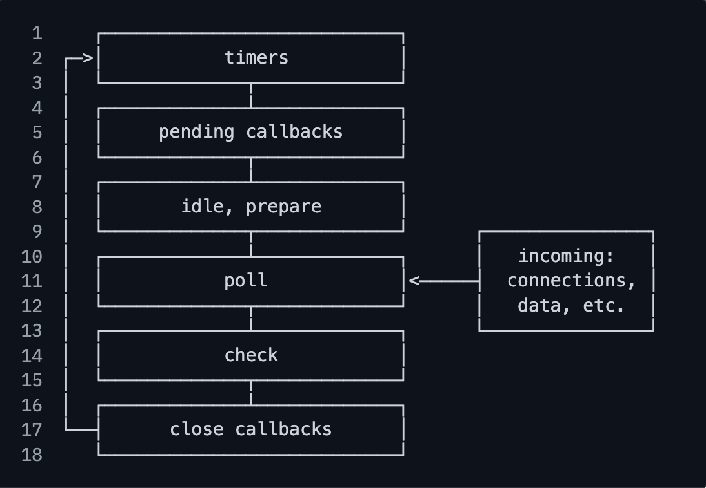

Review
1. 2024-08-12 08:08

> [!Summary]
> 

## 一、Introduction
> The event loop is what allows Node.js to perform non-blocking I/O operations — despite the fact that a single JavaScript thread is used by default — by offloading operations to the system kernel whenever possible.
> 
> Since most modern kernels are multi-threaded, they can handle multiple operations executing in the background. When one of these operations completes, the kernel tells Node.js so that the appropriate callback may be added to the **poll** queue to eventually be executed.

A set of ***six phases*** that perform specific tasks.
Implemented by the C library `libuv`.
Keeps NodeJS running with non-blocking(asynchronous) operations.
Offloads long operations to the system kernal.
	I/O operations.
	DB connections.
	Network operations.

## Reactor Pattern
Reactor 模式是一种用于处理并发 I/O 的设计模式。它特别适用于需要处理大量并发连接的场景，比如网络服务器。在 Reactor 模式中，有一个或多个反应器（Reactor）负责监听事件，当有事件发生时，反应器就会分发给相应的处理程序进行处理。

> **Reactor Pattern** is an idea of non-blocking I/O operations in Node.js. This pattern provides a handler(in case of Node.js, a _callback function_) that is associated with each I/O operation. When an I/O request is generated, it is submitted to a _demultiplexer_.
> 
> This _demultiplexer_ is a notification interface that is used to handle concurrency in non-blocking I/O mode and collects every request in form of an event and queues each event in a queue. Thus, the demultiplexer provides the _Event Queue_.
> 
> At the same time, there is an Event Loop which iterates over the items in the Event Queue. Every event has a callback function associated with it, and that callback function is invoked when the Event Loop iterates.

#### Reactor 模式的核心组件
- **Reactor：** 反应器是整个模式的核心，它负责监听事件，并将事件分发给对应的处理程序。
- **Handle：** Handle 代表一个事件源，比如一个 socket 连接。
- **Handler：** Handler 是一个回调函数，当对应的事件发生时，Reactor 会调用这个回调函数来处理事件。

#### Reactor 模式的运作流程
1. **初始化：** 创建 Reactor 对象，注册需要监听的事件和对应的 Handler。
2. **事件分发：** Reactor 进入事件循环，不断地检查是否有新的事件发生。
3. **事件处理：** 当有新的事件发生时，Reactor 将事件分发给对应的 Handler 进行处理。
4. **异步处理：** Handler 在处理事件时，通常会进行异步操作，比如发起 I/O 请求。
5. **事件循环继续：** 处理完事件后，Reactor 继续回到事件循环，监听新的事件

#### Reactor 模式的优点
- **高并发：** Reactor 模式可以高效地处理大量的并发连接，因为每个连接都是异步处理的。
- **响应快：** 由于采用了事件驱动的机制，Reactor 模式可以快速响应事件。
- **可扩展性：** Reactor 模式易于扩展，可以添加新的事件和 Handler。
- **可复用性：** Reactor 模式是一种通用的模式，可以应用于各种 I/O 密集型的场景。

#### Reactor 模式在 Node.js 中的应用
Node.js 的事件循环就是基于 Reactor Pattern 实现的。当我们使用 Node.js 开发服务器时，底层就是通过 Reactor Pattern 来处理大量的 HTTP 请求。
- **事件循环：** Node.js 的事件循环就是一个 Reactor，它不断地监听事件，并将事件分发给对应的回调函数。
- **异步 I/O：** Node.js 的异步 I/O 操作也是基于 Reactor 模式实现的，比如读取文件、网络请求等。

## Reference
[#OFFICIAL# The Node.js Event Loop](https://nodejs.org/en/learn/asynchronous-work/event-loop-timers-and-nexttick)
[dont block the event loop](https://nodejs.org/en/learn/asynchronous-work/dont-block-the-event-loop)
