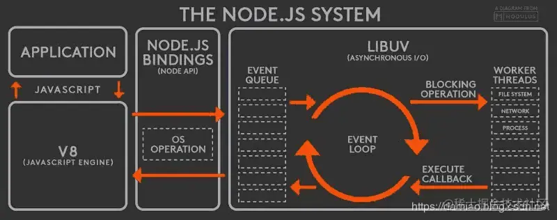

#Threads #Process 


Review
1. 2020/03/15
2. 2024-07-17 08:29
3. 2024-08-17


> [!Summary]
> 1. `child_process` : `fork`, `spawn`, `exec` 
> 2. Cluster Process
> 3. Worker Threads 


## 一、Introduction
> Node.js is a **single-threaded** language and gives us ways to work parallelly to our main process. Taking note of nowadays multicore system single threading is very memory efficient.

> 进程 `Process` 是计算机中的程序关于某数据集合上的一次运行活动，是系统进行资源分配和调度的基本单位，是操作系统结构的基础，进程是线程的容器。进程是资源分配的最小单位。多进程就是进程的复制（fork），fork 出来的每个进程都拥有自己的独立空间地址、数据栈，一个进程无法访问另外一个进程里定义的变量、数据结构，只有建立了 IPC 通信，进程之间才可数据共享。

> 线程是操作系统能够进行运算调度的最小单位，首先我们要清楚线程是隶属于进程的，被包含于进程之中。**一个线程只能隶属于一个进程，但是一个进程是可以拥有多个线程的**。


> **Node 严格讲并非只有一个线程，通常说的 “Node 是单线程” 是指 JS 的执行主线程只有一个**。



- **应用层**： 即 JavaScript 交互层，常见的就是 Node.js 的模块，比如 `http`，`fs`
- **V8引擎层**： 即利用 V8 引擎来解析JavaScript 语法，进而和下层 API 交互
- **Node API层**： 为上层模块提供系统调用，一般是由 C 语言来实现，和操作系统进行交互 。
- **LIBUV层**： 是跨平台的底层封装，实现了 事件循环、文件操作等，是 Node.js 实现异步的核心

**Node 进程中并非只有一个线程**。事实上一个 Node 进程通常包含：1 个 Javascript 执行主线程；1 个 watchdog 监控线程用于处理调试信息；1 个 v8 task scheduler 线程用于调度任务优先级，加速延迟敏感任务执行；4 个 v8 线程，主要用来执行代码调优与 GC 等后台任务；以及用于异步 I/O 的 libuv 线程池。


```js
const http = require('http');

const server = http.createServer();
server.listen(3000,()=>{
    process.title='程序员成长指北测试进程';
    console.log('进程id',process.pid)
})

```


## 二、NodeJS 多进程
多进程可充分利用多核CPU性能
1. `child_process.fork`
2. `cluster` 调用的仍然是 `child_process.fork` 

> The `Cluster` module allows you to easily create child processes that each runs simultaneously on their own single thread, to handle workloads among their application threads.

diff
- `child_process.spawn()`：适用于返回大量数据，例如图像处理，二进制数据处理。This method doesn’t generate a new V8 instance, and only a single copy of the node module is active on the processor.
- `child_process.exec()`：适用于小量数据，maxBuffer 默认值为 200 * 1024(*200KB*) 超出这个默认值将会导致程序崩溃，数据量过大可采用 spawn。
- `child_process.fork()`： 衍生新的进程，进程之间是相互独立的，每个进程都有自己的 V8 实例、内存，系统资源是有限的，不建议衍生太多的子进程出来，通长根据系统 **CPU 核心数**设置。`fork()` is a particular case of `spawn()` that generates a new instance of a V8 engine. Creates child processes that are independent and have their own memory space and event loop.

```js
const fs = require('fs');
const { spawn } = require('child_process');

const ls = spawn('ls', ['-la']);
const writeStream = fs.createWriteStream('output.txt');

ls.stdout.pipe(writeStream);
```

> `fork` 每个子进程都是完全独立的，拥有自己的端口和内存空间，适合需要完全隔离的场景。可以通过管道、共享内存、消息队列等进行通信。专门用于创建新的 Node.js 进程，并与父进程建立 IPC 通道，实现高效的进程间通信。

```js
const { fork } = require('child_process');
const child = fork('./worker.js');

child.send({ message: 'ping' });
child.on('message', (message) => {
    console.log(message); // 收到子进程的回复
});
```


#### Cluster process
**Purpose:** Creates multiple worker processes that share the same memory space and event loop.

**Communication:** Uses a shared memory space and inter-process communication (IPC) for communication between the master process and worker processes.

> [!Caution]
> 虽然 Cluster 子进程共享同一个端口，但它们并不是完全共享内存的。进程间通信的开销相对较大，尤其是当通信频率较高或者数据量较大时。
> 
> **为什么说它们共享内存呢？**
> - **共享端口：** 所有子进程共享同一个端口，这意味着它们可以共同处理传入的请求。
> - **共享部分状态：** 一些全局变量、模块缓存等可能会被多个子进程共享，但具体的共享范围和机制比较复杂。
> 
> **为什么说它们不完全共享内存？**
> - **独立的 V8 实例：** 每个子进程都有自己的 V8 实例，这意味着它们有独立的堆内存和执行上下文。
> - **独立的堆栈：** 每个子进程都有自己的堆栈，用于存储函数调用、局部变量等信息。


```js
const cluster = require('node:cluster');
const http = require('node:http');
const numCPUs = require('node:os').cpus().length;

if (cluster.isPrimary) {
  console.log(`主进程 ${process.pid} 正在运行`);

  // Fork worker processes.
  for (let i = 0; i < numCPUs; i++) {
    cluster.fork();
  }

  cluster.on('exit', (worker, code, signal) => {
    console.log(`worker ${worker.process.pid} died`);
  });

  cluster.on('message', (worker, message) => {
    console.log('primary msg', worker.id, message);
    worker.send('收到')
  });
} else {
  // Workers can share any TCP port they want, including the same one as the parent
  http.createServer((req, res) => {
    res.writeHead(200);
    res.end(`Hello from worker ${process.pid}`);
  }).listen(3000);

  // 向主进程发送消息
  process.send({ msg: 'Hello from worker' });
  process.send({ msg: 'Hello from worker2' });

  // 监听主进程发送的消息
  process.on('message', (msg) => {
    console.log(`Worker ${process.pid} received:`, msg);
  });
}
```

> 1. 通过 `cluster.isPrimary` 和 `cluster.isWorker` 判断是主进程还是子进程
> 
> 2. 创建Worker Process `const worker = cluster.fork()` 
> 3. 主进程监听 `message`, `exit`, `online`, `setup`, `fork` 
> 4. 主进程可以使用 `worker.send()` 给worker process发送消息
> 
> 5. 子进程通过 `process.on('message', (msg)=> {})` 监听主进程的消息
> 6. 通过 `process.send({msg: 'ok'})` 向主进程发送消息


**pm2 是 cluster 的高级封装：** pm2 在 `cluster` 的基础上提供了更高级的功能和更友好的用户体验。


## 三、Worker Threads
Worker thread is a continuous parallel thread that runs and accepts messages until it is explicitly closed or terminated. With worker threads, we can achieve a much efficient application without creating a deadlock situation. Workers, unlike children’s processes, can exchange memory.

> While clusters create multiple instances of a Node.js process, each running on a separate CPU core, worker threads provide a way to create multiple threads within a single process.

> [!Summary]
> - **本质:** 基于线程的并行，共享同一个 Node.js 进程。
> - **优势:**
>     - 创建和管理成本较低，启动速度快。
>     - 共享内存，通信开销小，适合频繁数据交换的场景。
> - **劣势:**
>     - 每个 Worker Thread 共享一个 V8 实例，内存泄漏可能影响整个进程。
>     - 不适合 CPU 密集型任务长时间运行，因为可能导致主线程阻塞。
> 
> 适用场景
> - **任务执行时间较短:** 适合执行时间较短的 CPU 密集型任务，例如图像处理、数据压缩等。
> - **需要频繁数据交换:** Worker Threads 共享内存，适合需要频繁在主线程和 Worker 之间交换数据的场景。
> - **对启动速度有较高要求:** Worker Threads 创建和管理成本较低，启动速度快。


```js
const { Worker, isMainThread, parentPort, workerData } = require('worker_threads');

// 在主线程中创建多个 Worker，模拟线程池
const numWorkers = 4; // 设置线程池大小
const workers = [];

for (let i = 0; i < numWorkers; i++) {
  const worker = new Worker('./worker.js', { workerData: { id: i } });
  workers.push(worker);

  worker.on('message', (message) => {
    console.log(`Worker ${i} says: ${message}`);
  });
}

// 模拟任务队列
const tasks = [
  { task: '任务1', data: '数据1' },
  { task: '任务2', data: '数据2' },
  { task: '任务3', data: '数据3' },
  { task: '任务4', data: '数据4' },
  // ...更多任务
];

// 将任务分发给 Worker
tasks.forEach((task, index) => {
  const workerIndex = index % numWorkers; // 轮询分配任务
  workers[workerIndex].postMessage(task);
});
```


`worker.js` 文件
```js
const { parentPort, workerData } = require('worker_threads');

console.log(`Worker ${workerData.id} started.`);

parentPort.on('message', (task) => {
  // 模拟耗时任务
  console.log(`Worker ${workerData.id} is processing task: ${task.task}`);
  const result = ''; /* ...执行耗时任务的代码 */;
  parentPort.postMessage(result);
});
```


`worker_threads` 之间无法直接共享内存（不能直接使用操作系统提供的同步原语）。如果需要共享数据，必须通过消息传递的方式（`postMessage`）进行。这种方式虽然安全，但会引入额外的通信开销。

也可以使用 `SharedArrayBuffer` 共享一块内存，可能有漏洞，注意安全。

可以使用一个*共享的计数器*来实现互斥锁的效果。

## Reference
1. [浅析 Node 进程与线程](https://www.infoq.cn/article/g6gcqifgphhetfow2vdd)
2. [深入理解Node.js 中的进程与线程](https://juejin.cn/post/6844903908385488903) 
3. [[07-NodeJS Event Loop]]
4. <https://nodejs.org/api/child_process.html#child-process> 
5. <https://nodejs.org/api/cluster.html#cluster> 
