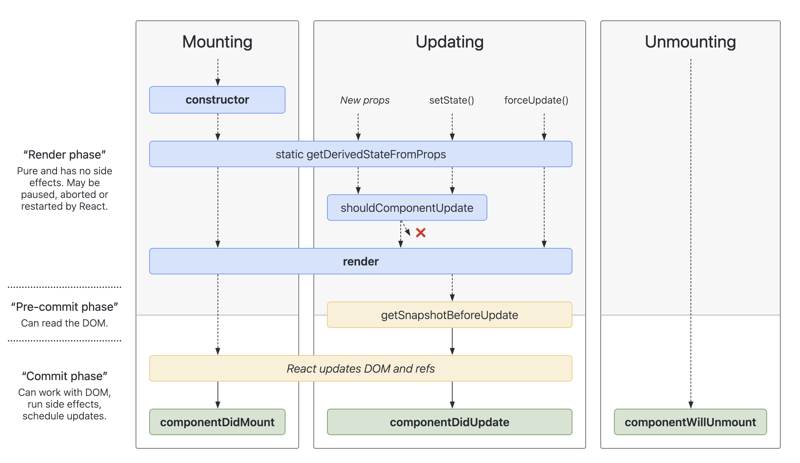

Review
1. 2024-07-29 13:44

## 一、Introduction
React components have a lifecycle consisting of three phases: Mounting, Updating, and Unmounting along with several “lifecycle methods” that you can override to run code at particular times in the process.

Lifecycle diagram <https://projects.wojtekmaj.pl/react-lifecycle-methods-diagram/>

### 生命周期
**4-5-1-1**
#### 挂载阶段
1. constructor
2. static getDerivedStateFromProps
3. render
4. componentDidMount

#### 更新阶段
1. static getDerivedStateFromProps
2. shouldComponentUpdate
3. render
4. getSnapshotBeforeUpdate
5. componentDidUpdate

#### 卸载阶段
1. componentWillUnmount

#### 异常捕获
1. componentDidCatch

## Reference
<https://react.dev/learn/lifecycle-of-reactive-effects>
