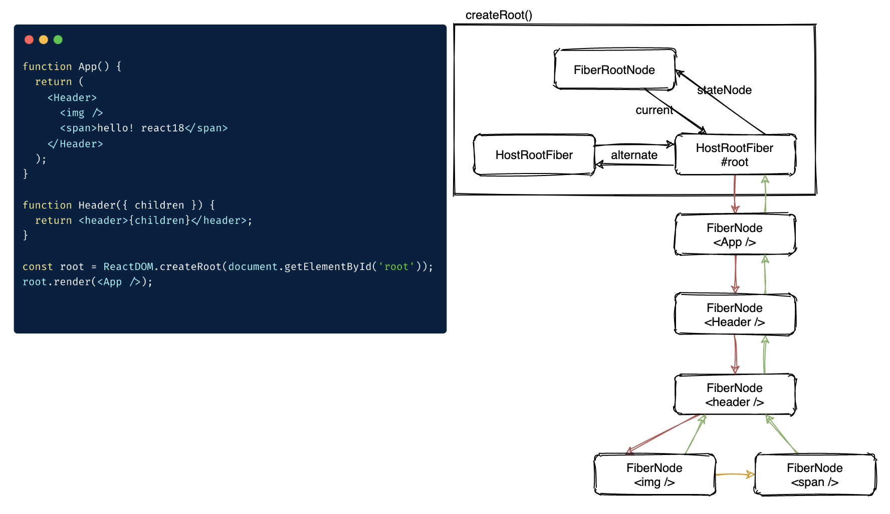

Review
1. 2020/08/03
2. 2021/01/07
3. 2023/02/08
2. 2024-08-20 07:50

> [!Summary]
> Fiber 指一种架构，或者一种算法、或者Fiber数据结构。
> Fiber 采用==双缓存架构==，current指向前缓冲区的FiberNode，workInProgress 指向后缓冲区的FiberNode。alternate属性指向“另一个缓冲区中对应的FiberNode”
> 
> React `fiber` is the **reconciliation engine** that replaced the **core algorithm** in React v16. It is a rewrite of the core algorithm, responsible for scheduling what gets rendered on screen. It is a set of algorithms for efficiently updating the UI. It's the internal implementation of React's reconciliation process, designed to enable incremental rendering.
> Here is a [bit-outdated but quite good article about React Fiber](https://github.com/acdlite/react-fiber-architecture). 
> 
> **Reconciliation** is the ==process== through which React updates the DOM by comparing the newly returned elements with the previously rendered ones. React updates the DOM when a component's state changes.
> 
> 1. **Reimplementation diff algorithm**
> 2. **reconciliation Engine** new reconciliation algorithm

1. Fiber是什么
2. Fiber数据结构
3. Fiber运行机制(render & commit)
4. Work是什么
5. 如何diff

> Fiber main goals are:
> 1. Ability to split interruptible work in chunks.
> 2. Ability to prioritize, rebase and reuse work in progress.
> 3. Ability to yield back and forth between parents and children to support layout in React.
> 4. Ability to return multiple elements from render().
> 5. Better support for error boundaries.

## 一、What's Fiber
*React Fiber is a reimplementation of React's core algorithm, released in September 2017 as React v16.0.* It was designed to improve the overall performance of React applications, particularly in terms of rendering and updating large or complex user interfaces. React Fiber is a complete rewrite of React's reconciliation process and works by breaking down a render into smaller, more manageable tasks that can be spread out over time and across multiple frames. This allows React to more efficiently schedule and render updates, leading to better overall performance for the user.

React Fiber is a complex and highly optimized system for rendering and updating user interfaces in React. It works by breaking down the process of rendering a component tree into smaller, more manageable tasks, and using a fiber data structure to keep track of the state of each task.

At a high level, the **Fiber architecture** can be broken down into several key parts:

1. **`FiberNode`** 每个FiberNode对应一个 ReactElement 
2. **Reconciliation**: The process of comparing the current component tree with the desired component tree, and determining which parts of the tree need to be updated.
3. **Fiber Tree**: 多个 *FiberNode* 组成的树状结构（链式结构）；A tree data structure that represents the component tree and stores information about the state of each component, including the priority of its update, the DOM node it represents, and other metadata.
4. **Task Scheduling**: The process of determining the order in which fiber nodes should be processed, based on the priority of their updates and the dependencies between different fibers.
5. **Rendering**: The process of actually rendering the component tree to the DOM, including rendering the component's output, updating the DOM, and handling any side effects.
6. **Interruptions**: The ability to interrupt the rendering process if necessary, such as when a higher priority update becomes available or the user interacts with the page.
7. **Work Stealing**: A mechanism for optimizing the allocation of work between different fibers, to ensure that all fibers are making progress and to minimize the time spent in rendering.

> Overall, the React Fiber architecture is designed to provide improved performance and responsiveness for React applications, particularly for complex and dynamic user interfaces. By breaking down the rendering process into smaller, more manageable tasks, React Fiber is able to more efficiently schedule and render updates, leading to a better user experience.

**reconciliation**
The algorithm React uses to diff one tree with another to determine which parts need to be changed.

**Motivation**
The goal of React Fiber is to increase its suitability for areas like **_animation_**, **_layout_**, and **_gestures_**. Its headline feature is **incremental rendering**: the ability to split rendering work into chunks and spread it out over multiple frames.

Other key features include the ability to **_pause, abort, or reuse_** work as new updates come in; the ability to assign **_priority_** to different types of updates; and new **_concurrency_** primitives.

Prerequisites
- [React Components, Elements, and Instances](https://reactjs.org/blog/2015/12/18/react-components-elements-and-instances.html) - "Component" is often an overloaded term. A firm grasp of these terms is crucial.
- [Reconciliation](https://reactjs.org/docs/reconciliation.html) - A high-level description of React's reconciliation algorithm.
- [React Basic Theoretical Concepts](https://github.com/reactjs/react-basic) - A description of the conceptual model of React without implementation burden. Some of this may not make sense on first reading. That's okay, it will make more sense with time.
- [React Design Principles](https://reactjs.org/docs/design-principles.html) - Pay special attention to the section on scheduling. It does a great job of explaining the _why_ of React Fiber.

## 二、Structure of a Fiber/FiberNode
In concrete terms, a fiber is a JavaScript object that contains information about a component, its input, and its output.

A fiber corresponds to a stack frame, but it also corresponds to an instance of a component.

> 生成 FiberNode 的流程
> JSX -> createElement -> ReactElement -> FiberNode

```ts
export type Fiber = {
  // These first fields are conceptually members of an Instance. This used to
  // be split into a separate type and intersected with the other Fiber fields,
  // but until Flow fixes its intersection bugs, we've merged them into a
  // single type.

  // An Instance is shared between all versions of a component. We can easily
  // break this out into a separate object to avoid copying so much to the
  // alternate versions of the tree. We put this on a single object for now to
  // minimize the number of objects created during the initial render.

  // Tag identifying the type of fiber.
  tag: WorkTag,

  // Unique identifier of this child.
  key: null | string,

  // The value of element.type which is used to preserve the identity during
  // reconciliation of this child.
  elementType: any,

  // The resolved function/class/ associated with this fiber.
  type: any,

  // The local state associated with this fiber.
  stateNode: any,

  // Conceptual aliases
  // parent : Instance -> return The parent happens to be the same as the
  // return fiber since we've merged the fiber and instance.

  // Remaining fields belong to Fiber

  // The Fiber to return to after finishing processing this one.
  // This is effectively the parent, but there can be multiple parents (two)
  // so this is only the parent of the thing we're currently processing.
  // It is conceptually the same as the return address of a stack frame.
  return: Fiber | null,

  // Singly Linked List Tree Structure.
  child: Fiber | null,
  sibling: Fiber | null,
  index: number,

  // Input is the data coming into process this fiber. Arguments. Props.
  pendingProps: any, // This type will be more specific once we overload the tag.
  memoizedProps: any, // The props used to create the output.

  // A queue of state updates and callbacks.
  updateQueue: mixed,

  // The state used to create the output
  memoizedState: any,

  // Dependencies (contexts, events) for this fiber, if it has any
  dependencies: Dependencies | null,

  // Bitfield that describes properties about the fiber and its subtree. E.g.
  // the ConcurrentMode flag indicates whether the subtree should be async-by-
  // default. When a fiber is created, it inherits the mode of its
  // parent. Additional flags can be set at creation time, but after that the
  // value should remain unchanged throughout the fiber's lifetime, particularly
  // before its child fibers are created.
  mode: TypeOfMode,

  // Effect
  flags: Flags,
  subtreeFlags: Flags,
  deletions: Array<Fiber> | null,

  lanes: Lanes,
  childLanes: Lanes,

  // This is a pooled version of a Fiber. Every fiber that gets updated will
  // eventually have a pair. There are cases when we can clean up pairs to save
  // memory if we need to.
  alternate: Fiber | null,
};
```


## 三、Fiber 机制
Fiber 采用双缓存架构，current指向前缓冲区的FiberNode，workInProgress 指向后缓冲区的FiberNode。alternate属性指向“另一个缓冲区中对应的FiberNode”

Fiber 工作原理从 mount 流程和 update 流程讲解。

mount 流程分为2种情况
1. 整个应用首次渲染
2. 状态变化导致某个组件首次渲染

> [!SUCCESS] 名词解释 
> 1. `FiberRootNode` 整个 Fiber 树根节点，有2个指针 `current` 和 `workInProgress` 分别指向当前 Fiber 树和 workInProgress 树。负责 current 和 wip 的切换，存储应用的调度信息和任务的过期时间
> 2. `HostRootFiber` **根FiberNode**，即挂载React应用的Dom对应的FiberNode

mount 时 FiberTree 构建过程
1. 创建 `FiberRootNode` 
2. 创建 `HostRootFiber` (tag=3 的 FiberNode)
3. 从 `HostRootFiber` 开始，以 DFS 顺序生成 `FiberNode` ，遍历过程中标记 flags，以此生成 `FiberTree` 




## The diffing algorithm
**❶ Elements Of Different Types**
This will destroy the old Component and remount a new one.

**❷ DOM Elements Of The Same Type**
React looks at the attributes of both, keeps the same underlying DOM node, and only updates the changed attributes. 

After handling the DOM node, React then recurses on the children.

**❸ Component Elements Of The Same Type**
 React updates the props of the underlying component instance to match the new element, and calls componentWillReceiveProps() and componentWillUpdate() on the underlying instance.

Next, the render() method is called and the diff algorithm recurses on the previous result and the new result.

**❹ Recursing On Children**
By default, when recursing on the children of a DOM node, React just iterates over both lists of children at the same time and generates a mutation whenever there’s a difference.

**Scheduling**
**_scheduling_**
the process of determining when work should be performed.

**_work_**
any computations that must be performed. Work is usually the result of an update (e.g. setState).

The key points are:
- In a UI, it's not necessary for every update to be applied immediately; in fact, doing so can be wasteful, causing frames to drop and degrading the user experience.
- Different types of updates have different priorities — an animation update needs to complete more quickly than, say, an update from a data store.
- A push-based approach requires the app (you, the programmer) to decide how to schedule work. A pull-based approach allows the framework (React) to be smart and make those decisions for you.


## Reference
- [React v18.0](https://react.dev/blog/2022/03/29/react-v18) 
- Inside Fiber: in-depth overview of the new reconciliation algorithm in React: https://indepth.dev/posts/1008/inside-fiber-in-depth-overview-of-the-new-reconciliation-algorithm-in-react
- react fiber architecture: https://github.com/acdlite/react-fiber-architecture
- react reconciler: https://github.com/facebook/react/tree/master/packages/react-reconciler
- The how and why on React’s usage of linked list in Fiber to walk the component’s tree: https://indepth.dev/posts/1007/the-how-and-why-on-reacts-usage-of-linked-list-in-fiber-to-walk-the-components-tree
- Reconciliation: https://reactjs.org/docs/reconciliation.html
- [How React 18 Improves Application Performance](https://vercel.com/blog/how-react-18-improves-application-performance) 
