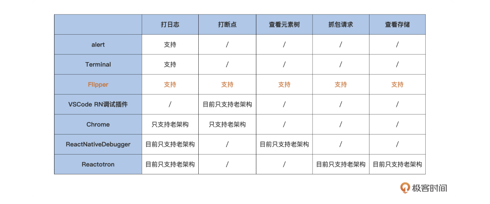

Review
1. 2024-10-14 06:52

> [!Summary]
> [Debugging Basics](https://reactnative.dev/docs/debugging) 

## 一、Introduction

流行的调试工具
1. alert
2. **Terminal**: console.log
3. **Flipper** <https://fbflipper.com/> 
4. React Native Debugger
5. Reactotron

> Flipper is a platform for debugging iOS, Android and React Native apps. Visualize, inspect, and control your apps from a simple desktop interface. Use Flipper as is or extend it using the plugin API.

## Reference

