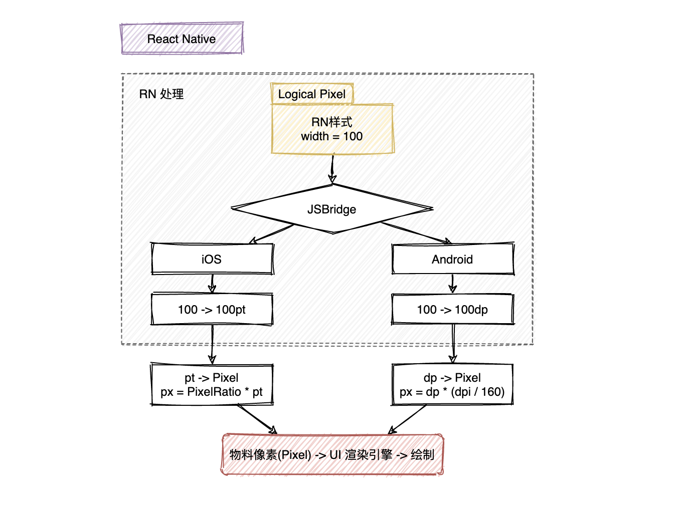

Review
1. 2024-08-24 08:15

> [!Summary]
> React Native 中的尺寸都是==无单位==的，表示的是与*设备像素密度无关*的==逻辑像素点==(logical pixels)。
> React Native's default unit is density-independent pixels (dp) while the web's default is pixels (px).

## 一、Introduction
React Native 中的尺寸都是==无单位==的，表示的是与*设备像素密度无关*的==逻辑像素点==(logical pixels)。

1. iOS逻辑像素：pt (point) `1pt = 1/163 inch`
2. Android逻辑像素：dp/dip (Density-independent Pixels) `1dp = 1/160 inch` 

RN Units
1. number
2. percentage(百分比)




**常用组合工具**
1. Dimensions
2. PixelRatio

```js
const {
  height,
  width
} = Dimensions.get('window');
```

1. window: Size of the visible Application window.
2. screen: Size of the device's screen.

> For Android the `window` dimension will exclude the size used by the `status bar` (if not translucent) and `bottom navigation bar`


SafeArea
<https://github.com/th3rdwave/react-native-safe-area-context> 
A flexible way to handle safe area, also works on Android and Web!


### 术语（Terms）
1. 物理尺寸：Inch英寸，`1 Inch = 2.54 centimeters` 屏幕对角线长度。这个“物理尺寸”存在混淆，尽可能使用屏幕尺寸指代对角线长度，使用设备尺寸指代物理设备的尺寸，包括边框。
2. 物理像素(Pixel)：屏幕上最小的显示单元，物理像素越多，屏幕分辨率越高，显示效果越细腻
3. 像素密度(**PPI**, Pixels Per Inch)：每英寸上的像素数，像素密度越高，显示效果越清晰
4. 设备分辨率(Resolution)：The total number of physical pixels on a screen. `width pixel * height pixel` 
5. 屏幕尺寸：屏幕的对角线长度，单位Inch，屏幕尺寸越大，可以显示的内容越多。
6. 操作系统：不同的操作系统有不同的缩放比例和字体渲染方式
7. 应用设置：用户可以自定义应用的字体大小、缩放比例等设置
8. **CSS/布局引擎:** CSS样式、布局引擎的计算方式都会影响最终的显示效果。


- dp (密度独立像素) 和 dip (设备独立像素) 实际上是同一个概念，只是不同的缩写
- sp (Scale-Independent Pixel) the same as dp but for Fonts
- pt (Points) `1/72`  of an inch based on the physical size of the screen.


### 设备屏幕密度DPI
1. **DPI** (Dots Per Inch)  每英寸点数，最初用于描述打印分辨率，Android开发中DPI用于定义屏幕密度。iOS不直接使用DPI，而是使用 `scale factor` 如 @2x, @3x
2. **PPI** (Pixels Per Inch) 每英寸像素数，更准确的描述数字屏幕

> 在讨论数字屏幕时，DPI 和 PPI 常被互换使用，严格来说，对于屏幕，PPI 是更准确的术语。Android 开发中通常使用 DPI 这个术语，实际上指的是 PPI。

```txt
PPI/DPI = 屏幕对角线像素数 / 屏幕对角线英寸数
```

密度桶(Density Buckets)
1. `ldpi`: 120dpi, Resources for low-density (_ldpi_) screens
2. `mdpi`: 160dpi, Resources for medium-density (_mdpi_) screens (~160 dpi). This is the baseline density.
3. `hdpi`: 240dpi
4. `xhdpi`: 320dpi
5. `xxhdpi`: 480dpi
6. `xxxhdpi`: 640dpi

```txt
px = dp * (dpi / 160)
```

```js
import {
  PixelRatio,
} from 'react-native';

PixelRatio.get();

// Android: PixelRatio = dpi / 160
// iOS: PixelRatio = scale factor
```


UI稿等比适配手机的转换
```ts
import {Dimensions} from 'react-native';

// 58 app 只有竖屏模式，所以可以只获取一次 width
const deviceWidthDp = Dimensions.get('window').width;
// UI 默认给图是 640 像素
const uiWidthPx = 640;

function uiToDp(uiElementPx) {
   return uiElementPx *  deviceWidthDp / uiWidthPx;
}

export default uipxToDp;
```


## Reference
<https://reactnative.dev/docs/layout-props> 
<https://developer.android.com/guide/practices/screens_support.html#terms> 
<https://developer.android.com/training/multiscreen/screendensities> 
<https://stackoverflow.com/questions/2025282/what-is-the-difference-between-px-dip-dp-and-sp> 
