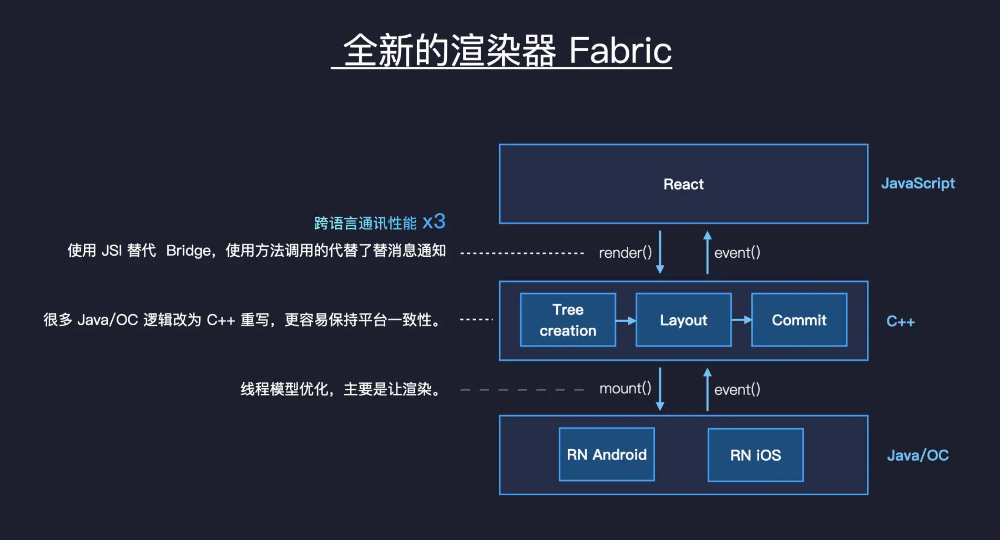

Review
1. 2024-10-02 10:46

> [!Summary]
> 

## 一、Introduction
Fabric渲染器是React Native新架构中的一项核心技术，旨在提升React Native的性能、可扩展性和与原生平台的互操作性。它通过重构渲染流水线，将更多的渲染逻辑下沉到C++层，从而实现更流畅的UI更新和更强的平台适配能力。

Fabric渲染器包括JS层和原生层。

##### 为什么需要Fabric渲染器？
- **性能提升：**
    - **C++层优化：** 将渲染逻辑下沉到C++层，利用C++的性能优势，减少JavaScript层的工作量。
    - **减少桥接开销：** 减少JavaScript和原生平台之间的通信次数，降低桥接开销。
- **可扩展性增强：**
    - **模块化设计：** Fabric采用模块化的设计，使得开发者可以更方便地定制和扩展渲染器。
    - **支持新特性：** Fabric为React Native带来了更多的新特性，如悬浮窗、手势识别等。
- **平台兼容性更好：**
    - **统一的渲染模型：** Fabric在C++层提供了一个统一的渲染模型，使得React Native应用在不同平台上的表现更加一致。

##### Fabric渲染器的核心概念
- **Shadow Tree:** 一种虚拟的UI树，用于表示组件的*布局和样式*信息。Shadow Tree在C++层进行维护，可以更有效地进行布局计算和视图更新。
- **Yoga:** 一个用于布局计算的开源库，被广泛应用于React Native中。Fabric将Yoga集成到C++层，进一步提升了布局性能。计算出*布局*。
- **组件系统:** Fabric引入了新的组件系统，使得开发者可以更方便地创建自定义组件。

##### Fabric渲染器的优势
- **性能卓越：** Fabric渲染器显著提升了React Native的性能，尤其是在复杂界面和高帧率场景下。
- **可扩展性强：** Fabric提供了丰富的API，方便开发者定制和扩展。
- **平台兼容性好：** Fabric使得React Native应用在不同平台上的表现更加一致。
- **未来可期：** Fabric是React Native未来的发展方向，将持续引入新的特性和优化。

##### Fabric渲染器的工作流程:
1. **JavaScript层:** Hermes引擎计算VDOM diff，生成Shadow Tree更新指令。
2. **桥:** 更新指令通过桥传递给原生模块。
3. **原生层:** 原生模块更新Shadow Tree，触发原生渲染（iOS是UIKit，Android是View System）。

###### 正确的顺序是：
1. **创建 Shadow Tree**
2. **Yoga 计算布局**
3. **更新 Shadow Tree**

###### 为什么是这个顺序？
- **Shadow Tree 提供布局信息:** Shadow Tree 包含了组件的样式信息，这些信息是 Yoga 进行布局计算所必需的。
- **Yoga 更新 Shadow Tree:** Yoga 计算出的布局结果会反馈给 Shadow Tree，从而使 Shadow Tree 更加完整和准确。

## Reference
1. [Introduce Fabric Architecture](https://medium.com/mindful-engineering/fabric-architecture-react-native-a4f5fd96b6d2) 
2. [What is Fabric in React Native and how does it work?](https://dianapps.com/blog/what-is-fabric-in-react-native-and-how-does-it-work/) 
3. [Unraveling Fabric: The Future of React Native’s Architecture](https://medium.com/@antoniogally/unraveling-fabric-the-future-of-react-natives-architecture-3fd88de8963a) 

