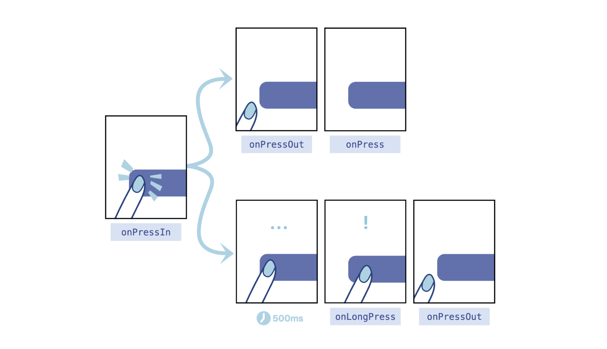
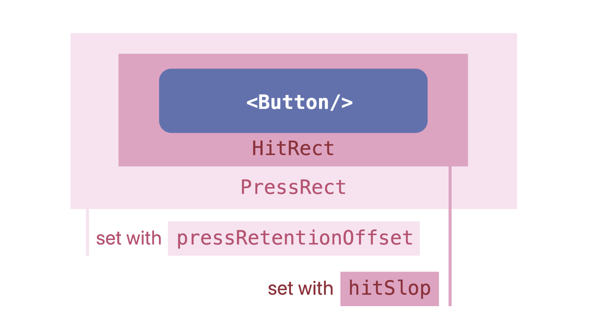

Review
1. 2024-10-13 17:20

> [!Summary]
> 3种点按组件
> 1. 第一代点按组件 Touchable，功能丰富但学习成本太高；
> 2. 第二代点按组件 Button，简单易用但带了默认样式和反馈效果，通用性太差；
> 3. 第三代点按组件 Pressable，同时满足了简单易用和复杂效果可扩展的特性。
> 
> 2个区域
> - 可触发区域 HitRect
> - 可保留区域 PressRect

## 一、Introduction
3个经典问题
1. 点按组件是要简单易用还是要功能丰富，如何取舍？
2. 点按组件是如何知道它是被点击了，还是被长按了？
3. 点按组件为什么还要支持用户中途取消点击？


### 第一代 Touchable 组件
第一代 Touchable 点按组件的设计思路是，提供多种原生平台的反馈风格给开发者自己选择。框架提供了 1 个基类和 4 个扩展类，它们分别是：
1. TouchableWithoutFeedback：用于响应用户的点按操作，但不给出任何点按反馈效果。反馈效果由 4 个扩展类实现；
2. TouchableNativeFeedback：给出当前原生平台的点按反馈效果，在 Android 中是涟漪（ripple）效果，就是从点击处散开水波纹的效果；
3. TouchableOpacity：短暂地改变组件的透明度；TouchableHighlight：短暂地加深组件的背景色；
4. TouchableBounce：有 bounce 回弹动画的响应效果。


### 第二代 Button 组件
第二代 Button 组件的实质是对 Touchable 组件的封装。在 Android 上是 TouchableNativeFeedback 组件，在 iOS 上是 TouchableOpacity 组件。

Button 组件的设计思想就是，别让开发者纠结选啥组件了，框架已经选好了，点按反馈的样式就和原生平台的自身风格保持统一就好了。

### 第三代 Pressable 组件
第三代 Pressable 点按组件，不再是 Touchable 组件的封装，而是一个全新重构的点按组件，它的反馈效果可由开发者自行配置。

点按组件通常是有点击和未点击两种状态的，这两种状态对应着两种点按样式，一种样式是未点击时的基础样式，一种是点按后的反馈样式。

```ts
type PressableStyle = ViewStyle | (({ pressed: boolean }) => ViewStyle)
```


```tsx
// 固定的基础样式
const baseStyle = { width: 50, height: 50, backgroundColor: 'red'}

<Pressable
  onPress={handlePress}
  style={baseStyle} >
  <Text>按钮</Text>
</Pressable>
```

```tsx
// 固定的基础样式
const baseStyle = { width: 50, height: 50, backgroundColor: 'red'}

<Pressable
  onPress={handlePress}
  style={({ pressed }) => [ /* 动态样式 */
    baseStyle,
    { opacity: pressed ? 0.5 : 1} 
  ]} >
  <Text>按钮</Text>
</Pressable>
```

除了改变透明度，你还可以选择改变背景色，改变按钮的宽高，甚至还可以把“按钮”的文字改了。

开始响应事件和结束响应事件是两个最基础的手势事件，在 Android、iOS 或者 Web 中都有类似的事件。
- onResponderGrant：开始响应事件，用户手指接触屏幕，且该手势被当前组件锁定后触发；
- onResponderRelease：结束响应事件，用户手指离开屏幕时触发。

基于开始响应事件 onResponderGrant 和结束响应事件 onResponderRelease，Pressable 组件可以很容易地封装出开始点按事件 onPressIn 和结束点按事件 onPressOut。


- 如果间隔耗时 < 500ms 属于点击。用户的点按动作会先触发 onPressIn，再触发 onPressOut，在 onPressOut 事件中可以触发我们 “自定义的”点击事件 onPress；
- 如果间隔耗时 >= 500ms 属于长按。用户的点按动作会先触发 onPressIn，这个时候你可以埋下一个定时器，并在第 500ms 时通过定时器触发我们 “自定义的” onLongPress，最后在用户松手的时候触发 onPressOut。

实际上，React Native 框架就是这么设计的。同时监听了 onPress 和 onLongPress 两个事件时，如果点按耗时小于 500ms，在你松手时触发的是点击事件 onPress；如果点按耗时大于 500ms，大致会在第 500ms 先触发长按事件 onLongPress，那这时即使你再松手也不会触发 onPress 事件了。也就是说，点击事件 onPress 和长按事件 onLongPress 是互斥的，触发了一个就不会再触发另一个了。




> 点按操作手势的可用范围包括盒模型区域、可触发区域 HitRect 和可保留区域 PressRect

点按事件的默认触发区域是盒模型中的默认不透明用户看得见的部分，包括 content、padding 和 border 部分。可以看得见才可以点击，这样的设计是非常合理的。

#### HitRect
Pressable 组件有一个**可触发区域** `HitRect`，默认情况下，可触发区域 HitRect 就是盒模型中的不透明的可见区域。你可以通过修改 hitSlop 的值，直接扩大可触发区域。

```ts
type Rect = {
    top?: number;
    bottom?: number;
    left?: number;
    right?: number;
}

type HitSlop = Rect | number
```

HitSlop 接收两种类型的参数，一种是 number 类型，以原有盒模型中的 border 为边界，将可触发区域向外扩大一段距离。另一种是 Rect 类型，你可以更加精准地定义，要扩大的上下左右的距离。

**可保留区域** `PressRect`。点按事件可保留区域的偏移量（Press Retention Offset）默认是 0，也就是说默认情况下可见区域就是可保留区域。你可以通过设置 pressRetentionOffset 属性，来扩大可保留区域 PressRect。

```ts
type PressRetentionOffset  = Rect | number
```

pressRetentionOffset 和 HitSlop 一样，接收两种类型的参数，一种是 number 类型，另一种是 Rect 类型。Rect 类型设置后，会以原有可触发区域为基准，将可保留区域向外扩大一段距离。

要不要触发，其实是根据你手指松开的位置来判断的，如果你*松手的位置在可保留区域内那就要触发*，如果不是那就不触发。




## Reference

