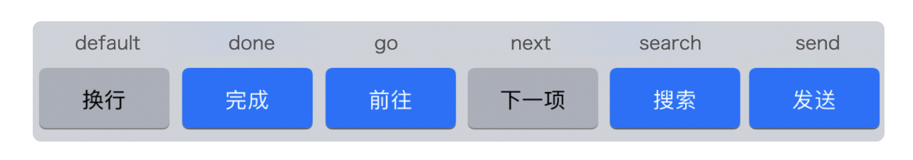

Review
1. 2024-10-13 20:02

> [!Summary]
> 

## 一、Introduction

### 受控组件 vs 非受控组件
对于受控组件来说，用户输入文字和文字展示这两步，依旧是在宿主应用层面进行的。但后续 JavaScript 业务代码也参与进去了，业务代码依次执行了 onChangeText 函数、setText 函数、controlledTextInput 函数，并且再次更新了展示值。

![[a96e5c9fd9c8_f60f916c.png]]

也就是说，受控组件更新了两次展示的值，只是因为两次展示的值是一样的，用户看不出来而已。

> [!Warning]
> “使用受控组件，并且使用异步的文字改变事件(`onChangeText`)，避免使用 `onChangeSync` ” ?
> 
> 从RN官方文档来看，没有 `onChangeSync` method。而且 `onChange` 和 `onChangeText` 都是同步调用。


### 输入框的焦点

页面只有一个搜索框的场景下 ，autoFocus 是好用的
```tsx
<TextInput autoFocus/>
```

控制 TextInput 获取焦点
```tsx
function AutoNextFocusTextInputs() {
  const ref1 = React.useRef<TextInput>(null);

  useEffect(()=>{
    ref1.current?.focus()
  },[])

  return  (
    <TextInput ref={ref1}  />
    )
}
```

使用 focus()命令对焦和使用autoFocus属性对焦，在原生应用层面的实现原理是一样的，只不过在 JavaScript 层面，前者是命令式的，后者是声明式的。

```tsx
function AutoNextFocusTextInputs() {
  const ref1,ref2,ref3 ...

  return (
    <>
      <TextInput ref={ref1} placeholder="姓名" textContentType="name" returnKeyType="next" onSubmitEditing={ref2.current?.focus}/>
      <TextInput ref={ref2} placeholder="电话"  keyboardType="phone-pad" returnKeyType="done" onSubmitEditing={ref3.current?.focus}
      />
      <TextInput  ref={ref3}  placeholder="地址"  returnKeyType="done" />
    </>
  );
}
```


### 联动键盘配置

#### 1: iOS 微信搜索框的键盘右下角按钮有一个“置灰置蓝”的功能。
默认情况下，键盘右下角的按钮显示的是置灰的“搜索”二字，当你在搜索框输入文字后，置灰的“搜索”按钮会变成蓝色背景的“搜索”二字。

控制键盘右下角按钮置灰置蓝的，是 TextInput 的enablesReturnKeyAutomatically属性，这个属性是 iOS 独有的属性，默认是false，也就是任何使用键盘右下角的按钮，都可以点击。你也可以通过将其设置为 true，使其在输入框中没有文字时置灰。

#### 2: 键盘右下角按钮的文案
有两个属性可以设置这些文案，包括 iOS/Android 通用的 `returnKeyType` 和 Android 独有的 `returnKeyLabel`。

- `default`：显示的文案是换行；iOS Only
- `done`：显示的文案是“完成”，它适合作为最后一个输入框的提示文案；
- `go`：显示的文案是“前往”，它适合作为浏览器网站输入框或页面跳出的提示文案；
- `next`：显示的文案是“下一项”，它适合作为转移焦点的提示文案；
- `search`：显示的文案是“搜索”，它适合作为搜索框的提示文案；
- `send`：显示的文案是“发送”，它比较适合聊天输入框的提示文案。




#### 3: 快速填写功能
在 iOS 上叫做 `textContentType`，在 Android 上叫做 `autoComplete`


#### 4: 键盘类型
`keyboardType` 可以控制键盘类型，可以让用户更方便地输入电话号码phone-pad、邮箱地址email-address等等。

- `default` 
- `number-pad` 
- `phone-pad` 
- `decimal-pad` 
- `email-address` 
- `url` 
- `numeric` 
- `ascii-capable`  iOS Only


## Reference

