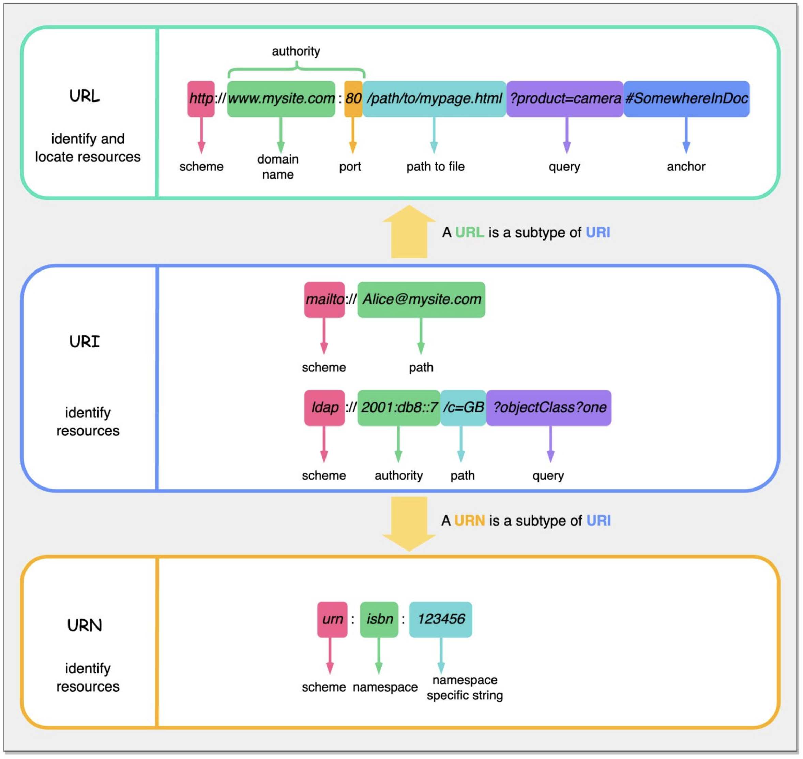

Review
1. 2023-07-03 23:38

## 一、Introduction

### 001、URL vs URI vs URN

#### URI
**URI** stands for Uniform Resource Identifier. It identifies a logical or physical resource on the web. URL and URN are subtypes of URI. URL locates a resource, while URN names a resource.

A URI is composed of the following parts:
`scheme:[//authority]path[?query][#fragment]`

#### URL
**URL** stands for Uniform Resource Locator, the key concept of HTTP. It is the address of a unique resource on the web. It can be used with other protocols like `FTP` and `JDBC`.

#### URN
**URN** stands for Uniform Resource Name. It uses the urn scheme. URNs cannot be used to locate a resource. A simple example given in the diagram is composed of a namespace and a namespace-specific string.

### 002、What are the differences between a data warehouse and a data lake?
- A data warehouse processes structured data, while a data lake processes structured, semi-structured, unstructured, and raw binary data.
    
- A data warehouse leverages a database to store layers of structured data, which can be expensive. A data lake stores data in low-cost devices.
    
- A data warehouse performs Extract-Transform-Load (ETL) on data. A data lake performs Extract-Load-Transform (ELT).
    
- A data warehouse is schema-on-write, which means the data is already prepared when written into the data warehouse. A data lake is schema-on-read, so the data is stored as it is. The data can then be transformed and stored in a data warehouse for consumption.

## Reference

