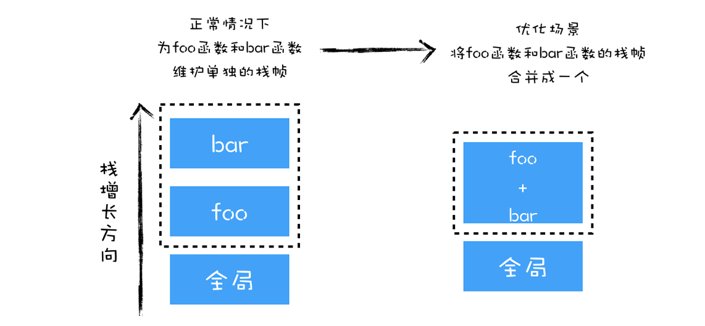

Review
1. 2023/02/11
2. 2024-10-04

## 简介
V8 是一个由 Google 开发的开源 JavaScript 引擎，目前用在 Chrome 浏览器和 Node.js 中，其核心功能是执行 JavaScript 代码。

> The Chrome V8 engine :
> - The V8 engine is written in C++ and used in Chrome and Nodejs.
> - It implements ECMAScript as specified in ECMA-262.
> - The V8 engine can run standalone we can embed it with our own C++ program.

V8 执行 JavaScript 代码主要核心流程分为 **编译** 和 **执行** 两步。首先需要将 JavaScript 代码转换为低级中间代码或者机器能够理解的机器代码，然后再执行转换后的代码并输出执行结果。


可以把 V8 看成是一个**虚拟机**，通过模拟实际计算机的各种功能来实现代码的执行，如模拟实际计算机的 CPU、堆栈、寄存器等，虚拟机还具有它自己的一套指令系统。

**高级代码为什么需要先编译再执行？**
为了能够完成复杂的任务，工程师们为 CPU 提供了一大堆指令，来实现各种功能，我们就把这一大堆指令称为**指令集**（Instructions），也就是**机器语言**。因为**CPU 只能识别二进制的指令**，但是对程序员来说，二进制代码难以阅读和记忆，于是我们又将二进制指令集转换为人类可以识别和记忆的符号，这就是**汇编指令集**。

```txt
1000100111011000  机器指令
mov ax,bx         汇编指令
```

使用汇编编写了一段程序，你还需要一个汇编编译器，其作用是将汇编代码编程成机器代码，具体流程你可以参考下图：


虽然汇编语言对机器语言做了一层抽象，减少了程序员理解机器语言的复杂度，但是汇编语言依然是复杂且繁琐的，即便你写一个非常简单的功能，也需要实现大量的汇编代码，这主要表现在以下两点。
1. 首先，不同的 CPU 有着不同的指令集（X86, Arm, MIPS, Risc-V），如果要使用机器语言或者汇编语言来实现一个功能，那么你需要为每种架构的 CPU 编写特定的汇编代码，这会带来巨大的、枯燥繁琐的操作
2. 其次，在编写汇编代码时，我们还需要了解和处理器架构相关的硬件知识，比如你需要使用寄存器、内存、操作 CPU 等。大部分程序员在编写应用的时候，只想专心处理业务逻辑，并不想要过多地理会这些处理器架构相关的细节。

**高级语言**就应运而生了，屏蔽了计算机架构细节的语言，能适应多种不同 CPU 架构的语言，能专心处理业务逻辑的语言。

通常，要有两种方式来执行高级语言代码：
第一种是**解释执行**，需要先将输入的源代码通过解析器编译成中间代码，之后直接使用解释器解释执行中间代码，然后直接输出结果
![[eeacb7b3248f_1382ad1a.webp]]
第二种是**编译执行**。采用这种方式时，也需要先将源代码转换为中间代码，然后我们的编译器再将中间代码编译成机器代码。通常编译成的机器代码是以二进制文件形式存储的，需要执行这段程序的时候直接执行二进制文件就可以了。还可以使用虚拟机将编译后的机器代码保存在内存中，然后直接执行内存中的二进制代码。


流行的JS引擎（虚拟机）
1. JavaScriptCore Safari
2. TraceMonkey Firefox
3. V8 Chrome

实际上，V8 采用混合编译执行和解释执行这两种手段，我们把这种混合使用编译器和解释器的技术称为 **JIT**（Just In Time）技术。==在启动过程中采用了解释执行的策略，但是如果某段代码的执行频率超过一个值，那么 V8 就会采用优化编译器将其编译成执行效率更加高效的机器代码==。这是一种权衡策略，因为这两种方法都各自有各自的优缺点。
- **解释执行的启动速度快，但是执行时的速度慢**
- **编译执行的启动速度慢，但是执行时的速度快**
可以参考下面完整的 V8 执行 JavaScript 的流程图：

## 执行过程

**基础环境准备**
看上图中的最左边的部分，在 V8 启动执行 JavaScript 之前，它还需要准备执行 JavaScript 时所需要的一些基础环境，这些基础环境包括了“堆空间”“栈空间”“全局执行上下文”“全局作用域”“消息循环系统”“内置函数”等，这些内容都是在执行 JavaScript 过程中需要使用到的。

**向 V8 提交要执行的 JavaScript 代码**
首先 V8 会接收到要执行的 JavaScript 源代码，不过这对 V8 来说只是一堆字符串，V8 并不能直接理解这段字符串的含义，它需要**结构化**这段字符串。结构化，是指信息经过分析后可分解成多个互相关联的组成部分，各组成部分间有明确的层次结构，方便使用和维护，并有一定的操作规范。V8 源代码的结构化之后，就生成了抽象语法树 (AST)，我们称为 AST，AST 是便于 V8 理解的结构。

**生成字节码**
字节码是介于 **AST** 和**机器代码**的中间代码。但是与特定类型的机器代码无关，***解释器可以直接解释执行字节码***，或者通过编译器将其编译为二进制的机器代码再执行。

**解释器**
按照顺序解释执行字节码，并输出执行结果。上图中在解释器附近画了个监控机器人，这是一个监控解释器执行状态的模块，在解释执行字节码的过程中，如果发现了某一段代码会被重复多次执行，那么监控机器人就会将这段代码标记为**热点代码**。

**优化编译器和反优化**
当某段代码被标记为热点代码后，V8 就会将这段字节码丢给优化编译器，优化编译器会在后台将字节码编译为二进制代码，然后再对编译后的二进制代码执行优化操作，优化后的二进制机器代码的执行效率会得到大幅提升。如果下面再执行到这段代码时，那么 V8 会优先选择优化之后的二进制代码，这样代码的执行速度就会大幅提升。不过，和静态语言不同的是，JavaScript 是一种非常灵活的动态语言，对象的结构和属性是可以在运行时任意修改的，而经过优化编译器优化过的代码只能针对某种固定的结构，一旦在执行过程中，对象的结构被动态修改了，那么优化之后的代码势必会变成无效的代码，这时候优化编译器就需要执行反优化操作，经过反优化的代码，下次执行时就会回退到解释器解释执行。

## 扩展
### Install V8
==macOS==

#### **brew**
```sh
brew install v8
```

#### **jsvu**
_jsvu_ is the **J**ava**S**cript (engine) **V**ersion **U**pdater.

_jsvu_ makes it easy to install recent versions of various JavaScript engines without having to compile them from source.

**Note:** _jsvu_ requires ==Node.js v18+==

```sh
npm install jsvu@2.0.1 -g

# add to .zshrc
export PATH="${HOME}/.jsvu/bin:${PATH}"

# 交互式安装
jsvu

# Installing specific versions
jsvu v8@7.2.502
jsvu --os=mac64 --engines=v8

# edit .zshrc
alias dk=~/.jsvu/bin/v8-debug
```

#### Build V8 and Install
[[00Installing V8 on a Mac]]

***==V8 version 11.2.100==***


### V8 debug基本代码
```js
var test = 'GeekTime'
```

```sh
# show all opts
dk --help
dk --help | grep 'print-ast'

# print ASR
dk --print-ast test.js

# 作用域
dk --print-scopes test.js

# 打印生成后的字节码
dk --print-bytecode test.js

# 热点代码
dk --trace-opt test.js
dk --trace-opt-verbose test.js

# 反优化代码
dk --trace-deopt test.js
dk --trace-deopt-verbose test.js
```


### 热点优化
_test.js_
```js
let a = {x:1}
function bar(obj) { 
  return obj.x 
}


function foo () { 
  let ret = 0
  for(let i = 1; i < 7049; i++) {
    ret += bar(a)
  }
  return ret
}


foo()
```

```sh
dk --trace-opt-verbose test.js
```

```txt
[not yet optimizing foo, not enough ticks: 1/3 and ICs changed]
[marking 0x32880025a901 <JSFunction foo (sfi = 0x32880025a7b9)> for optimization to TURBOFAN, ConcurrencyMode::kConcurrent, reason: small function]
[compiling method 0x32880025a901 <JSFunction foo (sfi = 0x32880025a7b9)> (target TURBOFAN) OSR, mode: ConcurrencyMode::kConcurrent]
```

可以看到
__marking 0x32880025a901 <JSFunction foo (sfi = 0x32880025a7b9)> for optimization to TURBOFAN, ConcurrencyMode::kConcurrent, reason: small function__

这就是告诉我们，已经使用 TurboFan 优化编译器将函数 foo 优化成了二进制代码，执行 foo 时，实际上是执行优化过的二进制代码。

还有一行信息：
**compiling method 0x32880025a901 <JSFunction foo (sfi = 0x32880025a7b9)> (target TURBOFAN) OSR, mode: ConcurrencyMode::kConcurrent**

这段提示是说，由于循环次数过多，V8 采取了 TurboFan 的 OSR 优化，OSR 全称是 On-Stack Replacement，它是一种在运行时替换正在运行的函数的栈帧的技术，如果在 foo 函数中，每次调用 bar 函数时，都要创建 bar 函数的栈帧，等 bar 函数执行结束之后，又要销毁 bar 函数的栈帧。

通常情况下，这没有问题，但是在 foo 函数中，采用了大量的循环来重复调用 bar 函数，这就意味着 V8 需要不断为 bar 函数创建栈帧，销毁栈帧，那么这样势必会影响到 foo 函数的执行效率。

于是，V8 采用了 OSR 技术，将 bar 函数和 foo 函数合并成一个新的函数，具体你可以参考下图：


如果我在 foo 函数里面执行了 10 万次循环，在循环体内调用了 10 万次 bar 函数，那么 V8 会实现两次优化，第一次是将 foo 函数编译成优化的二进制代码，第二次是将 foo 函数和 bar 函数合成为一个新的函数。

详见 [on-stack replacement in v8](https://wingolog.org/archives/2011/06/20/on-stack-replacement-in-v8)

### 查看垃圾回收

**test.js**
```js
function strToArray(str) {
  let i = 0
  const len = str.length
  let arr = new Uint16Array(str.length)
  for (; i < len; ++i) {
    arr[i] = str.charCodeAt(i)
  }
  return arr;
}


function foo() {
  let i = 0
  let str = 'test V8 GC'
  while (i++ < 1e5) {
    strToArray(str);
  }
}


foo()
```

```sh
dk --trace-gc test.js
```

```txt
[63972:0x7f805da0f000]       88 ms: Scavenge 1.6 (1.6) -> 0.6 (2.6) MB, 6.28 / 0.00 ms  (average mu = 1.000, current mu = 1.000) allocation failure;
[63972:0x7f805da0f000]       94 ms: Scavenge 1.6 (2.6) -> 0.6 (3.1) MB, 0.64 / 0.00 ms  (average mu = 1.000, current mu = 1.000) allocation failure;
[63972:0x7f805da0f000]      100 ms: Scavenge 1.6 (3.1) -> 0.6 (3.1) MB, 0.61 / 0.00 ms  (average mu = 1.000, current mu = 1.000) allocation failure;
```

这句话的意思是提示“Scavenge … 分配失败”，是因为垃圾回收器 Scavenge 所负责的空间已经满了，Scavenge 主要回收 V8 中“新生代”中的内存，大多数对象都是分配在新生代内存中，内存分配到新生代中是非常快速的，但是新生代的空间却非常小，通常在 1～8 MB 之间，一旦空间被填满，Scavenge 就会进行“清理”操作。

上面这段代码之所以能频繁触发新生代的垃圾回收，是因为它频繁地去申请内存，而申请内存之后，这块内存就立马变得无效了，为了减少垃圾回收的频率，我们尽量避免申请不必要的内存，比如我们可以换种方式来实现上述代码，如下所示：

```js
function strToArray(str, bufferView) {
  let i = 0
  const len = str.length
  for (; i < len; ++i) {
    bufferView[i] = str.charCodeAt(i);
  }
  return bufferView;
}
function foo() {
  let i = 0
  let str = 'test V8 GC'
  let buffer = new ArrayBuffer(str.length * 2)
  let bufferView = new Uint16Array(buffer);
  while (i++ < 1e5) {
    strToArray(str,bufferView);
  }
}
foo()
```

再次执行，我们就会看到，这时候没有任何垃圾回收的提示了，这也意味着这时没有任何垃圾分配的操作了。


