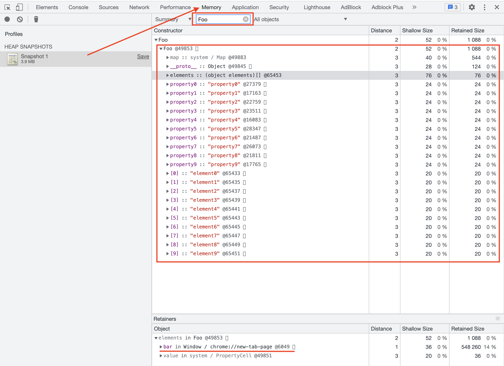
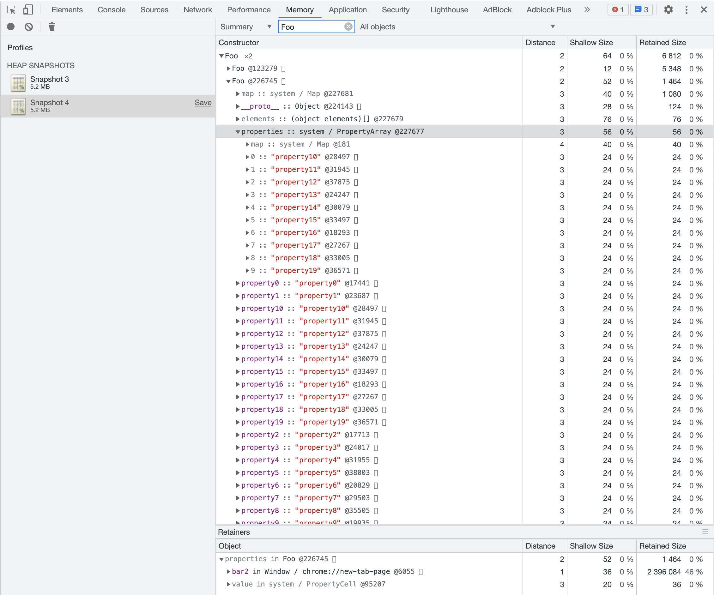
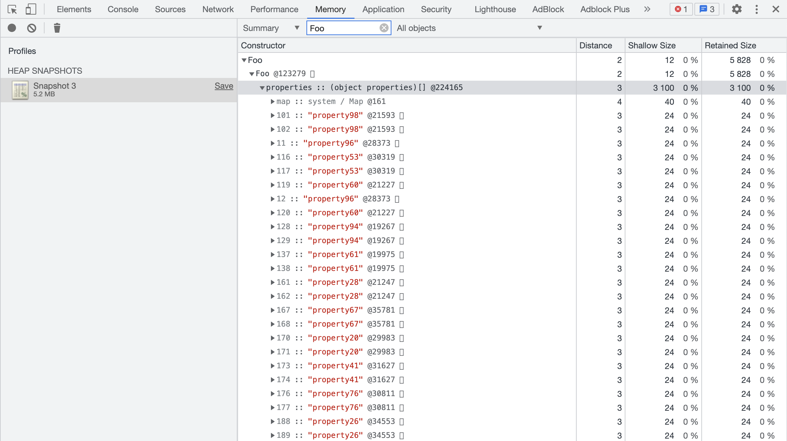

Review
1. 2023-02-11 14:05

## 常规属性 (properties) 和排序属性 (element)
举例
```js
function Foo() {
    this[100] = 'test-100'
    this[1] = 'test-1'
    this["B"] = 'bar-B'
    this[50] = 'test-50'
    this[9] =  'test-9'
    this[8] = 'test-8'
    this[3] = 'test-3'
    this[5] = 'test-5'
    this["A"] = 'bar-A'
    this["C"] = 'bar-C'
}
var bar = new Foo()


for(key in bar){
    console.log(`index:${key}  value:${bar[key]}`)
}
```

执行结果：
```txt
index:1  value:test-1
index:3  value:test-3
index:5  value:test-5
index:8  value:test-8
index:9  value:test-9
index:50  value:test-50
index:100  value:test-100
index:B  value:bar-B
index:A  value:bar-A
index:C  value:bar-C
```

可以发现：
1. 设置的数字属性被最先打印出来了，并且是按照数字大小的顺序打印的；
2. 设置的字符串属性依然是按照之前的设置顺序打印的，比如我们是按照 B、A、C 的顺序设置的，打印出来依然是这个顺序。

这样的结果，是因为在 ECMAScript 规范中定义了**数字属性应该按照索引值大小升序排列，字符串属性根据创建时的顺序升序排列**。

在这里我们把对象中的数字属性称为**排序属性**，在 V8 中被称为 **elements**；
字符串属性就被称为==**常规属性**==，在 V8 中被称为 ==**properties**==；

在 V8 内部，为了有效地提升存储和访问这两种属性的性能，分别使用了两个线性数据结构来分别保存排序属性和常规属性，具体结构如下图所示：


通过上图我们可以发现，bar 对象包含了两个隐藏属性：elements 属性和 properties 属性，elements 属性指向了 elements 对象，在 elements 对象中，会按照顺序存放排序属性，properties 属性则指向了 properties 对象，在 properties 对象中，会按照创建时的顺序保存了常规属性。

分解成这两种线性数据结构之后，如果执行索引操作，那么 V8 会先从 elements 属性中按照顺序读取所有的元素，然后再在 properties 属性中读取所有的元素，这样就完成一次索引操作。

## 快属性和慢属性

在查找元素时，比如执行 bar.B这个语句来查找 B 的属性值，那么在 V8 会先查找出 properties 属性所指向的对象 properties，然后再在 properties 对象中查找 B 属性，这种方式在查找过程中增加了一步操作，因此会影响到元素的查找效率。

基于这个原因，V8 采取了一个权衡的策略以加快查找属性的效率，这个策略是***将部分==常规属性==直接存储到对象本身***，我们把这称为**对象内属性** (in-object properties)。对象在内存中的展现形式参看下图：


采用对象内属性之后，常规属性就被保存到 bar 对象本身了，这样当再次使用bar.B来查找 B 的属性值时，V8 就可以直接从 bar 对象本身去获取该值就可以了，这种方式减少查找属性值的步骤，增加了查找效率。

不过**对象内属性的数量是固定的，默认是 10 个**，如果添加的属性超出了对象分配的空间，则它们将被保存在常规属性存储中。虽然属性存储多了一层间接层，但可以自由地扩容。

通常，我们将保存在线性数据结构中的属性称之为“**快属性**”，因为线性数据结构中只需要通过索引即可以访问到属性，虽然访问线性结构的速度快，但是如果从线性结构中添加或者删除大量的属性时，则执行效率会非常低，这主要因为会产生大量时间和内存开销。

因此，如果一个对象的属性过多时，V8 就会采取另外一种存储策略，那就是“**慢属性**”策略，但慢属性的对象内部会有独立的非线性数据结构 (词典) 作为属性存储容器。**所有的属性元信息不再是线性存储的，而是直接保存在属性字典中。**

![[a06d0bc0951b_19994d4b.webp]]

## 实践：在 Chrome 中查看对象布局

打开Chrome，在控制台中执行以下代码，然后捕获内存快照，并查看内存快照：
```js
function Foo(property_num,element_num) {
    //添加可索引属性
    for (let i = 0; i < element_num; i++) {
        this[i] = `element${i}`
    }
    //添加常规属性
    for (let i = 0; i < property_num; i++) {
        let ppt = `property${i}`
        this[ppt] = ppt
    }
}
var bar = new Foo(10,10)
```




观察上图，我们搜索出来了所有经过构造函数 Foo 创建的对象，点开 Foo 的那个下拉列表，第一个就是刚才创建的 bar 对象，我们可以看到 bar 对象有一个 **elements** 属性，这里面就包含我们创造的所有的**排序属性**，那么怎么没有常规属性对象呢？

这是因为只创建了 10 个常规属性，所以 V8 将这些常规属性直接做成了 bar 对象的对象内属性。

所以这时候的数据内存布局是这样的：
1. 10 个常规属性作为对象内属性，存放在 bar 函数内部；
2. 10 个排序属性存放在 elements 中。(==应该Chrome新版本有更新，也可以看到elements属性也放到了对象内属性中==)

将创建的对象属性的个数调整到 20 个
```js
var bar2 = new Foo(20,10)
```


由于创建的常用属性超过了 10 个，所以另外 10 个常用属性就被保存到 properties 中了，注意因为 properties 中只有 10 个属性，所以依然是线性的数据结构，我们可以看其都是按照创建时的顺序来排列的。


将创建的对象属性的个数调整到 100 个
```js
var bar3 = new Foo(100,10)
```


结合上图，我们可以看到，这时候的 properties 属性里面的数据并不是线性存储的，而是以非线性的字典形式存储的，所以这时候属性的内存布局是这样的：
1. 10 属性直接存放在 bar3 的对象内 ;
2. 90 个常规属性以非线性字典的这种数据结构方式存放在 properties 属性里面 ;
3. 10 个数字属性存放在 elements 属性里面。

观察上图，除了 elements 和 properties 属性，V8 还为每个对象实现了 map 属性和 \_\_proto\_\_ 属性，\_\_proto\_\_ 属性就是原型，是用来实现 JavaScript 继承的；而 map 则是隐藏类；
