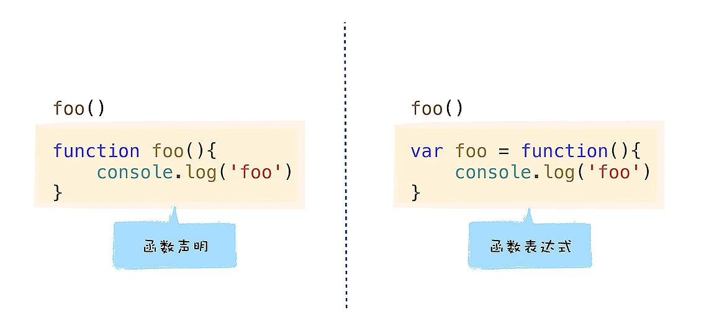
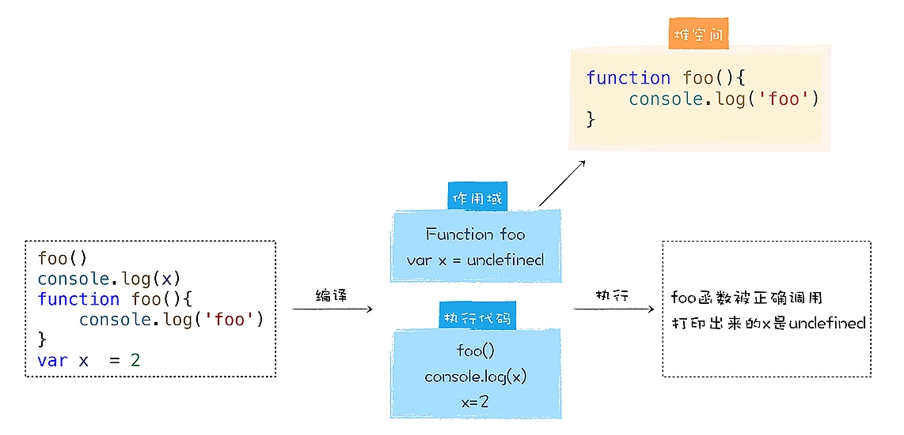

Review
1. 2023-02-11 16:25

定义函数方式
1. 函数表达式
2. 函数声明



```js
// 函数声明
foo()
function foo(){
    console.log('foo')
}
```

```js
// 函数表达式
foo()
var foo = function (){
    console.log('foo')
}

// ERROR： 
// VM130:1 Uncaught TypeError: foo is not a function
//    at <anonymous>:1:1
```

第一段代码就可以正确执行，而第二段代码却报错，主要原因是这两种定义函数的方式具有不同语义，不同的语义触发了不同的行为。


V8 是怎么处理函数声明的？
V8 在执行 JavaScript 的过程中，会先对其进行编译，然后再执行，比如下面这段代码：
```js
var x = 5
function foo(){
    console.log('Foo')
}
```

V8 执行这段代码的流程大致如下图所示：


在编译阶段，如果解析到函数声明，那么 V8 会将这个函数声明转换为内存中的函数对象，并将其放到作用域中。同样，如果解析到了某个变量声明，也会将其放到作用域中，但是会将其值设置为 undefined，表示该变量还未被使用。

然后在 V8 执行阶段，如果使用了某个变量，或者调用了某个函数，那么 V8 便会去作用域查找相关内容。

查看作用域的数据：
1. 将上面这段代码保存到 test.js 中；
2. 使用 `dk --print-scopes test.js` 命令即可查看作用域的状态。

```js
Inner function scope:
function foo () { // (0x7fd9890240e0) (22, 50)
  // NormalFunction
  // 2 heap slots
}
Global scope:
global { // (0x7fd989023e30) (0, 52)
  // will be compiled
  // NormalFunction
  // 1 stack slots
  // temporary vars:
  TEMPORARY .result;  // (0x7fd989024330) local[0]
  // local vars:
  VAR x;  // (0x7fd989024050)
  VAR foo;  // (0x7fd9890242a0)

  function foo () { // (0x7fd9890240e0) (22, 50)
    // lazily parsed
    // NormalFunction
    // 2 heap slots
  }
}
```

上面这段就是 V8 生成的作用域，我们可以看到，作用域中包含了变量 x 和 foo，变量 x 的默认值是 undefined，变量 foo 指向了 foo 函数对象，foo 函数对象被 V8 存放在内存中的堆空间了，这些变量都是在编译阶段被装进作用域中的。

因为在执行之前，这些变量都被提升到作用域中了，所以在执行阶段，V8 当然就能获取到所有的定义变量了。我们把这种在编译阶段，将所有的变量提升到作用域的过程称为**变量提升**(Hoisting)。

声明的函数在编译阶段就被提升到作用域中，在执行阶段，只要是在作用域中存在的变量或者对象，都是可以使用的。

对于变量提升，函数和普通的对象还是存在一些差异的，通过上面的分析我们知道，如果是一个普通变量，变量提升之后的值都是 undefined，如果是声明的函数，那么变量提升之后的值则是函数对象。

这就是涉及到**表达式**和**语句**的区别了。简单地理解，==表达式就是表示值的式子，有返回值，而语句是操作值的式子，执行该语句时，V8 并不会返回任何值。==
![[e210e2f00470_8fd784c2.webp]]

在 V8 执行 `var x = 5` 这段代码时，会认为它是两段代码，一段是定义变量的语句，一段是赋值的表达式，如下所示：
```js
var x = undefined
x = 5
```

首先，在变量提升阶段，**V8 并不会执行赋值的表达式**，该阶段只会分析基础的语句，比如变量的定义，函数的声明。

而这两行代码是在不同的阶段完成的，`var x` 是在**编译阶段**完成的，也可以说是在变量提升阶段完成的，而 `x = 5` 是表达式，所有的表达式都是在**执行阶段**完成的。

在变量提升阶段，V8 将这些变量存放在作用域时，还会给它们赋一个默认的 undefined 值，所以在定义一个普通的变量之前，使用该变量，那么该变量的值就是 undefined。

执行上面这段代码，它并没有输出任何内容，所以可以肯定，==**函数声明**并不是一个表达式，而是一个语句==。V8 在变量提升阶段，如果遇到函数声明，那么 V8 同样会对该函数声明执行变量提升操作。

==总的来说，在 V8 解析 JavaScript 源码的过程中，如果遇到普通的变量声明，那么便会将其提升到作用域中，并给该变量赋值为 undefined，如果遇到的是函数声明，那么 V8 会在内存中为声明生成函数对象，并将该对象提升到作用域中。==



函数表达式与函数声明的最主要区别有以下三点：
1. 函数表达式是在表达式语句中使用 function 的，最典型的表达式是“a=b”这种形式，因为函数也是一个对象，我们把“a = function (){}”这种方式称为函数表达式；
2. 在函数表达式中，可以省略函数名称，从而创建匿名函数（anonymous functions）；
3. 一个函数表达式可以被用作一个即时调用的函数表达式——IIFE（Immediately Invoked Function Expression）。

**函数表达式**也是表达式的一种，在编译阶段，V8 并不会将表达式中的函数对象提升到全局作用域中，所以无法在函数表达式之前使用该函数。函数立即表达式是一种特别的表达式，主要用来封装一些变量、函数，可以起到变量隔离和代码隐藏的作用，因此在一些大的开源项目中有广泛的应用。

因为小括号之间存放的必须是表达式，所以如果在小阔号里面定义一个函数，那么 V8 就会把这个函数看成是函数表达式，执行时它会返回一个函数对象。

存放在括号里面的函数便是一个函数表达式，它会返回一个函数对象，如果我直接在表达式后面加上调用的括号，这就称为**立即调用函数表达式**（IIFE）

另外，因为函数立即表达式是立即执行的，所以将一个函数立即表达式赋给一个变量时，不是存储 IIFE 本身，而是存储 IIFE 执行后返回的结果。

