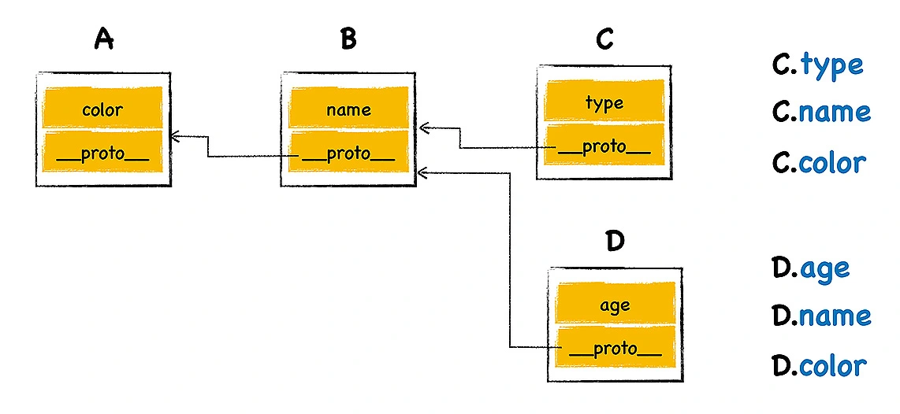
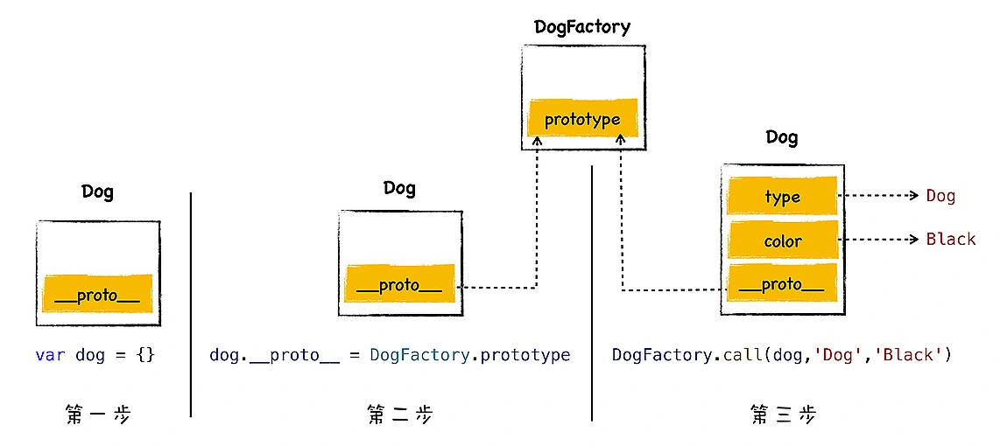

Review
1. 2023-02-11 18:01

继承就是一个对象可以访问另外一个对象中的属性和方法。
实现继承的最典型的两种方式是**基于类的设计**和**基于原型继承的设计**。
在JavaScript中，通过**原型**和**原型链**实现了继承机制，基于原型的继承省去了很多基于类继承时的繁文缛节，简洁而优美。


## 原型继承实现


从 V8 的内存快照看到，JavaScript 的每个对象都包含了一个隐藏属性  \_\_proto\_\_  ，把该隐藏属性 \_\_proto\_\_ 称之为该**对象的原型** (prototype)，\_\_proto\_\_ 指向了内存中的另外一个对象，我们就把 \_\_proto\_\_ 指向的对象称为该对象的**原型对象**，那么该对象就可以直接访问其原型对象的方法或者属性。




把这个查找属性的路径称为原型链，它像一个链条一样，将几个**原型**链接了起来。

不要将**原型链**和**作用域链**搞混淆了，作用域链是沿着函数的作用域一级一级来查找变量的，而原型链是沿着对象的原型一级一级来查找属性的，虽然它们的实现方式是类似的，但是它们的用途是不同的。

## 利用 \_\_proto\_\_ 实现继承

```js
var animal = {
    type: "Default",
    color: "Default",
    getInfo: function () {
        return `Type is: ${this.type}，color is ${this.color}.`
    }
}

var dog = {
    type: "Dog",
    color: "Black",
}
```

想让 dog 对象继承于 animal 对象，那么最直接的方式就是将 dog 的原型指向对象 animal，可以通过设置 dog 对象中的 __proto__ 属性，将其指向 animal ：

```js
dog.__proto__ = animal

// 设置之后，我们就可以使用 dog 来调用 animal 中的 getInfo 方法了。dog.getInfo()
dog.getInfo()
```


注意，通常隐藏属性是不能使用 JavaScript 来直接与之交互的。虽然现代浏览器都开了一个口子，让 JavaScript 可以访问隐藏属性 _proto_，但是在实际项目中，我们不应该直接通过 _proto_ 来访问或者修改该属性，其主要原因有两个：
1. 首先，这是隐藏属性，并不是标准定义的 ;
2. 其次，使用该属性会造成严重的性能问题。

推荐使用
1. Object.setPrototypeOf()
2. Object.getPrototypeOf()


## 构造函数创建对象
通过关键字 ***new*** 加上 ***构造函数*** 来体现

```js
function DogFactory(type,color){
    this.type = type
    this.color = color
}

var dog = new DogFactory('Dog','Black')
```

当 V8 执行上面这段代码时，V8 会在背后悄悄地做了以下几件事情，模拟代码如下所示：

```js
var dog = {}  
dog.__proto__ = DogFactory.prototype
DogFactory.call(dog,'Dog','Black')
```


每个函数对象中都有一个公开的 prototype 属性，当你将这个函数作为构造函数来创建一个新的对象时，新创建对象的原型对象就指向了该函数的 **prototype 属性**。当然了，如果你只是正常调用该函数，那么 prototype 属性将不起作用。


