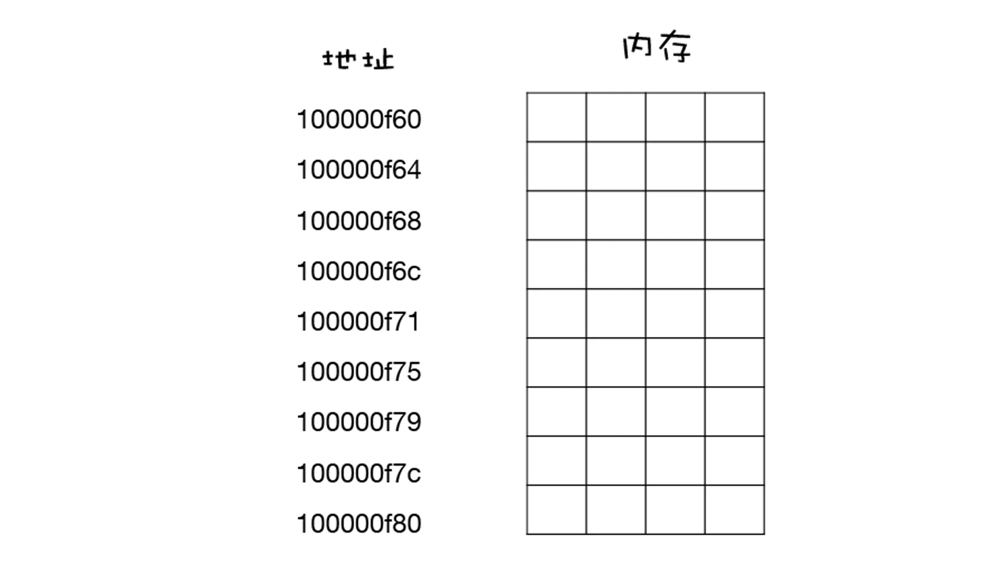
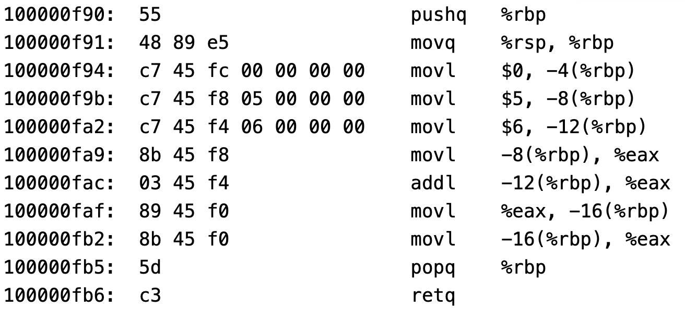
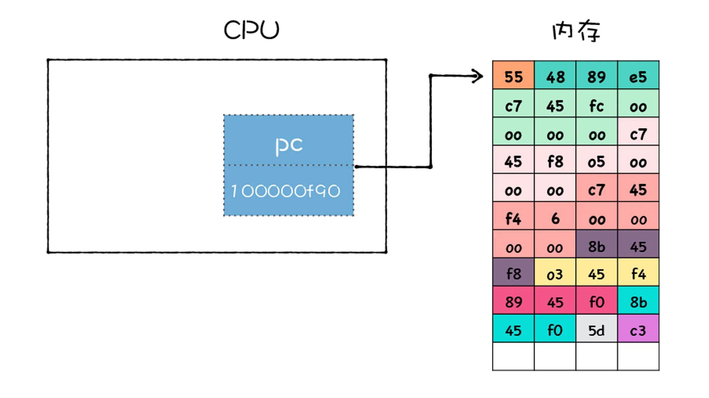
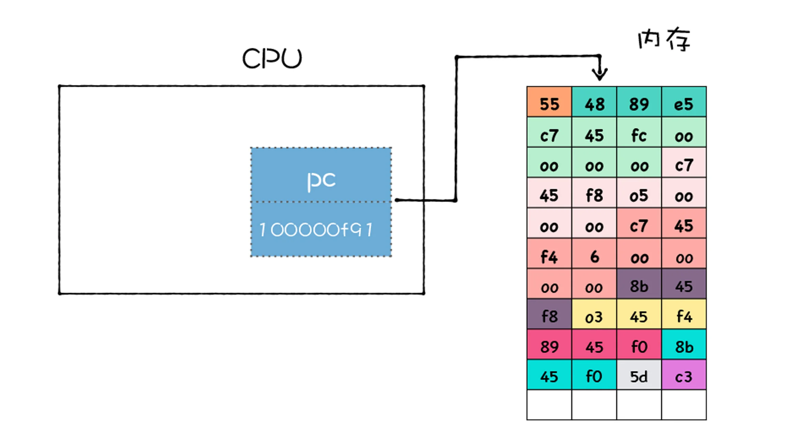
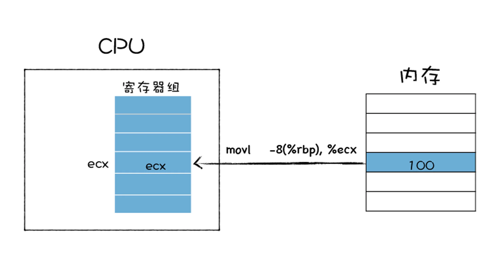
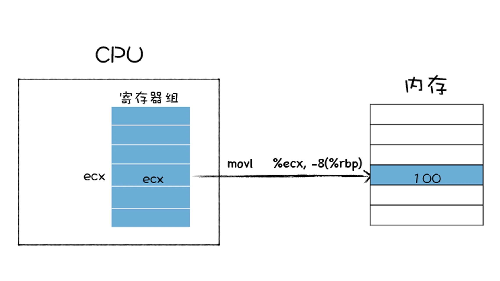
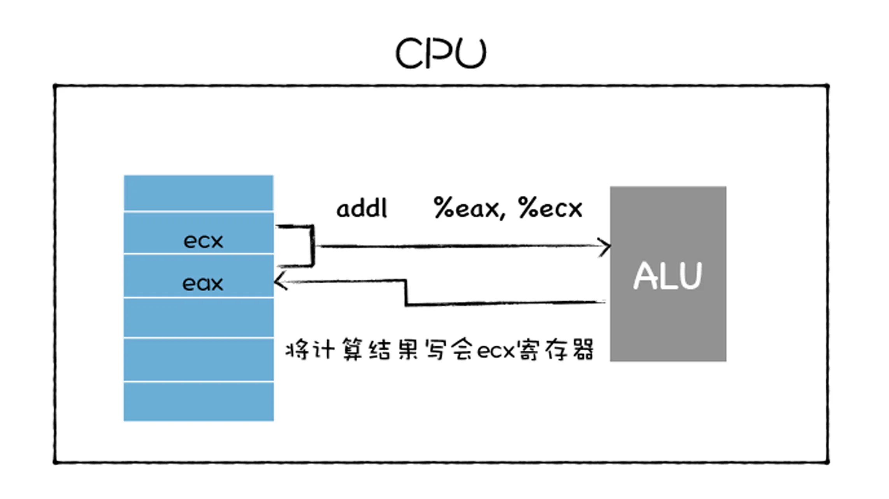
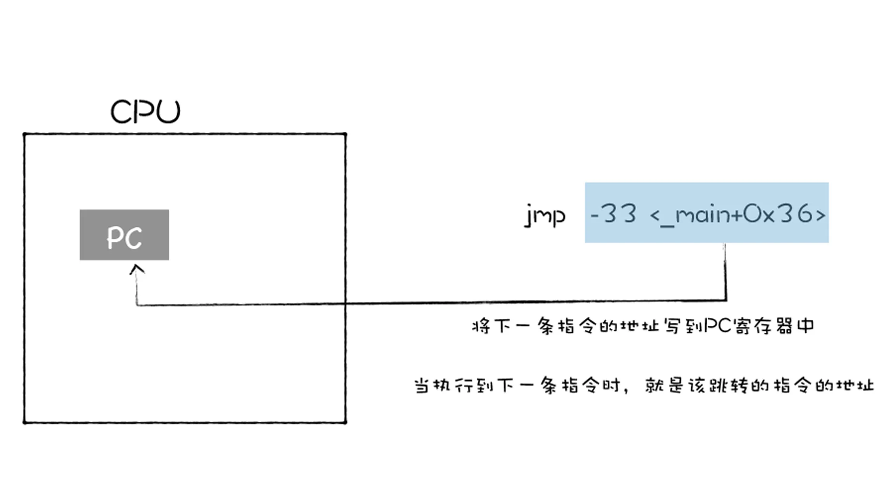

Review
1. 2023-02-12 06:38

## 一、Introduction
V8 首先需要将 JavaScript编译成字节码或者二进制代码，然后再执行。因为字节码的执行模式和 CPU 直接执行二进制代码的模式是类似的，所以先了解最基础的知识，CPU 如何执行二进制代码。


## 二、将源码编译成机器码
一段 C 代码为例
```c
int main()
{  
    int x = 1;
    int y = 2;
    int z = x + y;
    return z;
}
```

通过 GCC 编译器将这段 C 代码编译成二进制文件 `code_prog`
```sh
gcc -O0 -o code_prog code.c
```

再将编译出来的 `code_prog` 程序进行反汇编
```sh
objdump -d code_prog
```

最后编译出来的机器码如下


观察上图，左边就是编译生成的 **机器码**，在这里它是使用十六进制来展示的，这主要是因为十六进制比较容易阅读，所以我们通常使用十六进制来展示二进制代码。可以观察到上图是由很多行组成的，每一行都是一个指令，该指令可以让 CPU 执行指定的任务。

中间的部分是 **汇编代码**，汇编代码采用 **助记符（memonic）** 来编写程序，例如原本是二进制表示的指令，在汇编代码中可以使用单词来表示，比如 mov、add 就分别表示数据的存储和相加。**汇编语言和机器语言是一一对应的**，这一点和高级语言有很大的不同。

通常我们将汇编语言编写的程序转换为机器语言的过程称为“汇编”；反之，机器语言转化为汇编语言的过程称为“反汇编”，比如上图就是对 code_prog 进程进行了反汇编操作。

这一大堆指令按照顺序集合在一起就组成了程序，所以程序的执行，本质上就是 CPU 按照顺序执行这一大堆指令的过程。


## 三、CPU 是怎么执行程序的？
典型的计算机系统的硬件组织结构


首先，在程序执行之前，我们的程序需要被装进内存，有了内存地址，CPU 和内存就可以有序地交互，CPU 可以通过指定的内存地址，从内存中读取数据，或者往内存中写入数据。
内存还是一个临时存储数据的设备，断电之后，内存中的数据会消失。

内存中的每个存储空间都有其对应的独一无二的地址，内存和地址：


当二进制代码被加载进了内存后，那么内存中的每条二进制代码便都有了自己对应的地址，如下图所示：

有时候一条指令只需要一个字节就可以了，但是有时候一条指令却需要多个字节。在上图中，对于同一条指令，我使用了相同的颜色来标记，我们可以把上面这个一堆二进制数据反汇编成一条条指令的形式，这样可以方便我们的阅读，效果如下图所示


一旦二进制代码被装载进内存，CPU 便可以从内存中取出一条指令，然后分析该指令，最后执行该指令。

把**取出指令**、**分析指令**、**执行指令**这三个过程称为一个 **CPU 时钟周期**。CPU 是永不停歇的，当它执行完成一条指令之后，会立即从内存中取出下一条指令，接着分析该指令，执行该指令，CPU 一直重复执行该过程，直至所有的指令执行完成。

### CPU 是怎么知道要取出内存中的哪条指令呢？


可以看到 CPU 中有一个 PC 寄存器，它保存了将要执行的指令地址，当二进制代码被装载进了内存之后，系统会将二进制代码中的第一条指令的地址写入到 PC 寄存器中，到了下一个时钟周期时，CPU 便会根据 PC 寄存器中的地址，从内存中取出指令。

PC 寄存器中的指令取出来之后，系统要做两件事：
第一件事是将下一条指令的地址更新到 PC 寄存器中


更新了 PC 寄存器之后，CPU 就会立即做第二件事，那就是分析该指令，并识别出不同的类型的指令，以及各种获取操作数的方法。在指令分析完成之后，就要执行指令了。

### CPU 是如何执行指令的
**通用寄存器**是 CPU 中用来存放数据的设备，不同处理器中寄存器的个数也是不一样的，之所以要通用寄存器，是因为 **CPU 访问内存的速度很慢**，所以 CPU 就在内部添加了一些存储设备，这些设备就是通用寄存器。

==通用寄存器容量小，读写速度快，内存容量大，读写速度慢。==

通用寄存器通常用来**存放数据**或者**内存中某块数据的地址**，我们把这个地址又称为指针，通常情况下寄存器对存放的数据是没有特别的限制的，比如某个通用寄存器既可以存储数据，也可以存储指针。

由于历史原因，会将某些专用的数据或者指针存储在**专用的**通用寄存器中 ，比如 rbp 寄存器通常是用来存放栈帧指针的，rsp 寄存器用来存放栈顶指针的，PC 寄存器用来存放下一条要执行的指令等。

几种常用的指令类型：
第一种是加载的指令，其作用是从内存中复制指定长度的内容到通用寄存器中，并覆盖寄存器中原来的内容。


上图使用了 **movl** 指令，指令后面跟着的第一个参数是要拷贝数据的内存的位置，第二个参数是要拷贝到 ecx 这个寄存器。

第二种存储的指令，和加载类型的指令相反，其作用是将寄存器中的内容复制内存某个位置，并覆盖掉内存中的这个位置上原来的内容。



上图也是使用 movl 指令，movl 指令后面的 %ecx 就是寄存器地址，-8(%rbp) 是内存中的地址，这条指令的作用是将寄存器中的值拷贝到内存中。

第三种是更新指令，其作用是复制两个寄存器中的内容到 ALU 中，也可以是一块寄存器和一块内存中的内容到 ALU 中，ALU 将两个字相加，并将结果存放在其中的一个寄存器中，并覆盖该寄存器中的内容。具体流程如下图所示：


上图 **addl** 指令，将寄存器 eax 和 ecx 中的值传给 ALU，ALU 对它们进行相加操纵，并将计算的结果写回 ecx。

跳转指令，从指令本身抽取出一个字，这个字是下一条要执行的指令的地址，并将该字复制到 PC 寄存器中，并覆盖掉 PC 寄存器中原来的值。那么当执行下一条指令时，便会跳转到对应的指令了。


上图是通过 jmp 来实现的，jmp 后面跟着要跳转的内存中的指令地址。

还有 IO 读 / 写指令，这些指令可以从一个 IO 设备中复制指定长度的数据到寄存器中，也可以将一个寄存器中的数据复制到指定的 IO 设备。


### 分析一段汇编代码的执行流程
在 C 程序中，CPU 会首先执行调用 main 函数，在调用 main 函数时，CPU 会保存上个栈帧上下文信息和创建当前栈帧的上下文信息，主要是通过下面这两条指令实现的：

```c
pushq   %rbp
movq    %rsp, %rbp
```

第一条指令 pushq %rbp，是将 rbp 寄存器中的值写到内存中的栈区域。第二条指令是将 rsp 寄存器中的值写到 rbp 寄存器中。

然后将 0 写到栈帧的第一个位置，对应的汇编代码如下：
```c
movl  $0, -4(%rbp)
```

接下来给 x 和 y 赋值，对应的代码是下面两行：
```c
movl  $1, -8(%rbp)
movl  $2, -12(%rbp)
```

第一行指令是将常数值 1 压入到栈中，然后再将常数值 2 压入到栈中，这两个值分别对应着 x 和 y。

接下来，x 的值从栈中复制到 eax 寄存器中
```c
movl  -8(%rbp), %eax
```

现在 eax 寄存器中保存了 x 的值，那么接下来，再将内存中的 y 和 eax 中的 x 相加，相加的结果再保存在 eax 中，对应的指令如下所示：
```c
addl  -12(%rbp), %eax
```

现在 x+y 的结果保存在了 eax 中了，接下来 CPU 会将结果保存中内存中，执行如下指令：
```c
 movl  %eax, -16(%rbp)
```

最后又将结果 z 加载到 eax 寄存器中，代码如下所示：
```c
movl  -16(%rbp), %eax
```

注意这里的 eax 寄存器中的内容就被默认作为返回值了，执行到这里函数基本就执行结束了，然后需要继续执行一些恢复现场的操作，代码如下所示：
```c
popq  %rbp 
retq
```

到了这里，整个程序就执行结束了。


## Reference
<https://time.geekbang.org/column/article/221211>
