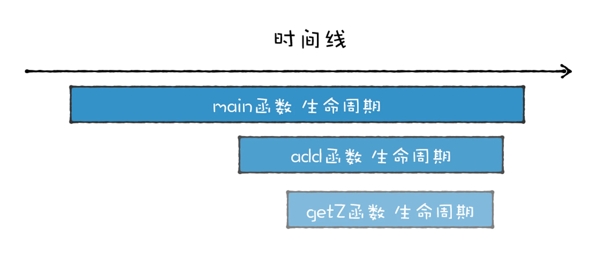
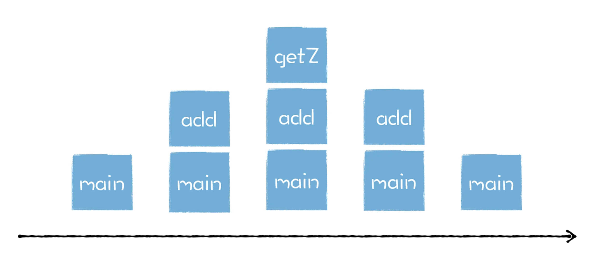

Review
1. 2023-02-12 08:23

## 一、Introduction
`Code1` 栈溢出
```js
function foo() {
 foo() // 是否存在堆栈溢出错误?
}
foo()
```

`Code2` 正确执行
```js
function foo() {
  setTimeout(foo, 0) // 是否存在堆栈溢出错误?
}
```

`Code3` 没有栈溢出，页面卡住
```js
function foo() {
    return Promise.resolve().then(foo)
}
foo()
```

主要原因是这三段代码的底层执行逻辑是完全不同的：
1. 第一段代码是在同一个任务中重复调用嵌套的 foo 函数；
2. 第二段代码是使用 setTimeout 让 foo 函数在不同的宏任务中执行；
3. 第三段代码是在同一个宏任务中执行 foo 函数，但是却不是嵌套执行。

这是因为，V8 执行这三种不同代码时，它们的内存布局是不同的，而不同的内存布局又会影响到代码的执行逻辑，因此我们需要了解 JavaScript 执行时的内存布局。

解释执行和直接执行二进制代码都使用了堆和栈
![[e3d5e6a1db82_c0c9743d.webp]]

## 使用栈结构来管理函数调用
与函数的特性有关。通常函数有两个主要的特性：
1. 第一个特点是函数可以被调用，你可以在一个函数中调用另外一个函数，当函数调用发生时，执行代码的控制权将从父函数转移到子函数，子函数执行结束之后，又会将代码执行控制权返还给父函数；
2. 第二个特点是函数具有作用域机制，所谓作用域机制，是指函数在执行的时候可以将定义在函数内部的变量和外部环境隔离，在函数内部定义的变量我们也称为临时变量，临时变量只能在该函数中被访问，外部函数通常无权访问，当函数执行结束之后，存放在内存中的临时变量也随之被销毁。

举例
```c
int getZ()
{
    return 4;
}
int add(int x, int y)
{
    int z = getZ();
    return x + y + z;
}
int main()
{
    int x = 5;
    int y = 6;
    int ret = add(x, y);
}
```

具体的函数调用示意图如下：


通过上述分析，可以得出，**函数调用者的生命周期总是长于被调用者（后进），并且被调用者的生命周期总是先于调用者的生命周期结束 (先出)。**

各个函数的生命周期


因为函数是有作用域机制的，作用域机制通常表现在函数执行时，会在内存中分配函数内部的变量、上下文等数据，在函数执行完成之后，这些内部数据会被销毁掉。所以站在函数资源分配和回收角度来看，被调用函数的资源分配总是晚于调用函数 (后进)，而函数资源的释放则总是先于调用函数 (先出)。


通过观察函数的生命周期和函数的资源分配情况，我们发现，它们都符合后进先出 (LIFO) 的策略，而栈结构正好满足这种后进先出 (LIFO) 的需求，所以我们选择 **栈** 来管理函数调用关系是一种很自然的选择。


### 栈如何管理函数调用
当一个函数被执行时，函数的参数、函数内部定义变量都会依次压入到栈中


1. 当执行到函数的第一段代码的时候，变量 x 第一次被赋值，且值为 5，这时 5 会被压入到栈中。
2. 然后，执行第二段代码，变量 y 第一次被赋值，且值为 6，这时 6 会被压入到栈中。
3. 接着，执行到第三段代码，注意这里变量 x 是第二次被赋值，且新的值为 100，那么这时并不是将 100 压入到栈中，而是替换之前压入栈的内容，也就是将栈中的 5 替换成 100。
4. 最后，执行第四段代码，这段代码是 int z = x + y，我们会先计算出来 x+y 的值，然后再将 x+y 的值赋值给 z，由于 z 是第一次被赋值，所以 z 的值也会被压入到栈中。

**函数在执行过程中，其内部的临时变量会按照执行顺序被压入到栈中。**

当一个函数调用另外一个函数
```c
int add(num1,num2){
    int x = num1;
    int y = num2;
    int ret = x + y;
    return ret;
}


int main()
{
    int x = 5;
    int y = 6;
    x = 100;
    int z = add(x,y);
    return z;
}
```

当执行到 int z = add(x,y) 时，当前栈的状态如下所示：


接下来，就要调用 add 函数了，理想状态下，执行 add 函数的过程是下面这样的：


当执行到 add 函数时，会先把参数 num1 和 num2 压栈，接着我们再把变量 x、y、ret 的值依次压栈，不过执行这里，会遇到一个问题，那就是当 add 函数执行完成之后，需要将执行代码的控制权转交给 main 函数，这意味着需要将栈的状态恢复到 main 函数上次执行时的状态，我们把这个过程叫恢复现场。那么应该怎么恢复 main 函数的执行现场呢？

方法很简单，只要在寄存器中保存一个永远指向当前栈顶的指针，**栈顶指针**的作用就是告诉你应该往哪个位置添加新元素，这个指针通常存放在 **esp 寄存器**中。如果你想往栈中添加一个元素，那么你需要先根据 esp 寄存器找到当前栈顶的位置，然后在栈顶上方添加新元素，新元素添加之后，还需要将新元素的地址更新到 esp 寄存器中。

有了栈顶指针，就很容易恢复 main 函数的执行现场了，当 add 函数执行结束时，只需要将栈顶指针向下移动就可以了，具体你可以参看下图：


将 esp 的指针向下移动到之前 main 函数执行时的地方就可以，不过新的问题又来了，CPU 是怎么知道要移动到这个地址呢？

CPU 的解决方法是增加了另外一个 **ebp 寄存器**，用来保存当前函数的起始位置，我们把一个函数的起始位置也称为**栈帧指针**，ebp 寄存器中保存的就是当前函数的栈帧指针，如下图所示：


在 main 函数调用 add 函数的时候，main 函数的栈顶指针就变成了 add 函数的栈帧指针，所以需要将 main 函数的栈顶指针保存到 ebp 中，当 add 函数执行结束之后，我需要销毁 add 函数的栈帧，并恢复 main 函数的栈帧，那么只需要取出 main 函数的栈顶指针写到 esp 中即可 (main 函数的栈顶指针是保存在 ebp 中的)，这就相当于将栈顶指针移动到 main 函数的区域。

因为 main 函数也有它自己的栈帧指针，在执行 main 函数之前，我们还需恢复它的栈帧指针。通常的方法是在 main 函数中调用 add 函数时，CPU 会将当前 main 函数的栈帧指针保存在栈中，如下图所示：

当函数调用结束之后，就需要恢复 main 函数的执行现场了，首先取出 ebp 中的指针，写入 esp 中，然后从栈中取出之前保留的 main 的栈帧地址，将其写入 ebp 中，到了这里 ebp 和 esp 就都恢复了，可以继续执行 main 函数了

每个栈帧对应着一个未运行完的函数，栈帧中保存了该函数的返回地址和局部变量。

再回过头来看下这节课开头提到的三段代码。

第一段代码由于循环嵌套调用了 foo，所以当函数运行时，就会导致 foo 函数会不断地调用 foo 函数自身，这样就会导致栈无限增，进而导致栈溢出的错误。

第二段代码是在函数内部使用了 setTimeout 来启动 foo 函数，这段代码之所以不会导致栈溢出，是因为 setTimeout 会使得 foo 函数在消息队列后面的任务中执行，所以不会影响到当前的栈结构。

最后一段代码是 Promise，Promise 的情况比较特别，既不会造成栈溢出，但是这种方式会导致主线的卡死，这就涉及到了微任务。这相当于在当前这一轮宏任务里不停地创建微任务，执行，创建，执行，创建……虽然不会爆栈，但也无法去执行下一个任务，主线程被卡在这里了，所以页面会卡死。

使用栈有非常多的优势：
1. 栈的结构和非常适合函数调用过程。
2. 在栈上分配资源和销毁资源的速度非常快，这主要归结于栈空间是连续的，分配空间和销毁空间只需要移动下指针就可以了。

栈也是有缺点的，其中最大的缺点也是它的优点所造成的，那就是栈是连续的，所以要想**在内存中分配一块连续的大空间是非常难的**，因此栈空间是有限的。

基于栈不方便存放大的数据，因此我们使用了另外一种数据结构用来保存一些大数据，这就是**堆**。JS中的Object数据是存放在堆中的。


## Reference

