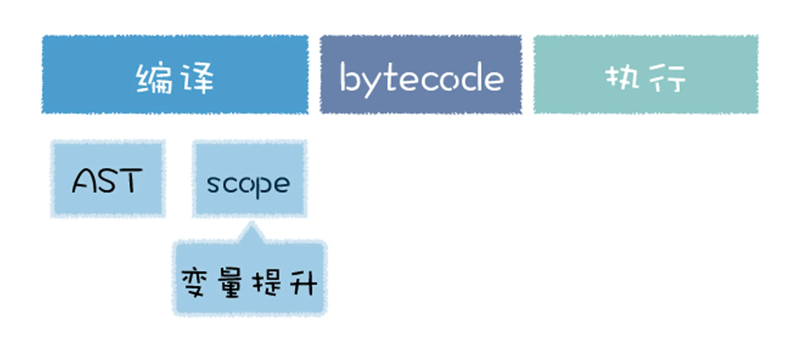

Review
1. 2023-02-12 09:10

## 一、Introduction
V8 执行 JavaScript 代码，需要经过**编译**和**执行**两个阶段，其中编译过程是指 V8 将 JavaScript 代码转换为字节码或者二进制机器代码的阶段，而执行阶段则是指解释器解释执行字节码，或者是 CPU 直接执行二进制机器代码的阶段。


在编译 JavaScript 代码的过程中，V8 并不会一次性将所有的 JavaScript 解析为中间代码，这主要是基于以下两点：
1. 首先，如果一次解析和编译所有的 JavaScript 代码，过多的代码会增加编译时间，这会严重影响到首次执行 JavaScript 代码的速度，让用户感觉到卡顿。因为有时候一个页面的 JavaScript 代码都有 10 多兆，如果要将所有的代码一次性解析编译完成，那么会大大增加用户的等待时间；
2. 其次，解析完成的字节码和编译之后的机器代码都会存放在内存中，如果一次性解析和编译所有 JavaScript 代码，那么这些中间代码和机器代码将会一直占用内存，特别是在手机普及的年代，内存是非常宝贵的资源。

基于以上的原因，所有主流的 JavaScript 虚拟机都实现了**惰性解析**。所谓惰性解析是指==解析器在解析的过程中，如果遇到函数声明，那么会跳过函数内部的代码，并不会为其生成 AST 和字节码，而仅仅生成顶层代码的 AST 和字节码==。

利用惰性解析可以加速 JavaScript 代码的启动速度，如果要将所有的代码一次性解析编译完成，那么会大大增加用户的等待时间。


## 二、惰性解析的过程
```js
function foo(a,b) {
    var d = 100
    var f = 10
    return d + f + a + b;
}
var a = 1
var c = 4
foo(1, 5)
```

当把这段代码交给 V8 处理时，V8 会至上而下解析这段代码，在解析过程中首先会遇到 foo 函数，由于这只是一个函数声明语句，V8 在这个阶段只需要将该函数转换为函数对象，如下图所示：


注意，这里只是将该函数声明转换为函数对象，但是并没有解析和编译函数内部的代码，所以也不会为 foo 函数的内部代码生成抽象语法树。

然后继续往下解析，由于后续的代码都是顶层代码，所以 V8 会为它们生成抽象语法树，最终生成的结果如下所示：


代码解析完成之后，V8 便会按照顺序自上而下执行代码，首先会先执行“a=1”和“c=4”这两个赋值表达式，接下来执行 foo 函数的调用，过程是从 foo 函数对象中取出函数代码，然后和编译顶层代码一样，V8 会先编译 foo 函数的代码，编译时同样需要先将其编译为抽象语法树和字节码，然后再解释执行。

在 V8 实现惰性解析的过程中，需要支持 JavaScript 中的闭包特性，这会使得 V8 的解析过程变得异常复杂。

JavaScript 中的闭包有三个基础特性。
1. 第一，JavaScript 语言允许在函数内部定义新的函数，主要是因为 JavaScript 中的函数即对象，你可以在函数中声明一个变量，当然你也可以在函数中声明一个函数。
2. 第二，可以在内部函数中访问父函数中定义的变量
3. 第三，因为函数是一等公民，所以函数可以作为返回值

经典的闭包代码：
```js
function foo() {
    var d = 20
    return function inner(a, b) {
        const c = a + b + d
        return c
    }
}
const f = foo()
```

观察上面上面这段代码，我们在 foo 函数中定义了 inner 函数，并返回 inner 函数，同时在 inner 函数中访问了 foo 函数中的变量 d。

当执行 foo 函数的时候，堆栈的变化如下图所示：

从上图可以看出来，在执行全局代码时，V8 会将全局执行上下文压入到调用栈中，然后进入执行 foo 函数的调用过程，这时候 V8 会为 foo 函数创建执行上下文，执行上下文中包括了变量 d，然后将 foo 函数的执行上下文压入栈中，foo 函数执行结束之后，foo 函数执行上下文从栈中弹出，这时候 foo 执行上下文中的变量 d 也随之被销毁。

但是这时候，由于 inner 函数被保存到全局变量中了，所以 inner 函数依然存在，最关键的地方在于 inner 函数使用了 foo 函数中的变量 d，按照正常执行流程，变量 d 在 foo 函数执行结束之后就被销毁了。

所以正常的处理方式应该是 foo 函数的执行上下文虽然被销毁了，但是 inner 函数引用的 foo 函数中的变量却不能被销毁，那么 V8 就需要为这种情况做特殊处理，需要保证即便 foo 函数执行结束，但是 foo 函数中的 d 变量依然保持在内存中，不能随着 foo 函数的执行上下文被销毁掉。

其实，在执行 foo 函数的阶段，虽然采取了惰性解析，不会解析和执行 foo 函数中的 inner 函数，但是 V8 还是需要判断 inner 函数是否引用了 foo 函数中的变量，负责处理这个任务的模块叫做 **预解析器**。

### 预解析器如何解决闭包所带来的问题？
V8 引入预解析器，比如当解析顶层代码的时候，遇到了一个函数，那么预解析器并不会直接跳过该函数，而是对该函数做一次快速的预解析，其主要目的有两个。
1. 第一，是判断当前函数是不是存在一些语法上的错误，在预解析过程中，预解析器发现了语法错误，那么就会向 V8 抛出语法错误。
2. 第二，除了检查语法错误之外，预解析器另外的一个重要的功能就是检查函数内部是否引用了外部变量，如果引用了外部的变量，预解析器会将栈中的变量复制到堆中，在下次执行到该函数的时候，直接使用堆中的引用，而外部函数的变量会随着执行上下文销毁而销毁，只剩下堆中的引用，这样就解决了闭包所带来的问题。


## Reference

