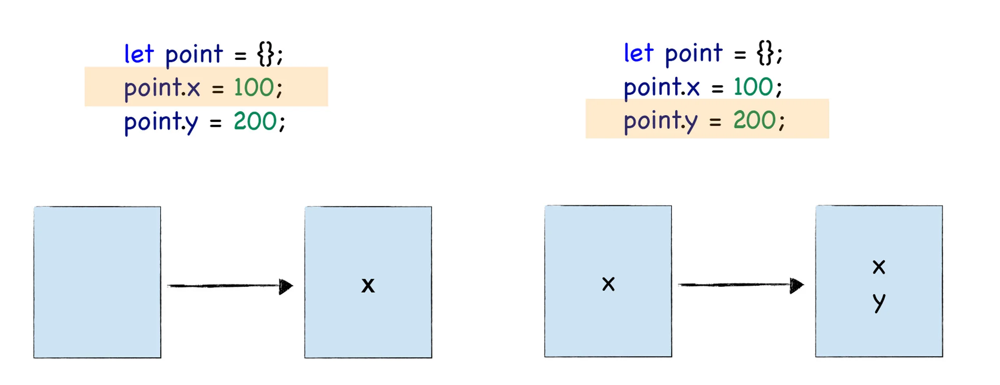

Review
1. 2023-02-12 22:34

## 一、Introduction
JavaScript 是一门动态语言，其执行效率要低于静态语言，V8 为了提升 JavaScript 的执行速度，借鉴了很多静态语言的特性，比如实现了 JIT 机制，为了提升对象的属性访问速度而引入了**隐藏类**，为了加速运算而引入了内联缓存。

### 为什么静态语言的效率更高？
由于隐藏类借鉴了部分静态语言的特性，因此要解释清楚这个问题，我们就先来分析下为什么静态语言比动态语言的执行效率更高。


JavaScript 在运行时，对象的属性是可以被修改的，所以当 V8 使用了一个对象时，比如使用了 start.x 的时候，它并不知道该对象中是否有 x，也不知道 x 相对于对象的偏移量是多少，也可以说 V8 并不知道该对象的具体的形状。

那么，当在 JavaScript 中要查询对象 start 中的 x 属性时，V8 会按照具体的规则一步一步来查询，这个过程非常的慢且耗时。

这种动态查询对象属性的方式和 C++ 这种静态语言不同，C++ 在声明一个对象之前需要定义该对象的结构，我们也可以称为形状，比如 Point 结构体就是一种形状，我们可以使用这个形状来定义具体的对象。

C++ 代码在执行之前需要先被编译，编译的时候，每个对象的形状都是固定的，也就是说，在代码的执行过程中，Point 的形状是无法被改变的。

那么在 C++ 中访问一个对象的属性时，自然就知道该属性相对于该对象地址的偏移值了，比如在 C++ 中使用 start.x 的时候，编译器会直接将 x 相对于 start 的地址写进汇编指令中，那么当使用了对象 start 中的 x 属性时，CPU 就可以直接去内存地址中取出该内容即可，没有任何中间的查找环节。

因为==静态语言中，可以直接通过偏移量查询来查询对象的属性值==，这也就是静态语言的执行效率高的一个原因。

### 什么是隐藏类 (Hidden Class）？
将 JavaScript 中的对象静态化，也就是 V8 在运行 JavaScript 的过程中，会假设 JavaScript 中的对象是静态的，具体地讲，V8 对每个对象做如下两点假设：
1. 对象创建好了之后就不会添加新的属性；
2. 对象创建好了之后也不会删除属性。

具体地讲，V8 会为每个对象创建一个隐藏类，对象的隐藏类中记录了该对象一些基础的布局信息，包括以下两点：
- 对象中所包含的所有的属性；
- 每个属性相对于对象的偏移量。

有了隐藏类之后，那么当 V8 访问某个对象中的某个属性时，就会先去隐藏类中查找该属性相对于它的对象的偏移量，有了偏移量和属性类型，V8 就可以直接去内存中取出对应的属性值，而不需要经历一系列的查找过程，那么这就大大提升了 V8 查找对象的效率。

举例
```js
let point = {x:100,y:200}
```

当 V8 执行到这段代码时，会先为 point 对象创建一个隐藏类，在 V8 中，把隐藏类又称为 **map**，每个对象都有一个 map 属性，其值指向内存中的隐藏类。

隐藏类描述了对象的属性布局，它主要包括了属性名称和每个属性所对应的偏移量，比如 point 对象的隐藏类就包括了 x 和 y 属性，x 的偏移量是 4，y 的偏移量是 8。


注意，这是 point 对象的 map，它不是 point 对象本身。关于 point 对象和 map 之间的关系，参看下图：


当再次使用 point.x 访问 x 属性时，V8 会查询 point 的 map 中 x 属性相对 point 对象的偏移量，然后将 point 对象的起始位置加上偏移量，就得到了 x 属性的值在内存中的位置，有了这个位置也就拿到了 x 的值，这样就省去了一个比较复杂的查找过程。

V8 通过引入隐藏类，模拟 C++ 这种静态语言的机制，从而达到静态语言的执行效率。

### 实践：通过 d8 查看隐藏类
使用 d8 提供的 API DebugPrint 来查看 point 对象中的隐藏类。

```js
let point = {x:100,y:200};
%DebugPrint(point);
```

> 注意，在使用 d8 内部 API 时，有一点很容易出错，就是需要为 JavaScript 代码加上分号，不然 d8 会报错

```sh
dk --allow-natives-syntax test.js 
```

```yaml
DebugPrint: 0x1a620010bf45: [JS_OBJECT_TYPE]
 - map: 0x1a620025a841 <Map[20](HOLEY_ELEMENTS)> [FastProperties]
 - prototype: 0x1a6200244989 <Object map = 0x1a6200244045>
 - elements: 0x1a62000022a9 <FixedArray[0]> [HOLEY_ELEMENTS]
 - properties: 0x1a62000022a9 <FixedArray[0]>
 - All own properties (excluding elements): {
    0x1a6200004be5: [String] in ReadOnlySpace: #x: 100 (const data field 0), location: in-object
    0x1a6200004bf5: [String] in ReadOnlySpace: #y: 200 (const data field 1), location: in-object
 }
0x1a620025a841: [Map] in OldSpace
 - type: JS_OBJECT_TYPE
 - instance size: 20
 - inobject properties: 2
 - elements kind: HOLEY_ELEMENTS
 - unused property fields: 0
 - enum length: invalid
 - stable_map
 - back pointer: 0x1a620025a7f9 <Map[20](HOLEY_ELEMENTS)>
 - prototype_validity cell: 0x1a6200003875 <Cell value= 1>
 - instance descriptors (own) #2: 0x1a620010bf75 <DescriptorArray[2]>
 - prototype: 0x1a6200244989 <Object map = 0x1a6200244045>
 - constructor: 0x1a620024454d <JSFunction Object (sfi = 0x1a6200217e8d)>
 - dependent code: 0x1a62000022b9 <Other heap object (WEAK_ARRAY_LIST_TYPE)>
 - construction counter: 0
```

从这段 point 的内存结构中，我们可以看到，point 对象的第一个属性就是 map，它指向了 0x1a620025a841 这个地址，这个地址就是 V8 为 point 对象创建的隐藏类，除了 map 属性之外，还有 prototype 属性，elements 属性和 properties 属性。

### 多个对象共用一个隐藏类
在 V8 中，每个对象都有一个 map 属性，该属性值指向该对象的隐藏类。不过如果两个对象的形状是相同的，V8 就会为其复用同一个隐藏类，这样有两个好处：
1. 减少隐藏类的创建次数，也间接加速了代码的执行速度；
2. 减少了隐藏类的存储空间。

什么情况下两个对象的形状是相同的，要满足以下两点：
1. 相同的属性名称；
2. 相等的属性个数。

接下来我们就来创建两个形状一样的对象，然后看看它们的 map 属性是不是指向了同一个隐藏类
```js
let point = {x:100,y:200};
let point2 = {x:3,y:4};
%DebugPrint(point);
%DebugPrint(point2);
```


当 V8 执行到这段代码时，首先会为 point 对象创建一个隐藏类，然后继续创建 point2 对象。在创建 point2 对象的过程中，发现它的形状和 point 是一样的。这时候，V8 就会将 point 的隐藏类给 point2 复用，具体效果你可以参看下图：


使用 d8 来证实下，同样使用这个命令：`dk --allow-natives-syntax test.js`
打印出来的 point 和 point2 对象，你会发现它们的 map 属性都指向了同一个地址，这也就意味着它们共用了同一个 map。

### 重新构建隐藏类
V8 为了实现隐藏类，需要两个假设条件：
1. 对象创建好了之后就不会添加新的属性；
2. 对象创建好了之后也不会删除属性。

JavaScript 依然是动态语言，在执行过程中，对象的形状是可以被改变的，如果某个对象的形状改变了，隐藏类也会随着改变，这意味着 V8 要为新改变的对象重新构建新的隐藏类，这对于 V8 的执行效率来说，是一笔大的开销。

通俗地理解，给一个对象添加新的属性，删除新的属性，或者改变某个属性的数据类型都会改变这个对象的形状，那么势必也就会触发 V8 为改变形状后的对象重建新的隐藏类。

举例
```js
let point = {};
%DebugPrint(point);
point.x = 100;
%DebugPrint(point);
point.y = 200;
%DebugPrint(point);
```

执行 `dk --allow-natives-syntax test.js`

执行这段命令，d8 会打印出来不同阶段的 point 对象所指向的隐藏类，在这里我们只关心 point 对象 map 的指向，所以我将其他的一些信息都省略了，最终打印出来的结果如下：

```yaml
DebugPrint: 0x986080c5b35: [JS_OBJECT_TYPE]
 - map: 0x0986082802d9 <Map(HOLEY_ELEMENTS)> [FastProperties]
 - ...


DebugPrint: 0x986080c5b35: [JS_OBJECT_TYPE]
 - map: 0x098608284ce9 <Map(HOLEY_ELEMENTS)> [FastProperties]
 - ...
 - properties: 0x0986080406e9 <FixedArray[0]> {
    #x: 100 (const data field 0)
 }


DebugPrint: 0x986080c5b35: [JS_OBJECT_TYPE]
 - map: 0x098608284d11 <Map(HOLEY_ELEMENTS)> [FastProperties]
 - p
 - ...
 - properties: 0x0986080406e9 <FixedArray[0]> {
    #x: 100 (const data field 0)
    #y: 200 (const data field 1) 
```

根据这个打印出来的结果，我们可以明显看到，每次给对象添加了一个新属性之后，该对象的隐藏类的地址都会改变，这也就意味着隐藏类也随着改变了，改变过程你可以参看下图


同样，如果你删除了对象的某个属性，那么对象的形状也就随着发生了改变，这时 V8 也会重建该对象的隐藏类，我们可以看下面这样的一个例子：
```js
let point = {x:100,y:200};
%DebugPrint(point);
delete point.x;
%DebugPrint(point);
```

```yaml
DebugPrint: 0x13ea0010bf69: [JS_OBJECT_TYPE]
 - map: 0x13ea0025a855 <Map[20](HOLEY_ELEMENTS)> [FastProperties]
 - prototype: 0x13ea00244989 <Object map = 0x13ea00244045>
 - elements: 0x13ea000022a9 <FixedArray[0]> [HOLEY_ELEMENTS]
 - properties: 0x13ea000022a9 <FixedArray[0]>
 - All own properties (excluding elements): {
    0x13ea00004be5: [String] in ReadOnlySpace: #x: 100 (const data field 0), location: in-object
    0x13ea00004bf5: [String] in ReadOnlySpace: #y: 200 (const data field 1), location: in-object
 }

DebugPrint: 0x13ea0010bf69: [JS_OBJECT_TYPE]
 - map: 0x13ea00255309 <Map[12](HOLEY_ELEMENTS)> [DictionaryProperties]
 - prototype: 0x13ea00244989 <Object map = 0x13ea00244045>
 - elements: 0x13ea000022a9 <FixedArray[0]> [HOLEY_ELEMENTS]
 - properties: 0x13ea0010bfc1 <NameDictionary[29]>
 - All own properties (excluding elements): {
   y: 200 (data, dict_index: 2, attrs: [WEC])
 }
```


## 最佳实践

对象中的隐藏类不要随便被改变，因为这样会触发 V8 重构该对象的隐藏类，直接影响到了程序的执行性能。那么在实际工作中，我们应该尽量注意以下几点：
1. 一，使用字面量初始化对象时，要保证**属性的顺序**是一致的
2. 二，尽量使用字面量一次性初始化完整对象属性
3. 三，尽量避免使用 delete 方法


## Reference

