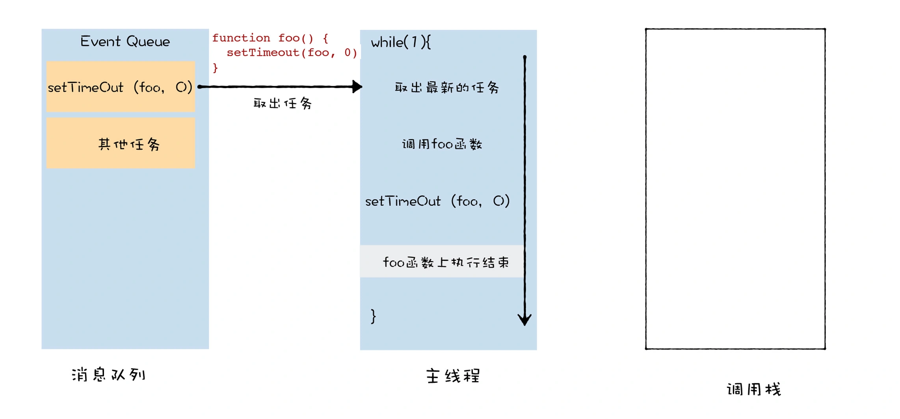

Review
1. 2023-02-14 06:15

## 一、Introduction
基于通用的 UI 线程架构，JavaScript 又延伸出很多新的技术，其中应用最广泛的当属宏任务和微任务。

**宏任务是指消息队列中的等待被主线程执行的事件**。每个宏任务在执行时，V8 都会重新创建栈，然后随着宏任务中函数调用，栈也随之变化，最终，当该宏任务执行结束时，整个栈又会被清空，接着主线程继续执行下一个宏任务。

可以把**微任务看成是一个需要异步执行的函数，执行时机是在主函数执行结束之后、当前宏任务结束之前**。

JavaScript 中之所以要引入微任务，主要是由于主线程执行消息队列中宏任务的时间颗粒度太粗了，无法胜任一些对精度和实时性要求较高的场景，那么**微任务可以在实时性和效率之间做一个有效的权衡**。另外使用微任务，可以改变我们现在的异步编程模型，使得我们可以使用同步形式的代码来编写异步调用。


从图中可以看出，微任务是基于消息队列、事件循环、UI 主线程还有堆栈而来的，然后基于微任务，又可以延伸出协程、Promise、Generator、await/async 等现代前端经常使用的一些技术。

## 主线程、调用栈、消息队列
**调用栈是一种数据结构，用来管理在主线程上执行的函数的调用关系。**
```js
function bar() {
}
function foo(fun){
  fun()
}
foo(bar)
```

当 V8 准备执行这段代码时，会先将全局执行上下文压入到调用栈中，如下图所示：


然后 V8 便开始在主线程上执行 foo 函数，首先它会创建 foo 函数的执行上下文，并将其压入栈中，那么此时调用栈、主线程的关系如下图所示：


然后，foo 函数又调用了 bar 函数，那么当 V8 执行 bar 函数时，同样要创建 bar 函数的执行上下文，并将其压入栈中，最终效果如下图所示：

等 bar 函数执行结束，V8 就会从栈中弹出 bar 函数的执行上下文，此时的效果如下所示：
![[e38ccc945660_1026ba43.webp]]

最后，foo 函数执行结束，V8 会将 foo 函数的执行上下文从栈中弹出，效果如下所示：


以上就是调用栈管理主线程上函数调用的方式，不过，这种方式会带来一种问题，那就是栈溢出。比如下面这段代码：
```js
function foo(){
  foo()
}
foo()
```

由于 foo 函数内部嵌套调用它自己，所以在调用 foo 函数的时候，它的栈会一直向上增长，但是由于栈空间在内存中是连续的，所以通常我们都会限制调用栈的大小，如果当函数嵌套层数过深时，过多的执行上下文堆积在栈中便会导致栈溢出，最终如下图所示：


可以使用 setTimeout 来解决栈溢出的问题，setTimeout 的本质是将同步函数调用改成异步函数调用，这里的异步调用是将 foo 封装成事件，并将其添加进消息队列中，然后主线程再按照一定规则循环地从消息队列中读取下一个任务。使用 setTimeout 改造后代码代码如下所示：
```js
function foo() {
  setTimeout(foo, 0)
}
foo()
```

由于 foo 函数内部嵌套调用它自己，所以在调用 foo 函数的时候，它的栈会一直向上增长，但是由于栈空间在内存中是连续的，所以通常我们都会限制调用栈的大小，如果当函数嵌套层数过深时，过多的执行上下文堆积在栈中便会导致栈溢出，最终如下图所示：


接下来 V8 就要执行 foo 函数了，同样执行 foo 函数时，会创建 foo 函数的执行上下文，并将其压入栈中，最终效果如下图所示：


当 V8 执行执行 foo 函数中的 setTimeout 时，setTimeout 会将 foo 函数封装成一个新的宏任务，并将其添加到消息队列中，在 V8 执行 setTimeout 函数时的状态图如下所示：


等 foo 函数执行结束，V8 就会结束当前的宏任务，调用栈也会被清空，调用栈被清空后状态如下图所示：
![[aca383524e7e_c5a653a6.webp]]
当一个宏任务执行结束之后，忙碌的主线程依然不会闲下来，它会一直重复这个取宏任务、执行宏任务的过程。刚才通过 setTimeout 封装的回调宏任务，也会在某一时刻被主线取出并执行，这个执行过程，就是 foo 函数的调用过程。具体示意图如下所示：


因为 foo 函数并不是在当前的父函数内部被执行的，而是封装成了宏任务，并丢进了消息队列中，然后等待主线程从消息队列中取出该任务，再执行该回调函数 foo，这样就解决了栈溢出的问题。


### 微任务解决了宏任务执行时机不可控的问题
不过，对于栈溢出问题，虽然我们可以通过将某些函数封装成宏任务的方式来解决，但是宏任务需要先被放到消息队列中，如果某些宏任务的执行时间过久，那么就会影响到消息队列后面的宏任务的执行，而且这个影响是不可控的，因为你无法知道前面的宏任务需要多久才能执行完成。

于是 JavaScript 中又引入了微任务，微任务会在当前的任务快要执行结束时执行，利用微任务，你就能比较精准地控制你的回调函数的执行时机。

通俗地理解，**V8 会为每个宏任务维护一个微任务队列**。当 V8 执行一段 JavaScript 时，会为这段代码创建一个环境对象，微任务队列就是存放在该环境对象中的。当你通过 Promise.resolve 生成一个微任务，该微任务会被 V8 自动添加进微任务队列，等整段代码快要执行结束时，该环境对象也随之被销毁，但是在销毁之前，V8 会先处理微任务队列中的微任务。

理解微任务的执行时机，你只需要记住以下两点：
1. 首先，如果当前的任务中产生了一个微任务，通过 Promise.resolve() 或者 Promise.reject() 都会触发微任务，触发的微任务不会在当前的函数中被执行，所以执行微任务时，不会导致栈的无限扩张；
2. 其次，和异步调用不同，微任务依然会在当前任务执行结束之前被执行，这也就意味着在当前微任务执行结束之前，消息队列中的其他任务是不可能被执行的。

因此在函数内部触发的微任务，一定比在函数内部触发的宏任务要优先执行。

```js
function bar(){
  console.log('bar')
  Promise.resolve().then(
    (str) =>console.log('micro-bar')
  ) 
  setTimeout((str) =>console.log('macro-bar'),0)
}


function foo() {
  console.log('foo')
  Promise.resolve().then(
    (str) =>console.log('micro-foo')
  ) 
  setTimeout((str) =>console.log('macro-foo'),0)
  
  bar()
}
foo()
console.log('global')
Promise.resolve().then(
  (str) =>console.log('micro-global')
) 
setTimeout((str) =>console.log('macro-global'),0)
```

```txt
foo
bar
global
micro-foo
micro-bar
micro-global
macro-foo
macro-bar
macro-global
```

首先，当 V8 执行这段代码时，会将全局执行上下文压入调用栈中，并在执行上下文中创建一个空的微任务队列。那么此时：
1. 调用栈中包含了全局执行上下文；
2. 微任务队列为空。

此时的消息队列、主线程、调用栈的状态图如下所示：
![[e05f3e2db68c_c6453ecc.webp]]

然后，执行 foo 函数的调用，V8 会先创建 foo 函数的执行上下文，并将其压入到栈中。接着执行 Promise.resolve，这会触发一个 micro-foo1 微任务，V8 会将该微任务添加进微任务队列。然后执行 setTimeout 方法。该方法会触发了一个 macro-foo1 宏任务，V8 会将该宏任务添加进消息队列。那么此时：

- 调用栈中包含了全局执行上下文、foo 函数的执行上下文；
- 微任务队列有了一个微任务，micro-foo；
- 消息队列中存放了一个通过 setTimeout 设置的宏任务，macro-foo。

此时的消息队列、主线程和调用栈的状态图如下所示：

执行bar函数

此时的消息队列、主线程和调用栈的状态图如下所示：


等到这段代码即将执行完成时，V8 便要销毁这段代码的环境对象，这里就是 V8 执行微任务的一个检查点，这时候 V8 会检查微任务队列，如果微任务队列中存在微任务，那么 V8 会依次取出微任务，并按照顺行执行。因为微任务队列中的任务分别是：micro-foo、micro-bar、micro-global，所以执行的顺序也是如此。

以上就是完整的执行流程的分析，到这里，相信你已经了解微任务和宏任务的执行时机是不同的了，微任务是在当前的任务快要执行结束之前执行的，宏任务是消息队列中的任务，主线程执行完一个宏任务之后，便会接着从消息队列中取出下一个宏任务并执行。


### 能否在微任务中循环地触发新的微任务？
既然宏任务和微任务都是异步调用，只是执行的时机不同，那能不能在 setTimeout 解决栈溢出的问题时，把触发宏任务改成是触发微任务呢？

```js
function foo() {
  return Promise.resolve().then(foo)
}
foo()
```

当执行 foo 函数时，由于 foo 函数中调用了 Promise.resolve()，这会触发一个微任务，那么此时，V8 会将该微任务添加进微任务队列中，退出当前 foo 函数的执行。

然后，V8 在准备退出当前的宏任务之前，会检查微任务队列，发现微任务队列中有一个微任务，于是先执行微任务。由于这个微任务就是调用 foo 函数本身，所以在执行微任务的过程中，需要继续调用 foo 函数，在执行 foo 函数的过程中，又会触发了同样的微任务。

那么这个循环就会一直持续下去，当前的宏任务无法退出，也就意味着消息队列中其他的宏任务是无法被执行的，比如通过鼠标、键盘所产生的事件。这些事件会一直保存在消息队列中，页面无法响应这些事件，具体的体现就是页面的卡死。

不过，由于 V8 每次执行微任务时，都会退出当前 foo 函数的调用栈，所以这段代码是不会造成栈溢出的。

**消息队列**中事件又被称为**宏任务**，不过，宏任务的时间颗粒度太粗了，无法胜任一些对精度和实时性要求较高的场景，而微任务可以在实时性和效率之间做有效的权衡。

微任务的执行时机，==微任务其实是一个需要异步执行的函数，执行时机是在主函数执行结束之后、当前宏任务结束之前==。


**MutationObserver** 和 **IntersectionObserver** 两个性质应该差不多。这里简称ob。ob是一个微任务，通过浏览器的 ***requestIdleCallback***，在浏览器每一帧的空闲时间执行ob监听的回调，该监听是不影响主线程的，但是回调会阻塞主线程。当然有一个限制，如果100ms内主线程一直处于未空闲状态，那会强制触发ob。

## Reference

