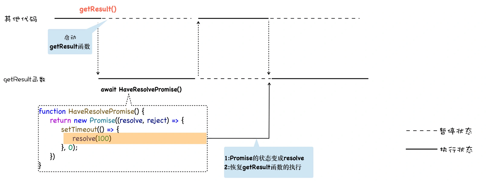

Review
1. 2023-02-14 08:21

## 一、Introduction
JavaScript 是基于单线程设计的，最终造成了 JavaScript 中出现大量回调的场景。当 JavaScript 中有大量的异步操作时，会降低代码的可读性, 其中最容易造成的就是回调地狱的问题。

JavaScript 社区探索并推出了一系列的方案，从“Promise 加 then”到“generator 加 co”方案，再到最近推出“终极”的 async/await 方案，完美地解决了回调地狱所造成的问题。

异步回调模式影响到我们的编码方式，如果在代码中过多地使用异步回调函数，会将你的整个代码逻辑打乱，从而让代码变得难以理解，这也就是我们经常所说的回调地狱问题。

异步编程方案史


### 使用 Promise 解决回调地狱问题
虽然使用 Promise 可以解决回调地狱中编码不线性的问题，但这种方式充满了 Promise 的 then() 方法，如果处理流程比较复杂的话，那么整段代码将充斥着大量的 then，异步逻辑之间依然被 then 方法打断了，因此这种方式的语义化不明显，代码不能很好地表示执行流程。

能不能更进一步，像编写同步代码的方式来编写异步代码，比如：
```js
function getResult(){
   let id = getUserID()
   let name = getUserName(id)
   return name
}
```
执行到异步请求的时候，暂停当前函数，等异步请求返回了结果，再恢复该函数。
这个思维模型大致如下所示：


我们可以看出，这个模型的关键就是实现函数暂停执行和函数恢复执行，而生成器就是为了实现暂停函数和恢复函数而设计的。

生成器函数是一个带星号函数，配合 yield 就可以实现函数的暂停和恢复，我们看看生成器的具体使用方式：
```js
function* getResult() {

yield 'getUserID'

yield 'getUserName'

return 'name'
}

let result = getResult()

console.log(result.next().value)
console.log(result.next().value)
console.log(result.next().value)
```

在生成器内部，如果遇到 yield 关键字，那么 V8 将返回关键字后面的内容给外部，并暂停该生成器函数的执行。生成器暂停执行后，外部的代码便开始执行，外部代码如果想要恢复生成器的执行，可以使用 result.next 方法。

那么，V8 是怎么实现生成器函数的暂停执行和恢复执行的呢？

这背后的魔法就是**协程**，**协程是一种比线程更加轻量级的存在**。可以把协程看成是跑在线程上的任务，正如一个进程可以拥有多个线程一样，一个线程也可以拥有多个协程，**但是在线程上同时只能执行一个协程**。最重要的是，**协程不是被操作系统内核所管理，而完全是由程序所控制（也就是在用户态执行）**。这样带来的好处就是性能得到了很大的提升，不会像线程切换那样消耗资源。比如，当前执行的是 A 协程，要启动 B 协程，那么 A 协程就需要将主线程的控制权交给 B 协程，这就体现在 A 协程暂停执行，B 协程恢复执行；同样，也可以从 B 协程中启动 A 协程。通常，如果从 **A 协程启动 B 协程，我们就把 A 协程称为 B 协程的父协程**。

协程执行流程图


其实在 JavaScript 中，生成器就是协程的一种实现方式。

```js
function* getResult() {
    let id_res = yield fetch(id_url);
    console.log(id_res)
    let id_text = yield id_res.text();
    console.log(id_text)


    let new_name_url = name_url + "?id=" + id_text
    console.log(new_name_url)


    let name_res = yield fetch(new_name_url)
    console.log(name_res)
    let name_text = yield name_res.text()
    console.log(name_text)
}


let result = getResult()
result.next().value.then((response) => {
    return result.next(response).value
}).then((response) => {
    return result.next(response).value
}).then((response) => {
    return result.next(response).value
}).then((response) => {
    return result.next(response).value
```

这样，我们可以将同步、异步逻辑全部写进生成器函数 getResult 的内部，然后，我们在外面依次使用一段代码来控制生成器的暂停和恢复执行。以上，就是协程和 Promise 相互配合执行的大致流程。

通常，我们把执行生成器的代码封装成一个函数，这个函数驱动了 getResult 函数继续往下执行，我们把这个执行生成器代码的函数称为**执行器**（可参考著名的 co 框架），如下面这种方式：
```js
function* getResult() {
    let id_res = yield fetch(id_url);
    console.log(id_res)
    let id_text = yield id_res.text();
    console.log(id_text)


    let new_name_url = name_url + "?id=" + id_text
    console.log(new_name_url)


    let name_res = yield fetch(new_name_url)
    console.log(name_res)
    let name_text = yield name_res.text()
    console.log(name_text)
}

co(getResult())
```

co源码实现原理：其实就是通过不断的调用generator函数的next()函数，来达到自动执行generator函数的效果（类似async、await函数的自动自行）。

### async/await：异步编程的“终极”方案
由于生成器函数可以暂停，因此我们可以在生成器内部编写完整的异步逻辑代码，不过生成器依然需要使用额外的 co 函数来驱动生成器函数的执行，这一点非常不友好。

基于这个原因，ES7 引入了 async/await，这是 JavaScript 异步编程的一个重大改进，它改进了生成器的缺点，提供了在不阻塞主线程的情况下使用同步代码实现异步访问资源的能力。你可以参考下面这段使用 async/await 改造后的代码：
```js
async function getResult() {
    try {
        let id_res = await fetch(id_url)
        let id_text = await id_res.text()
        console.log(id_text)
  
        let new_name_url = name_url+"?id="+id_text
        console.log(new_name_url)


        let name_res = await fetch(new_name_url)
        let name_text = await name_res.text()
        console.log(name_text)
    } catch (err) {
        console.error(err)
    }
}
getResult()
```

虽然这种方式看起来像是同步代码，但是实际上它又是异步执行的，也就是说，在执行到 await fetch 的时候，整个函数会暂停等待 fetch 的执行结果，等到函数返回时，再恢复该函数，然后继续往下执行。

其实 async/await 技术背后的秘密就是 Promise 和生成器应用，往底层说，就是微任务和协程应用。要搞清楚 async 和 await 的工作原理，我们就得对 async 和 await 分开分析。

根据 MDN 定义，async 是一个通过 **异步执行并隐式返回 Promise** 作为结果的函数。

简单地理解，如果在 async 函数里面使用了 await，那么此时 async 函数就会暂停执行，并等待合适的时机来恢复执行，所以说 async 是一个异步执行的函数。

那么暂停之后，什么时机恢复 async 函数的执行呢？要解释这个问题，我们先来看看，V8 是如何处理 await 后面的内容的。

通常，await 可以等待两种类型的表达式：
1. 可以是任何普通表达式 ;
2. 也可以是一个 Promise 对象的表达式。

如果 await 等待的是一个 Promise 对象，它就会暂停执行生成器函数，直到 Promise 对象的状态变成 resolve，才会恢复执行，然后得到 resolve 的值，作为 await 表达式的运算结果。
```js
function NeverResolvePromise(){
    return new Promise((resolve, reject) => {})
}
async function getResult() {
    let a = await NeverResolvePromise()
    console.log(a)
}
getResult()
console.log(0)
```

这一段代码，我们使用 await 等待一个没有 resolve 的 Promise，那么这也就意味着，getResult 函数会一直等待下去。

和生成器函数一样，使用了 async 声明的函数在执行时，也是一个单独的协程，我们可以使用 await 来暂停该协程，由于 await 等待的是一个 Promise 对象，我们可以 resolve 来恢复该协程。

这段代码的执行流程图


如果 await 等待的对象已经变成了 resolve 状态，那么 V8 就会恢复该协程的执行，我们可以修改下上面的代码，来证明下这个过程：
```js
function HaveResolvePromise(){
    return new Promise((resolve, reject) => {
        setTimeout(() => {
            resolve(100)
          }, 0);
      })
}
async function getResult() {
    console.log(1)
    let a = await HaveResolvePromise()
    console.log(a)
    console.log(2)
}
console.log(0)
getResult()
console.log(3)
```

现在，这段代码的执行流程就非常清晰了，具体执行流程你可以参看下图：


如果 await 等待的是一个非 Promise 对象，比如 await 100，那么 V8 会隐式地将 await 后面的 100 包装成一个已经 resolve 的对象，其效果等价于下面这段代码：
```js
function ResolvePromise(){
    return new Promise((resolve, reject) => {
            resolve(100)
      })
}
async function getResult() {
    let a = await ResolvePromise()
    console.log(a)
}
getResult()
console.log(3)
```


## Reference


