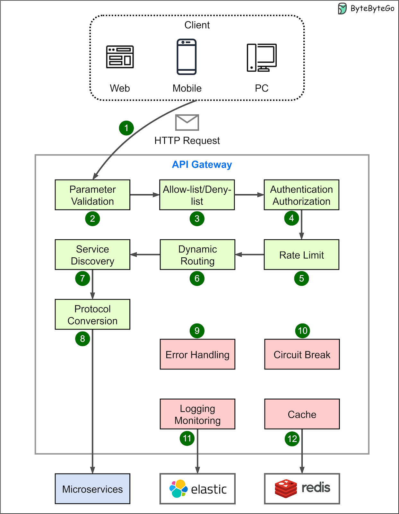
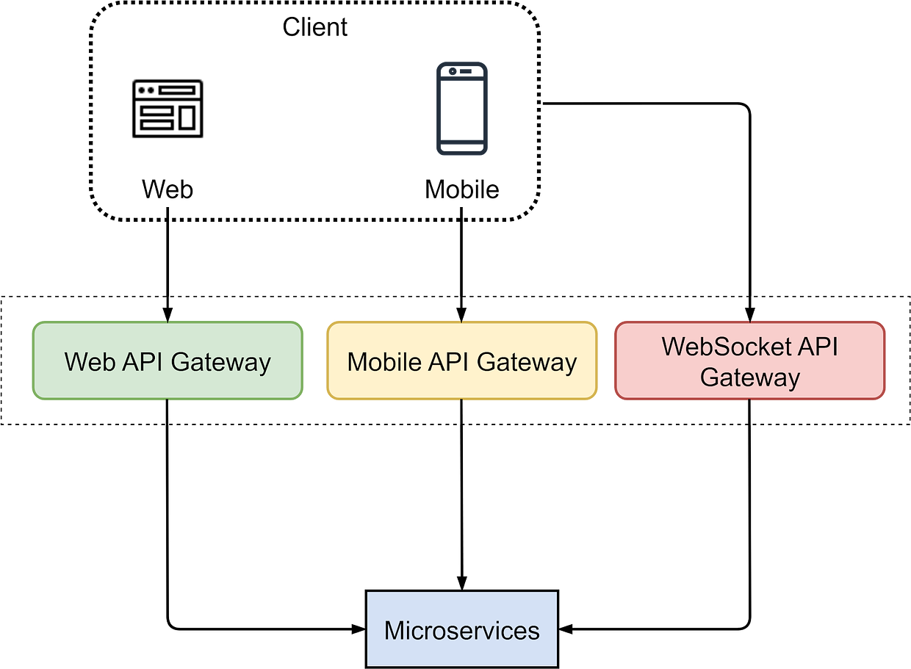

Review
1. 2024-01-05 08:01

## 一、Introduction
In a microservices architecture, an API gateway acts as a **single entry point** for client requests. The API gateway is responsible for request routing, composition, and protocol translation. It also provides additional features like authentication, authorization, caching, and rate limiting.

The diagram below shows the key steps:

Step 1: The client sends an HTTP request to the API gateway.

Step 2: The API gateway parses and validates the attributes in the HTTP request.

Step 3: The API gateway checks allow/deny lists.

Step 4: The API gateway authenticates and authorizes through an identity provider.

Step 5: Rate-limiting rules are applied. Requests over the limit are rejected.

Steps 6 and 7: The API gateway routes the request to the relevant backend service by path matching.

Step 8: The API gateway transforms the request into the appropriate protocol and forwards it to backend microservices.

Step 9: The API gateway handles any errors that may arise during request processing for graceful degradation of service.

Step 10: The API gateway implements resiliency patterns like circuit brakes to detect failures and prevent overloading interconnected services, avoiding cascading failures.

Step 11: The API gateway utilizes observability tools like the ELK stack (Elastic-Logstash-Kibana) for logging, monitoring, tracing, and debugging.

Step 12: The API gateway can optionally cache responses to common requests to improve responsiveness.

Besides request routing, the API gateway can also aggregate responses from microservices into a single response for the client. 

The API gateway is different from a load balancer. While both handle network traffic, the API gateway operates at the application layer, mainly handling HTTP requests; the load balancer mostly operates at the transport layer, dealing with TCP/UDP protocols. The API gateway offers more functions as it sees the request payload. 

However, the lines can blur between these two types of infrastructure. Some advanced load balancers are gaining application layer visibility and routing capabilities resembling API gateways.

But in general, API gateways focus on application-level concerns like **security**, **routing**, **composition**, and **resilience** based on the payload, while traditional load balancers map requests to backend servers mainly based on transport-level metadata like IP and port numbers.

We often have separate API gateways tailored for different clients and their user experience requirements. The diagram below shows a typical architecture. We have different API gateways to handle requests from mobile devices and web applications because they have unique requirements for user experiences. Additionally, we separate WebSocket API Gateway because it has different connection persistence and rate-limiting requirements compared to HTTP gateways.

Some recent API gateway trends:

1. GraphQL support. GraphQL is a type system and a query language for APIs. Many API gateways now offer integration with GraphQL.
    
2. Service Mesh integration. Service meshes like `Istio` and `Linkerd` are used to handle communications among microservices. API gateways are integrating with them to enhance traffic management capabilities.
    
3. AI integration. API gateways are integrating with AI capabilities to enable smarter request routing or anomaly detection in traffic patterns.

## Reference

