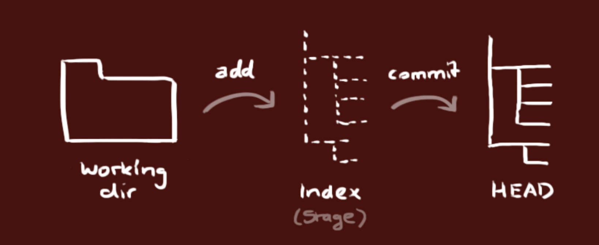

#Git

**Review**
1. 2020/11/17
2. 2022/03/10
3. 2023/07/09

## 一、Overview
Git is a version control system that allows you to track changes to files and folders. It's a powerful tool that can be used for everything from small personal projects to large-scale enterprise applications.

本地仓库由 git 维护的三棵“树”组成。
1. 第一个是**工作目录**（Working Dir），它持有实际文件；
2. 第二个是**缓存区**（Index/Stage），它像个缓存区域，临时保存你的改动；
3. 最后是 HEAD，指向你最近一次提交后的结果。



## 二、Setup and Configuration
```sh
# 生成SSH Key
ssh-keygen -t rsa -b 4096 -C "your_email@example.com"

# Initialize a new Git repository
git init
# Clone and create a local copy of a remote repository
git clone <url>
# Configure global Git settings
git config --global <setting_name> <value>
# Configure local Git settings for a specific repo
git config --local <setting_name> <value>

# --------------- Advanced ------------------

# Show a summary of your Git configuration settings
git config --list
# Set a custom text editor for Git messages
git config --global core.editor "<editor_command>"
# Create a Git command alias
git config --global alias.<shortcut> <command>
# Enable automatic colorization of Git output
git config --global color.ui auto
# Cache Git credentials for a certain amount of time
git config --global credential.helper 'cache --timeout=<seconds>'
# Configure git to detect specific types of whitespace errors
git config --global core.whitespace <options>
# Automatically prune remote-tracking branches when fetching updates
git config --global fetch.prune true
# Set a custom diff tool for Git
git config --global diff.tool <tool>
# Set a custom merge tool for Git
git config --global merge.tool <tool>
# Compare changes using a custom diff tool
git difftool
# Resolve merge conflicts with a custom merge tool
git mergetool
```


## 三、常规操作
### 3.1 File Operations
```sh
# Show working tree status
git status
# Add files to the staging area
git add <file(s)>
# Remove files from working tree and staging area
git rm <file(s)>
# Move or rename a file
git mv <old_file> <new_file>
# Commit changes with a message
git commit -m "commit message"
# Show differences between working tree and last commit
git diff

# --------------- Advanced ------------------

# Assume a tracked file is unchanged
git update-index --assume-unchanged <file>
# Restore normal behavior of tracking changes
git update-index --no-assume-unchanged <file>
# Show differences between two commits
git diff <commit_id1>..<commit_id2>
# Unstage a file, but keep in the working directory
git rm --cached <file_name>
```

### 3.2 Branching and Merging
```sh
# List all branches
git branch
# Create a new branch
git branch <branch_name>
# Switch to a specific branch
git checkout <branch_name>
# Merge a branch into the current branch
git merge <branch_name>
# Delete a specific branch
git branch -d <branch_name>
# List all remote branches
git branch -r

# --------------- Advanced ------------------

# List branches with additional information
git branch -vv
# Create a new branch based on a remote branch
git checkout -b <branch_name> <remote_name>/<remote_branch>
# Cancel merge in case of conflicts
git merge --abort
# Rebase the current branch onto another branch
git rebase <branch_name>
# Cancel an ongoing rebase operation
git rebase --abort
# Interactive rebase for edit, squash, re-order or drop commits
git rebase -i
# Rebase commits in the current branch onto a remote branch interactively
git rebase -i <remote_name>/<remote_branch>
```


### 3.3 Remote Repositories
```sh
# List remote repositories
git remote
# Add a remote repository
git remote add <name> <url>
# Fetch from a remote repository
git fetch <remote_name>
# Pull changes from a remote branch
git pull <remote_name> <remote_branch>
# Push changes to a remote repository
git push <remote_name> <local_branch>
# Remove a remote repository
git remote rm <remote_name>
# Display information about a specific remote repository
git remote show <remote_name>
# Show the tracking branches for remote repositories
git remote show <remote_name> --verbose

# --------------- Advanced -------------------

# Fetch updates from all remote repositories
git remote update
# Force-push changes to a remote repository, overwriting remote history
git push --force <remote_name> <local_branch>
# Push all tags to a remote repository
git push --tags <remote_name>
# Rename a remote repository
git remote rename <old_name> <new_name>
# Change the URL of a remote repository
git remote set-url <name> <new_url>
# Remove stale remote-tracking branches
git remote prune <remote_name>
# List all remote branches that have been merged into the current branch
git branch -r --merged
# List all remote branches not yet merged into the current branch
git branch -r --no-merged
# Fetch updates from a remote repository and prune obsolete remote-tracking branches
git fetch -p

# Track a remote branch and set up the local branch to automatically sync with it
git branch --track <branch_name> <remote_name>/<remote_branch>
# Set an existing local branch to track a remote branch
git branch -u <remote_name>/<remote_branch>
# Push a branch to a remote repository and set it to track the remote branch
git push -u <remote_name> <local_branch>
# Remove the tracking association between a local and a remote branch
git branch --unset-upstream <branch_name>
```

### 3.4 Commit History
```sh
# Show commit history
git log
# Display a condensed commit history
git log --oneline
# Show branching commit history
git log --graph
# Filter commit history by author
git log --author=<author_name>
# Show commit history since specific date
git log --since=<date>
# Show commit history until specific date
git log --until=<date>
```

### 3.5 Tags
```sh
# List all tags
git tag
# Create a new tag at a specific commit
git tag <tag_name> <commit_id>
# Create an annotated tag with a message
git tag -a <tag_name> -m "tag message"
# Delete a specific tag
git tag -d <tag_name>
# Delete a specific remote tag
git push <remote_name> --delete <tag_name>
# Show information about a specific tag
git show <tag_name>
```

### 3.6 Stashes
```sh
# Temporarily save changes in the working tree
git stash save "stash message"
# List all stashes
git stash list
# Apply changes from a specific stash
git stash apply <stash>
# Remove a specific stash
git stash drop <stash>
# Remove all stashes
git stash clear
```

### 3.7 Commit Management
```sh
# Modify the latest commit
git commit --amend
# Create a new commit that undoes changes from a previous commit
git revert <commit_id>
# Discard changes and move HEAD to a specific commit
git reset --hard <commit_id>
# Move HEAD to a specific commit, but preserve staged changes
git reset --soft <commit_id>
# Show a record of all changes made to the local repository head
git reflog
```

### 3.8 Hooks and Automation, and Diff and Merge Tools
```sh
# Locate hooks directory in the Git repository (usually in .git/hooks/)
git hooks
# Script names for specific hooks that can be added to the hooks directory
pre-commit, post-commit, pre-push, post-merge, etc.
# Make a hook script executable to ensure it's triggered when necessary
chmod +x <hook_script>
```

### 3.9 Collaboration
```sh
# Generate a request-pull summary with the changes between two commits
git request-pull <start_commit> <end_commit> <url>
# Summarize the commit history, listing authors and their contributions
git shortlog
# List all files tracked by Git
git ls-files
# Search for a specified pattern in files tracked by Git
git grep <pattern>
```

### 3.10 Tips and Tricks
```sh
# Interactively choose parts (hunks) of files to stage
git add -p

# Show the commit history and associated patches for a specific file
git log -p <file_name>
# Customize the format of the git log output
git log --pretty=format:"%h - %an, %ar : %s"
# Find text in commit messages (useful for locating specific changes)
git log --grep="<text>"
# Quickly view the changes in the working directory since the last commit
git diff --stat
# Display the branch history with decoration to see where branches have split or merged
git log --oneline --decorate --graph

# Stash changes in the working tree, including untracked files
git stash save -u
# Create an empty commit, useful while testing branch protection rules
git commit --allow-empty -m "Empty commit message"

# Set the git output pager to quit when the output is less than one screen, and not clear the screen after displaying
git config --global core.pager 'less -RFX'
# Use Git's auto-correct feature to fix mistyped commands
git config --global help.autocorrect 1
# List aliases for Git commands
git config --get-regexp alias

# Perform a dry run of merging without actually merging branches
git merge --no-commit --no-ff <branch_name>
# Show a tree-like representation of the repo's structure
git ls-tree --name-only -r -t HEAD
```

注意这2个命令
```sh
git pull = fetch + merge
git pull --rebase = fetch + rebase
```


**merge vs rebase**
1. merge 合并两个分支时会产生一个**特殊的提交记录**，它有两个父节点。简单说就是：“我要把这两个父节点本身及它们所有的祖先都包含进来。”
2. rebase 实际上就是取出一系列的提交记录，“复制”它们，然后在另外一个地方逐个的放下去。它的优势就是可以**创造更线性的提交历史**。

**Git clone with proxy**
```sh
git config --global http.proxy 'socks5://127.0.0.1:7070'
```

_To disable the proxy, run command:_
```sh
git config --global --unset http.proxy
```

**If you do not want to set the proxy as global config, try ALL_PROXY= e.g.:**
```sh
ALL_PROXY=socks5://127.0.0.1:8888 git clone https://github.com/some/one.git
```

[https://stackoverflow.com/questions/15227130/using-a-socks-proxy-with-git-for-the-http-transport](https://stackoverflow.com/questions/15227130/using-a-socks-proxy-with-git-for-the-http-transport)

**change author after a commit**
```sh
git rebase -i origin/master

git commit --amend --author=“ZekeXu <zekexu18@outlook.com>”
git rebase --continue
git push -f
```


1. [https://makandracards.com/makandra/1717-git-change-author-of-a-commit](https://makandracards.com/makandra/1717-git-change-author-of-a-commit)
2. [https://www.git-tower.com/learn/git/faq/change-author-name-email](https://www.git-tower.com/learn/git/faq/change-author-name-email)
3. 脚本替换修改：[https://help.github.com/cn/github/using-git/changing-author-info](https://help.github.com/cn/github/using-git/changing-author-info)
4. Git **filter-branch** [https://git-scm.com/book/zh/v2/Git-%E5%B7%A5%E5%85%B7-%E9%87%8D%E5%86%99%E5%8E%86%E5%8F%B2](https://git-scm.com/book/zh/v2/Git-%E5%B7%A5%E5%85%B7-%E9%87%8D%E5%86%99%E5%8E%86%E5%8F%B2)

**脚本替换**
```sh
git filter-branch --env-filter '
WRONG_EMAIL="pzrealjob@163.com"
NEW_NAME="Xu Lipeng"
NEW_EMAIL="xulipeng@4paradigm.com"
if [ "$GIT_COMMITTER_EMAIL" = "$WRONG_EMAIL" ]
then
    export GIT_COMMITTER_NAME="$NEW_NAME"
    export GIT_COMMITTER_EMAIL="$NEW_EMAIL"
fi

if [ "$GIT_AUTHOR_EMAIL" = "$WRONG_EMAIL" ]
then
    export GIT_AUTHOR_NAME="$NEW_NAME"
    export GIT_AUTHOR_EMAIL="$NEW_EMAIL"
fi
' --tag-name-filter cat -- --branches --tags

```

**git alias [zsh]**

[https://github.com/ohmyzsh/ohmyzsh/wiki/Cheatsheet](https://github.com/ohmyzsh/ohmyzsh/wiki/Cheatsheet)

git merge vs git rebase
git reset vs git revert

**macOS删除手动安装的Git**
```sh
/usr/local/git/uninstall.sh

brew install git

which git

git --version
```

**git merge conflicated**

If you're already in conflicted state, and you want to just accept _all_ of theirs:
```sh
git checkout --theirs .

If you want to do the opposite:

git checkout --ours .
```

**Git log**
```sh
git log --pretty="%h - %s" --author='Junio C Hamano' —after="2008-10-01" \
   --before="2008-11-01"
```

[https://git-scm.com/book/en/v2/Git-Basics-Viewing-the-Commit-History](https://git-scm.com/book/en/v2/Git-Basics-Viewing-the-Commit-History)

**Turn off password authentication**
```sh
sudo nano /etc/ssh/sshd_config
```

```txt
PasswordAuthentication no
PubkeyAuthentication yes
```

```sh
sudo systemctl restart sshd
```


[https://upcloud.com/community/tutorials/use-ssh-keys-authentication/](https://upcloud.com/community/tutorials/use-ssh-keys-authentication/)

书籍
[https://git-scm.com/book/en/v2](https://git-scm.com/book/en/v2)

Git 删除远程tags
```sh
git delete origin tags
git push origin :tagName
```

删除本地tag
```sh
git tag —delete tagName
```

**git revert 多个commit**
假如git commit 链是
A -> B -> C -> D 

如果想把B，C，D都给revert，除了一个一个revert之外，还可以使用range revert
```sh
git revert B^..D 
```

这样就把B,C,D都给revert了，变成：
A-> B ->C -> D -> D'-> C' -> B'

用法就是：
```sh
git revert OLDER_COMMIT^..NEWER_COMMIT
```

如果我们想把这三个revert不自动生成三个新的commit，而是用一个commit完成，可以这样：
```sh
git revert -n OLDER_COMMIT^..NEWER_COMMIT
git commit -m "revert OLDER_COMMIT to NEWER_COMMIT"
```

**删除本地新增文件**
```sh
git clean -f -d
```


## Reference
1. [Git Cheatsheet](https://cs.fyi/guide/git-cheatsheet)
2. [Git for Absolutely Everyone](https://thenewstack.io/tutorial-git-for-absolutely-everyone/)
3. [Git basics](https://www.atlassian.com/git)
4. [#YouTube Git & GitHub Crash Course For Beginners](https://www.youtube.com/watch?v=SWYqp7iY_Tc)
5. [https://www.bootcss.com/p/git-guide/](https://www.bootcss.com/p/git-guide/)
6. [https://mp.weixin.qq.com/s/eCWYmuHaiG0TgWqKT6xs0Q](https://mp.weixin.qq.com/s/eCWYmuHaiG0TgWqKT6xs0Q)
7. 生成SSHKEY：[https://www.atlassian.com/git/tutorials/git-ssh](https://www.atlassian.com/git/tutorials/git-ssh)
8. GeneratingSSHKey: [https://git-scm.com/book/en/v2/Git-on-the-Server-Generating-Your-SSH-Public-Key](https://git-scm.com/book/en/v2/Git-on-the-Server-Generating-Your-SSH-Public-Key)
