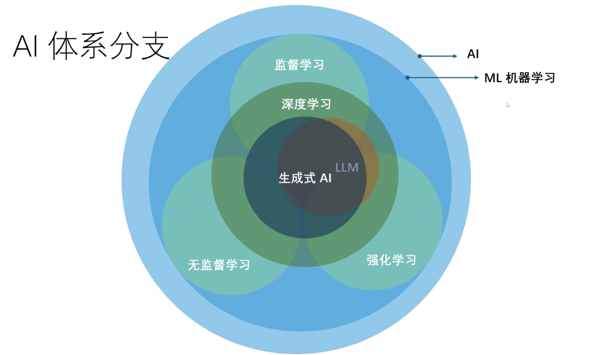
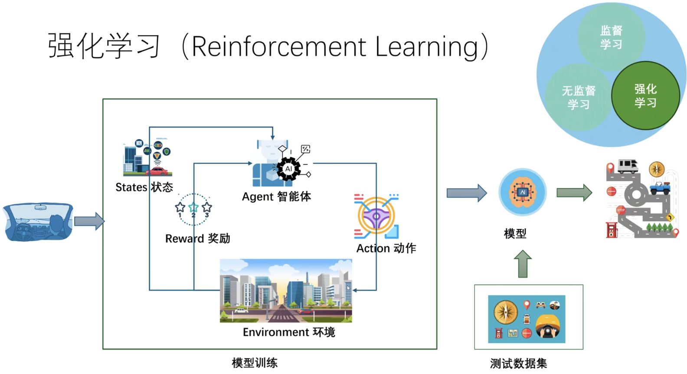
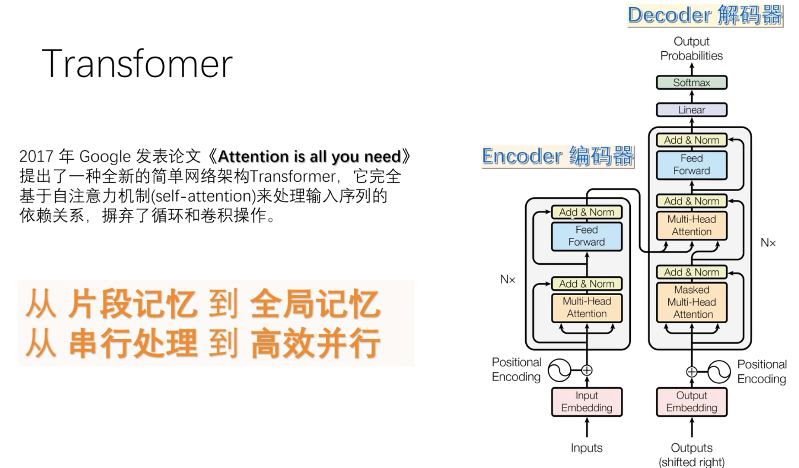
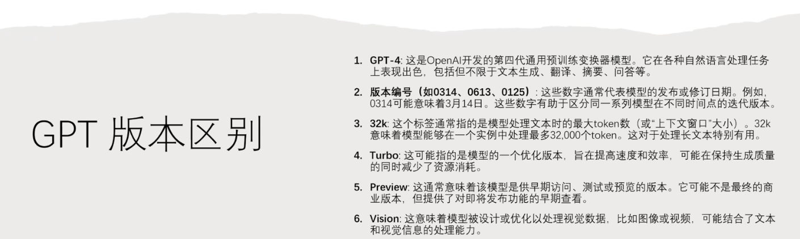
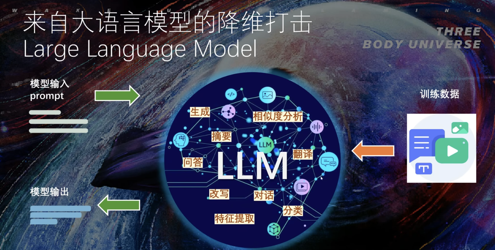
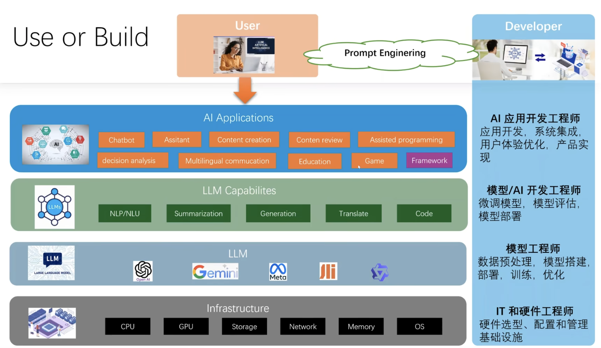

Review
1. 2024-12-09 07:42

> [!Summary]
> 

## 一、Introduction

AI体系分支

## 1、机器学习
1. 传统编程指令：基于规则和流程，手动特征提取，明确编写逻辑
2. 机器学习：自行从数据中学习和改进

机器学习方法
1. 监督学习（Supervised Learning）通过打标签（Annotations/Labels）进行训练，主要使用场景：分类、回归(Regression)。不足：打标签成本高，很多数据无标签。
2. 无监督学习 (Unsupervised Learning) 无标签，机器学习算法寻找规则。应用场景：聚类Clustering，关联规则Association Rule（推荐算法）
3. 强化学习

机器学习效果评估
1. 欠拟合 (Under-fitting) 不准
2. 最佳拟合 (Optimal-fitting) 这个所有机器学习的目标
3. 过拟合 (Over-fitting) 不能泛化

## 2、深度学习 （Deep Learning）
一种机器学习架构，使用多层人工神经网络，模仿人脑的工作方式来解决复杂的模式识别问题。能够从图像、语音、自然语言中自动提取高层次的特征。

### Transformer

### GPT
Generative Pre-trained Transformer 生成式预训练

**发展历史**
1. 2017年，Transformer论文诞生
2. 2018年5月，GPT-1
3. 2019年11月，GPT-2
4. 2020年5月，GPT-3
5. 2022年底，ChatGPT发布（GPT3.5）
6. 2023年3月，GPT-4
7. 2024年4月，GPT-4 Turbo 多模态
8. 2024年5月，GPT-4o 多模态，`o` 指代 `omni` 意思是全部、全能。
9. 2024年7月，GPT-4o Mini

### 生成式AI - Generative AI
AIGC - AI Generated Content，AI生成内容。
- 文本
- 图片
- 视频
- 音频
- 代码

GPT-4o 计费token计算 https://gpt-tokenizer.dev/

> [!Caution]
> 1. OpenAI 使用了什么样的数据模型训练方法，使得GPT能够在问答中获得优异表现？

## Reference

