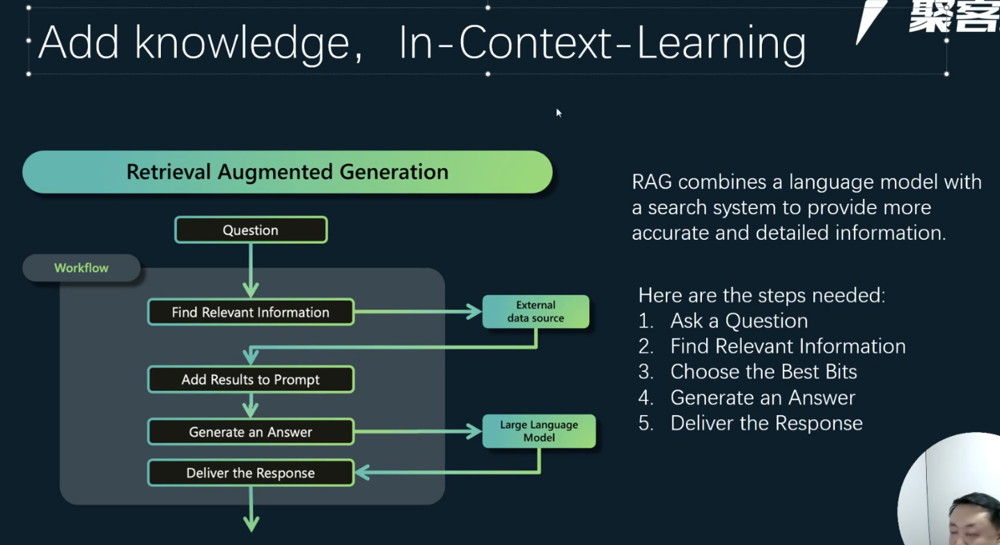
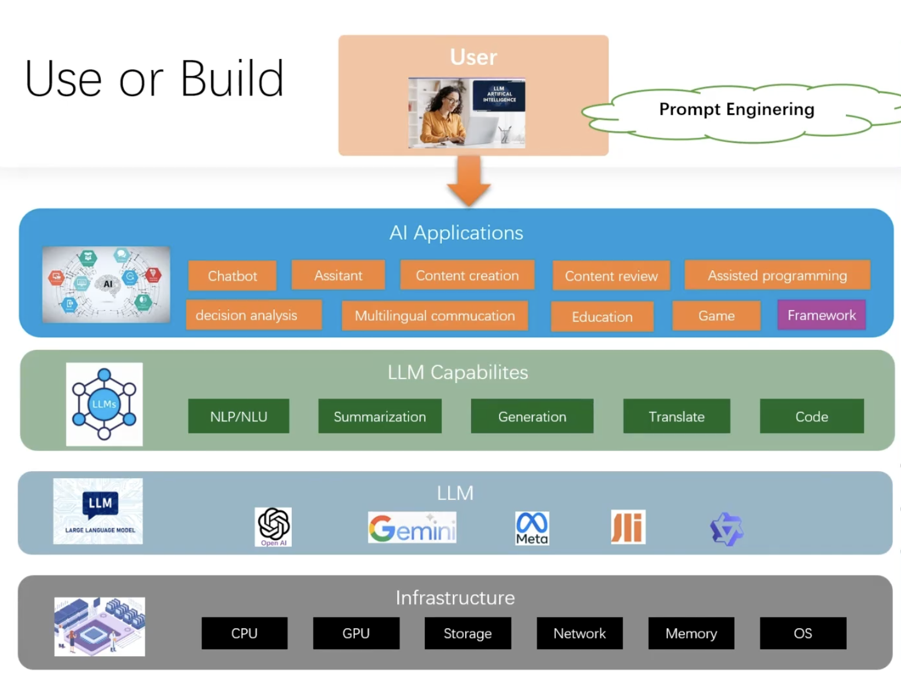

Review
1. 2023-09-15 23:19
2. 2024-12-12

## 一、Introduction

应用场景
- 基于 LangChain 构建 RAG 问答系统。

训练大模型成本
1. 硬件：显卡较贵
2. 数据：
3. 其他：电力

大模型训练的都是公开的海量数据，不含盖私有化数据，如果补充私有化数据？
解决方案
1. RAG 检索增强生成：适用大部分是文献资料、文档使用RAG。
2. SFT 微调：QA（法律咨询、心里问诊），对数据标签归类，微调出一个适用场景的垂直模型。

##### RAG不足
1. 检索机制：rerank
2. 延迟变高：增加了Retrieve过程，导致延迟变高。对于系统延迟低场景

![[efd1527f8d28_a45e5048.png]]

##### RAG (Retrieval Augmented Generation) 检索增强生成

##### 文本向量(Embeddings)
1. 将文本转成一组N维浮点数，即文本向量又叫Embeddings
2. 向量之间可以计算距离，距离远近对应语义相似度大小

##### 向量存储（Vector Store）
1. FAISS：Meta开源的向量检索引擎
2. Chroma：开源向量数据库，同时有云服务
3. Pinecone：商用向量数据库，只有云服务
4. Milvus：开源向量数据库，同时有云服务
5. Weaviate：开源
6. Qdrant：开源
7. PGVector：Postgres的开源
8. RediSearch：Redis开源
9. ElasticSearch：支持向量/Keywords

##### 构建Index
1. Load
2. Split
3. Embedded
4. Store

Split
1. 简单文本处理：LangChain `RecursiveCharacterTextSplitter` 按行切割
2. 复杂文本处理：
	- 基于 NLP 篇章分析（discourse parsing）工具：提取段落之间的主要关系，把所有包含主从关系的段落合并成一段
	- *基于 BERT 中的NSP（next sentence prediction）训练任务* 设置相似度阈值t，从前往后依次判断相邻2个段落的相似度分数是否大于t，如果大于则合并，否则断开

## 二、周边
[Flowise](https://github.com/FlowiseAI/Flowise)

## Reference
1. <https://github.com/langfuse/langfuse>
