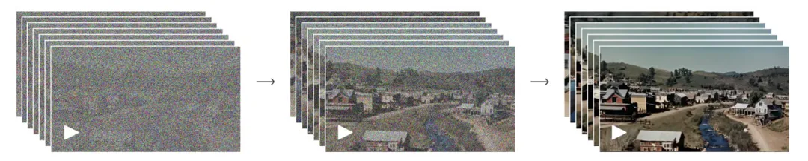

Review
1. 2024-02-24

## 背景简介
OpenAI 于 2024/02/15 发布了首款文本生成视频（text-to-video, t2v）模型Sora.

Sora使用Transformer架构，可根据文本指令创建现实且富有想象力的场景，生成多种风格、不同画幅、最长为一分钟的高清视频。Sora还能够根据静态图像生成视频，扩展现有视频或填充缺失的帧。

OpenAI说，**Sora** **能深刻地理解语言，不仅理解用户文本提示，还理解所述事物在物理世界中的存在方式。**“我们正在教授人工智能理解和模拟运动中的物理世界，目标是训练模型帮助人们解决需要与现实世界交互的问题。”

Sora至少有以下突破：
（1）画质突破：视频非常高清，细节极其丰富；
（2）帧率和连续性突破：视频帧率高、连续性好（无闪烁或明显的时序不一致）；
（3）时长突破：相比之前t2v模型仅能生成几秒的时长，Sora可以生成长达1分钟的视频，这是之前t2v模型不敢想象的；
（4）物理规则理解突破：视频中物体的运动、光影等似乎都非常符合自然世界的物理规则，整个视频看上去都非常自然和逼真。

## Sora原理
如果用一句话来描述Sora训练建模过程，可以是：将原始视频通过一个视觉编码器（visual encoder）编码到隐空间（latent space）形成隐时空块（spacetime latent patches），这些隐时空块（结合text信息）通过transformer做diffusion ^[Ho, Jonathan, Ajay Jain, and Pieter Abbeel. "Denoising diffusion probabilistic models." Advances in neural informaion processing systems 33 (2020): 6840-6851.] 的训练和生成，将生成的隐时空块再通过视觉解码器（visual decoder）解码到像素空间（pixel space）。**所以整个过程就是：visual encoding -> latent diffusion with diffusion transformer (DiT) ^[Peebles, William, and Saining Xie. "Scalable diffusion models with transformers." Proceedings of the IEEE/CVF International Conference on Computer Vision. 2023.] -> visual decoding。**

### （1）Visual Encoding
![[0x022-AI/assets/7ccbd5f3fb90_57796345.png]]
这一步其实很好理解，就是通过一个变分自编码器（VAE）^[Kingma, Diederik P., and Max Welling. "Auto-encoding variational bayes." arXiv preprint arXiv:1312.6114 (2013).] 的encoder将高维的原始视频映射（压缩）到较为低维的隐空间（注意：**不仅仅是空间上压缩了，时间上也进行了压缩**），即得到该视频的低维隐空间特征（可以看成一个大的3D tensor），为了后续transformer计算方便，将这个特征切成不重叠的3D patches，再将这些patches拉平成一个token序列，这个token序列其实就是原始视频的表征了（即visual token序列）。

### （2）Latent Diffusion with DiT
在得到视觉表征（上述visual token序列）后，Sora借鉴了DiT，使用 **transformer** 来做diffusion model的训练，使用transformer的好处在于可以输入任意长度的token序列，这样就不再限制输入视频的尺寸和时长，并且模型很容易scale up（OpenAI表示这个我熟）。同时，因为Sora想解决t2v的问题，所以Sora会将text的表征以某种形式condition到visual tokens上来约束生成。

在diffusion transformer的训练中，给定噪声输入（e.g., 噪声patches）并conditioned on text特征，模型被训练去预测原始视频的patches（预测过程又叫 denoising 过程，具体可以参考DDPM [2]中的训练算法），示意图如下：

### （3）Visual Decoding
第（2）步中，diffusion transformer可以生成的其实不是像素空间的视频，而是隐空间的视频表征（denoised patches），这些patches reshape成视频3D特征再经过第（1）步中的VAE的decoder，就可以映射回像素空间，得到最后生成的视频。

## Reference
- [Sora的前世今生：从文生图到文生视频](https://mp.weixin.qq.com/s/dIAUwc33IZMid9gVB5uTJg)
- [一文带你了解OpenAI Sora](https://mp.weixin.qq.com/s/Efk-gP8iuau3crWB2wWizg)

---

[^1] OpenAI. "[Video generation models as world simulators](https://openai.com/research/video-generation-models-as-world-simulators)." OpenAI Blog. 2024.
[^2]: Ho, Jonathan, Ajay Jain, and Pieter Abbeel. "Denoising diffusion probabilistic models." Advances in neural informaion processing systems 33 (2020): 6840-6851.
[^3] Rombach, Robin, et al. "High-resolution image synthesis with latent diffusion models." Proceedings of the IEEE/CVF conference on computer vision and pattern recognition. 2022.
[^4] Peebles, William, and Saining Xie. "Scalable diffusion models with transformers." Proceedings of the IEEE/CVF International Conference on Computer Vision. 2023.
[^5] Kingma, Diederik P., and Max Welling. "Auto-encoding variational bayes." arXiv preprint arXiv:1312.6114 (2013).
[^6] Betker, James, et al. "Improving image generation with better captions." Computer Science. https://cdn.openai.com/papers/dall-e-3. pdf 2.3 (2023): 8.
[^7] Meng, Chenlin, et al. "Sdedit: Guided image synthesis and editing with stochastic differential equations." arXiv preprint arXiv:2108.01073 (2021).
[^8] Ha, David, and Jürgen Schmidhuber. "World models." arXiv preprint arXiv:1803.10122 (2018).
