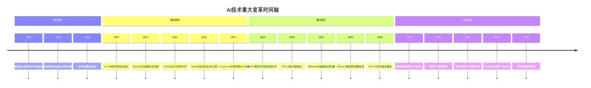

# AI Time

```mermaid
timeline
    title AI技术重大变革时间轴
    
    section 理论奠基
    1950 : 图灵提出"模仿游戏"测试框架
    1956 : 达特茅斯会议确立AI研究领域
    1980 : 反向传播算法提出
    
    section 算法革命
    1997 : LSTM神经网络架构诞生
    2012 : AlexNet实现图像识别突破
    2014 : GAN生成对抗网络问世
    2015 : ResNet解决梯度消失问题
    2017 : Transformer架构颠覆NLP领域
    
    section 能力跃迁
    2018 : BERT模型开启预训练新时代
    2020 : GPT-3展示涌现能力
    2021 : AlphaFold2破解蛋白质折叠
    2022 : Diffusion模型革新图像生成
    2023 : GPT-4实现多模态推理
    
    section 架构创新
    2016 : 神经架构搜索(NAS)自动化
    2019 : 联邦学习框架成熟
    2021 : 混合专家(MoE)模型扩展
    2022 : 基于注意力的视觉Transformer
    2023 : 世界模型架构探索
```
