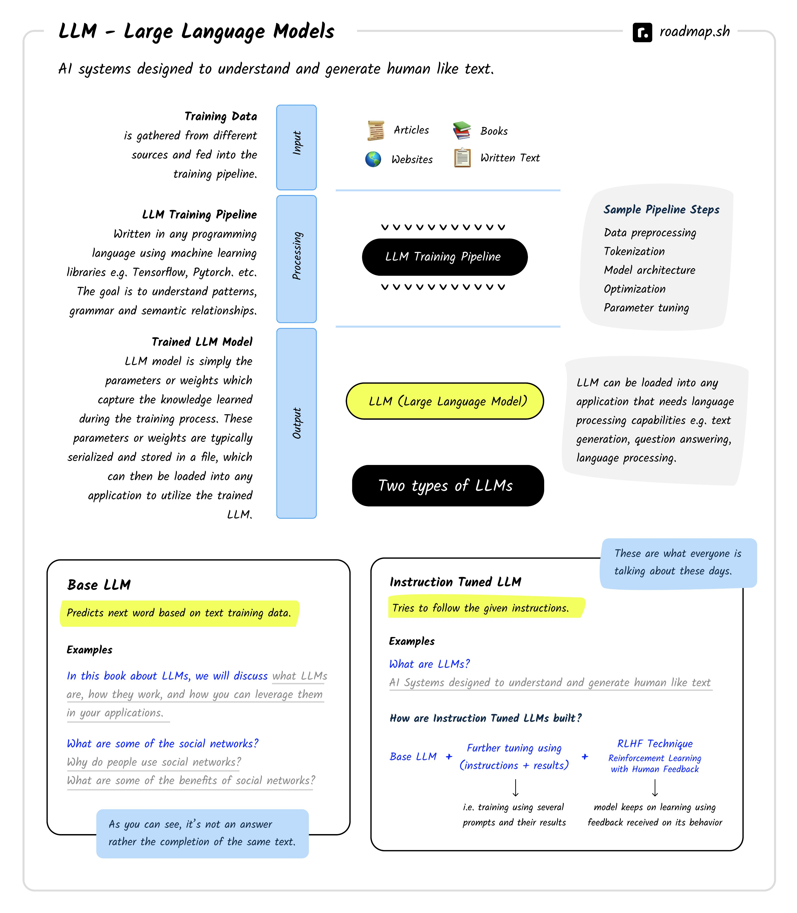

Review
1. 2023-04-08 09:11
2. 2023-07-09 23:19

## 一、Introduction
Large language models (LLMs)

LLM stands for “Large Language Model.” These are advanced AI systems designed to understand and generate human-like text based on the input they receive. These models have been trained on vast amounts of text data and can perform a wide range of language-related tasks, such as answering questions, carrying out conversations, summarizing text, translating languages, and much more.



OpenAI has been a major contributor to this space in the past few years with their models and research. However, there are other players in the market as well e.g. Meta with their [OPT](https://huggingface.co/facebook/opt-66b), [OPT-IML](https://huggingface.co/facebook/opt-iml-30b) and [LLaMA](https://ai.facebook.com/blog/large-language-model-llama-meta-ai/) models, Google released [FLAN-T5](https://huggingface.co/google/flan-t5-xxl) and [BERT](https://huggingface.co/bert-base-uncased), [StableLM](https://github.com/stability-AI/stableLM/) by Stability AI, [Alpaca](https://crfm.stanford.edu/2023/03/13/alpaca.html) at Stanford and there are many [other opensource models as well](https://github.com/Hannibal046/Awesome-LLM).

## 二、Vocabulary
- **Machine Learning (ML)** — ML is a field of study that focuses on algorithms that can learn from data. ML is a subfield of AI.
    
- **“Model” vs. “AI” vs. “LLM”** — These terms are used somewhat interchangeably throughout this course, but they do not always mean the same thing. LLMs are a type of AI, as noted above, but not all AIs are LLMs. When we mentioned models in this course, we are referring to AI models. As such, in this course, you can consider the terms “model” and “AI” to be interchangeable.
    
- **LLM** — Large language model. A large language model is a type of artificial intelligence that can understand and generate human-like text based on the input it receives. These models have been trained on vast amounts of text data and can perform a wide range of language-related tasks, such as answering questions, carrying out conversations, summarizing text, translating languages, and much more.
    
- **MLM** — Masked language model. A masked language model is a type of language model that is trained to predict the next word in a sequence of words. It is typically trained on a large corpus of text data and can be used for a variety of tasks, such as machine translation, sentiment analysis, summarization, and more.
    
- **NLP** — Natural language processing. Natural language processing is a branch of artificial intelligence that deals with the interaction between computers and human languages. It is used to analyze, understand, and generate human language.
    
- **Label** — Labels are just possibilities for the classification of a given text. For example, if you have a text that says “I love you”, then the labels could be “positive”, “negative”, or “neutral”. The model will try to predict which label is most likely to be correct based on the input text.
    
- **Label Space** — The label space is the set of all possible labels that can be assigned to a given text. For example, if you have a text that says “I love you”, then the label space could be “positive”, “negative”, or “neutral”.
    
- **Label Distribution** — The label distribution is the probability distribution over the label space. For example, if you have a text that says “I love you”, then the label distribution could be [0.8, 0.1, 0.1]. This means that the model thinks there is an 80% chance that the text is positive, a 10% chance that it is negative, and a 10% chance that it is neutral.
    
- **Sentiment Analysis** — Sentiment analysis is the process of determining the emotional tone behind a series of words, used to gain an understanding of the the attitudes, opinions and emotions expressed within an online mention. Sentiment analysis is also known as opinion mining, deriving the opinion or attitude of a speaker.
    
- **Verbalizer** — In the classification setting, verbalizers are mappings from labels to words in a language model’s vocabulary. For example, consider performing sentiment classification with the following prompt:
    
    ```
    Tweet: "I love hotpockets"
    What is the sentiment of this tweet? Say 'pos' or 'neg'.
    ```
    
    Here, the verbalizer is the mapping from the conceptual labels of `positive` and `negative` to the tokens `pos` and `neg`.
    
- **Reinforcement Learning from Human Feedback (RLHF)** — RLHF is a technique for training a model to perform a task by providing it with human feedback. The model is trained to maximize the amount of positive feedback it receives from humans, while minimizing the amount of negative feedback it receives.

## 三、Training an LLM Model

On a high level, training an LLM model involves three steps i.e. data collection, training and evaluation.

- **Data Collection** The first step is to collect the data that will be used to train the model. The data can be collected from various sources such as Wikipedia, news articles, books, websites etc.
    
- **Training**: The data then goes through a training pipeline where it is cleaned and preprocessed before being fed into the model for training. The training process usually takes a long time and requires a lot of computational power.
    
- **Evaluation**: The final step is to evaluate the performance of the model to see how well it performs on various tasks such as question answering, summarization, translation etc.

The output from the training Pipeline is an LLM model which is simply the parameters or weights which capture the knowledge learned during the training process. These parameters or weights are typically serialized and stored in a file, which can then be loaded into any application that requires language processing capabilities e.g. text generation, question answering, language processing etc.

## 四、Types of LLMs

On a high level, LLMs can be categorized into two types i.e. Base LLMs and Instruction tuned LLMs.

### 4.1、Base LLMs

Base LLMs are the LLMs which are designed to predict the next word based on the training data. They are not designed to answer questions, carry out conversations or help solve problems. For example, if you give a base LLM the sentence “In this book about LLMs, we will discuss”, it might complete this sentence and give you “In this book about LLMs, we will discuss **what LLMs are, how they work, and how you can leverage them in your applications.**.” Or if you give it “What are some famous social networks?”, instead of answering it might give back “Why do people use social networks?” or “What are some of the benefits of social networks?“. As you can see, it is giving us relevant text but it is not answering the question. This is where the Instruction tuned LLMs come in to the picture.

### 4.2、Instruction tuned LLMs

Instruction Tuned LLMs, instead of trying to autocomplete your text, try to follow the given instructions using the data that they have been trained on. For example, if you input the sentence “What are LLMs?” it will use the data that it is trained on and try to answer the question. Similarly, if you input “What are some famous social networks?” it will try to answer the question instead of giving you a random answer.

Instruction Tuned LLMs are built on top of Base LLMs:

```txt
Instruction Tuned LLMs = Base LLMs + Further Tuning + RLHF
```

To build an Instruction Tuned LLM, a Base LLM is taken and is further trained using a large dataset covering sample “Instructions” and how the model should perform as a result of those instructions. The model is then fine-tuned using a technique called “Reinforcement Learning with Human Feedback” (RLHF) which allows the model to learn from human feedback and improve its performance over time.

## 五、大模型框架
1. RNN
2. LSTM
3. GRU
4. [Transformer](https://github.com/huggingface/transformers): Google Brain 2017提出的模型
5. BERT(Bidirectional Encoder Representation from Transformer): Google Brain在2018年提出的基于Transformer的自然语言表示框架。BERT与GPT一样，采取了Pre-training + Fine-tuning的训练方式，在分类、标注等任务下都获得了更好的效果。
6. XLNet
7. GPT(Generative Pre-Training): OpenAI在2018年提出的模型
8. GPT-2
9. GPT-3
10. ChatGPT(GPT-3.5)
11. GPT-4
12. [Llama2](https://github.com/facebookresearch/llama) 
13. [ChatGLM-6B](https://github.com/THUDM/ChatGLM-6B)
14. [ChatGLM2-6B](https://github.com/THUDM/ChatGLM2-6B)
15. [VisualGLM-6B](https://github.com/THUDM/VisualGLM-6B)
16. [WebGLM](https://github.com/THUDM/WebGLM)
17. [CodeGeeX2](https://github.com/THUDM/CodeGeeX2)
18. [通义千问 Qwen](https://github.com/QwenLM/Qwen-7B) 


**排行榜**
1. [ModelScope](https://modelscope.cn/home)
2. [Hugging Face](https://huggingface.co/)

**大模型分支**
1. NLP大模型
2. CV大模型
3. 多模态大模型
4. 科学计算大模型
5. 通义大模型

**相关技术**
1. 深度学习
2. 自然语言处理NLP
3. 统一学习范式OFA

**应用场景**
1. 文本分类
2. 文本生成：文生文、文生图、图片描述、内容摘要
3. 系统问答
4. 图像检测
5. 视频编辑

## Conclusion

LLMs are a powerful tool that can be used to solve a wide range of language-related tasks. They are being used in various industries such as healthcare, finance, education etc. to automate processes and improve efficiency. LLMs have the potential to revolutionize the way we interact with computers and make our lives easier.


## Reference
1. [Transformer结构及其应用详解--GPT、BERT、MT-DNN、GPT-2](https://zhuanlan.zhihu.com/p/69290203)
2. [Introduction to LLMs](https://roadmap.sh/guides/introduction-to-llms)
3. [Awesome LLM](https://github.com/Hannibal046/Awesome-LLM)
4. [LLM Vocabulary](https://learnprompting.org/docs/vocabulary)
5. <https://bbycroft.net/llm>

