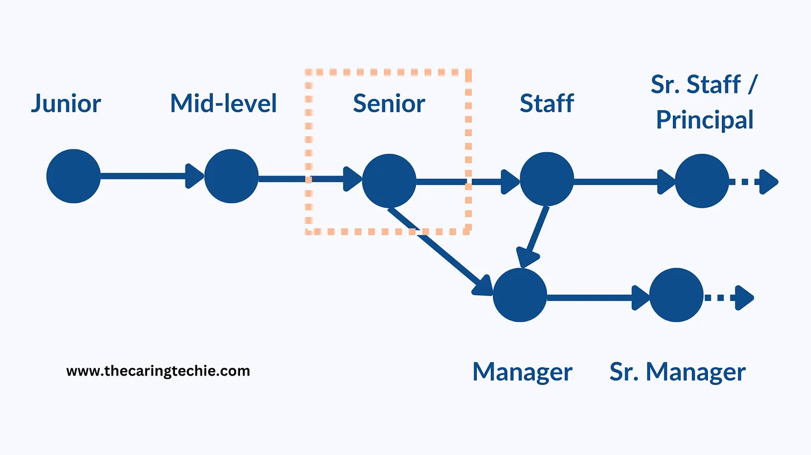
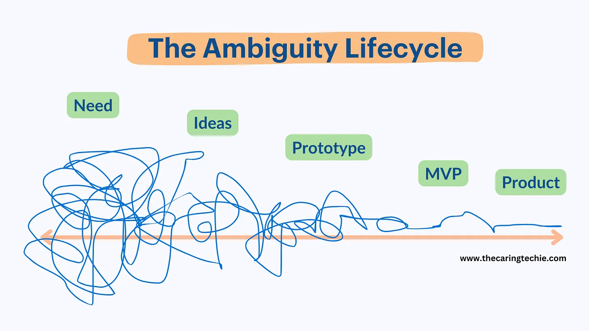

2024-05-29

Throughout my career as a Software Engineer, I was fortunate to get promoted multiple times from Junior, to Mid-level, Senior, and Staff. The most difficult jump was from Senior to Staff.

Part of the reason is that I made a lateral move from Google to Uber, and also switched teams internally at Uber during that time. The other part is just the difficulty of the transition itself.

Advancing from Senior to Staff isn’t impossible, but it is significantly more difficult than prior promotions because you start facing some unique challenges.

I agree with [Will Larson](https://lethain.com/terminal-level-rulebook/) who compares it to graduating:

> Before you graduate, you have clear grades, graduation requirements, exams, and someone else is responsible for teaching you how it works. After you graduate, there’s no framework at all. — Will Larson

In other words:

> What gets you to senior won’t get you past senior. - Me

Whether you wish to stay on the technical track or switch to management, career progression beyond senior requires developming and mastering vastly different skills.

In today’s article, we discuss 3 of the most critical skills you need beyond senior.

## 1. Learning to scale yourself

Levels after senior come with significantly larger scope and increased expectations to make an impact. Sadly, they don’t also come with days longer than 24hrs or superhuman powers.

In the “scaling yourself” equation, your impact is what you can do on your own combined with what you can accomplish through others. Maximizing impact becomes a problem of maximizing each component.

![[e0b800e1497d_9ba10b87.webp]]

The challenge is that your individual impact is bound by how much time there is in a day, while the expectations are not. The only way to thrive under these conditions is to start investing heavily in what you can do through others.

**How to build this skill:**

- **Maximize what you can do on your own:** by ruthlessly prioritizing your time, [pushing back](https://www.thecaringtechie.com/p/strategies-for-saying-no) on activities that have small ROI, and focusing on areas where your input is crucial; for engineers, it often means less coding (if more junior people can do that piece of coding).
    
- **How you can maximize what you can do through others:** by teaching & mentoring, delegating work, and influencing without authority; My advice is to teach as much as you can so you can delegate as much as you can.
    

The idea is to aim to offload as much as possible from the things that can (or could) be done by others and focus your efforts where they are most needed and where you can make the biggest impact.

Keep an eye out for a future article on this topic.

## 2. Navigating ambiguity

Ambiguity in engineering is a given, but for levels above senior, it grows significantly.

For tech products, ambiguity comes from all the problems where multiple strategies, interpretations of data, conflicting requirements, or incomplete specifications can lead to different approaches.

Sometimes you don’t even know if these problems are solvable or what problem should be worked on in the first place. Past senior levels, it is expected that you start contributing to finding and advocating for the most important problems that need to be solved.

Evaluating and choosing a solution in these situations became a game of making tradeoffs and taking chances.

**How to build this skill:**

For engineers and engineering leaders, the challenge is to navigate these uncertainties wisely.

The goal is to move a problem from a vague need all the way to a valid product as illustrated in this ambiguity lifecycle diagram.

Your job involves turning the unknown into the known and translating vague ideas into actionable plans. This often involves a blend of:

- **Detective work** — ask the right questions, collect evidence, build a case theory, validate it
    
- **Isolating uncertainty** to the smallest components and proving / disproving theories
    
- **Divide and conquer** — breaking down the problem into smaller subproblems and tackling them systematically
    
- **Making informed decisions even with incomplete information**
    
- **Being able to pivot** as new information and feedback become available
    

Note: Future article on this topic coming up soon.

## 3. Influence without authority

[Influencing without authority](https://www.thecaringtechie.com/p/why-influence-is-vital) is an important skill for any software engineer. It becomes vital for people aiming to advance past senior levels irrespective of whether it’s on the technical track or the leadership track.

At the team level, to get anyone you don’t have formal authority over to do or stop doing something, your approach needs to be based on influence. At the organization level, the same principle applies. To align diverse groups towards a common goal, you need—you guessed it—influence.

Most of us see influencing as figuring out the perfect words to use to convince someone of something we believe in. The reality is that it’s much less about that and much more about the credibility and personal connections you build over time.

